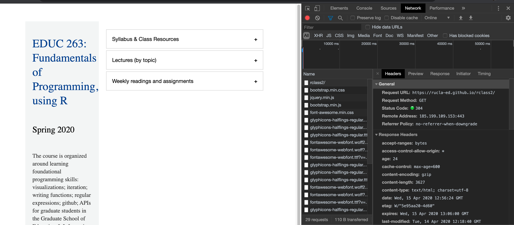

<!--Outline:
Introduction to APIs
- Conceptual example, analogy
What and why use APIs
- should we include stuff on web-scraping? (maybe)
Example
- rscorecard?
Introduction to JSON
Example -->


# Introduction to APIs
Load packages:
```{r, message=FALSE}
library(tidyverse)
#install.packages('rscorecard')
library(rscorecard)
library(tidycensus)
```

Resources used to create this lecture:  

- https://zapier.com/learn/apis/  
- https://learn.g2.com/api
- https://medium.com/swlh/api-for-dummies-232a5a48f950 
- https://blog.hubspot.com/marketing/how-to-use-apis  
- https://medium.com/@traffordDataLab/querying-apis-in-r-39029b73d5f1  
- https://github.com/wdoyle42/hoddatasci/blob/master/lessons/07-webscraping.Rmd


## What are APIs and why do we use them  

[API video](https://www.youtube.com/watch?v=s7wmiS2mSXY), from MuleSoft

What is an __API__? (from [wikipedia](https://en.wikipedia.org/wiki/Application_programming_interface))

> "An application programming interface (API) is a computing interface to a software component or a system, that defines how other components or systems can use it. It defines the kinds of calls or requests that can be made, how to make them, the data formats that should be used, the conventions to follow, etc. "  

You might have heard the term __API__ used colloquially at some point. API stands for **A**pplication **P**rogramming **I**nterface. In simple terms, an API allows applications (or systems) to communicate with one another.  

Before getting into the nuts and bolts of APIs, we must first talk about servers.  

- Servers are big computers (with no keyboard, monitor, or mouse) that are connected remotely.  
- There are a variety of tasks that servers can perform, but the most common for example are web servers which we interact with often when we visit a website.

[](https://zapier.com/learn/apis/chapter-1-introduction-to-apis/)

*Credit: Brian Cooksey ([An introduction to APIs: Chapter 1](https://zapier.com/learn/apis/chapter-1-introduction-to-apis/))*

The image above depicts the workflow of communicating with a __server__. As a __user__, we type something into our web brower using our computer-- also known as the __client__. The __client__ then communicates our request to the __server__ via an __API__. The server returns a website, which we as the user are able to view.  

APIs as messengers  

- Alternatively, you can think of APIs as intermediaries or messengers. Take for example, you go to your favorite restaurant for breakfast. You peruse the menu and decide to order blueberry pancakes. The waiter takes your order and sends it to the kitchen.  

[](https://learn.g2.com/api)

*Credit: Bridget Poetker ([What is an API?](https://learn.g2.com/api))*  


- The customer is you, the __client__  
- The waiter is the __API__, the intermediary between you and the kitchen  
- The kitchen is the __server__ (it receives the customer's (client) request from the waiter (API) and returns your order of blueberry pancakes)  
  

# Web Protocols  

Many APIs use HTTP protocol to make requests to the server. HTTP stands for __Hyper-Text Transfer Protocol__ and it is the main protocol used on the web. Similar to how people have social norms and rules to communicate with one another (e.g. listening to someone speak, pausing, facial expressions, etc.) -- an HTTP protocol is a way computers communicate on the web. 

## HTTP Requests   

[HTTP Requests](https://zapier.com/learn/apis/chapter-2-protocols/) work through what is known as a Request-Response Cycle. Similar to our example above, a client sends a request and the server responds to the server's request.  

[](https://zapier.com/learn/apis/chapter-2-protocols/)  

*Credit: Brian Cooksey ([An introduction to APIs: Chapter 2](https://zapier.com/learn/apis/chapter-1-introduction-to-apis/))*  

Valid requests need the following four things:  

1. URL  
2. Method  
3. List of Headers  
4. Body

    [{ width=65% height=300px}](https://zapier.com/learn/apis/chapter-2-protocols/)  


*Credit: Brian Cooksey ([An introduction to APIs: Chapter 2](https://zapier.com/learn/apis/chapter-1-introduction-to-apis/))*

### URL
A [__URL__](https://www.whoishostingthis.com/resources/url/) is an acronym for Uniform Resource Locator and it refers to the location of a "thing" resource on the web. Usually URLs are considered "addresses" to a thing or "resource". These resources most of the time are web pages, but can also be images, pictures, or documents.   

A simple URL will include the protocol, the host name or address, and the resource location  

- Example : http://rucla-ed.github.io/rclass2  
    - __http__ is the protocol  
    - __rucla-ed.github.io__ is the domain name or address  
    - __rclass2__ is the resource location

### Method  

The [__method__](https://www.w3schools.com/tags/ref_httpmethods.asp) in an HTTP request tells the server what action the client wants the server to take.  

Four of the most common methods used for APIs are:  

- __GET__ - requests data from a server (what we will be doing!)
- __POST__ - sends data to a server  
- __PUT__ - asks the server to edit/update an existing resource 
- __DELETE__ - asks the server to delete a resource  


    [{ width=50% height=200px }](https://www.hallmarkchannel.com/home-and-family/recipes/blueberry-pancakes) 

*Credit: Cristina Ferrare ([Blueberry pancakes](https://www.hallmarkchannel.com/home-and-family/recipes/blueberry-pancakes))* 

- You make a __POST__ request by telling your waiter (API) you want to order blueberry pancakes.  
- After you have made your order, you realize that you are also craving something savory like roasted breakfast potatoes. You make a __PUT__ request by asking your waiter to update your order and communicate those changes to the kitchen (server).  
- After waiting for some time, you make a __GET__ request by asking your waiter for an update on your order which will be sent to the kitchen (server) and they will reply with the status of your order.  
- It's been over an hour and still not food. You make a __DELETE__ request and tell your waiter (API) to cancel your order which in turn they will communicate to the kitchen (server).  

### List of Headers  

[__Headers__](https://developer.mozilla.org/en-US/docs/Web/HTTP/Headers) let the client and server provide additional information about an HTTP request. An HTTP header has a case-sensitive name followed by a colon `:` and its value. To view HTTP headers on [Google Chrome](https://mkyong.com/computer-tips/how-to-view-http-headers-in-google-chrome/) you could:  

1. `right click` on the page  
2. select `Inspect`  
3. refresh the page and on the left panel select any HTTP request and you can view the HTTP headers on the right panel

    { width=70% height=300px}  

There are four kinds of HTTP messages: [headers](https://www.tutorialspoint.com/http/http_header_fields.htm):  

- __General Header__: These headers generally apply to both request and response messages.  
- __Client Request Header__: These headers only apply to request messages.  
- __Server Response Header__: These headers only apply to response messages.  
- __Entity Header__: These headers provide additional information about the entity-body or, if no body is present, about the resource identified by the request.  


In the image above we can see our class website has two kinds of HTTP messages-- General and Response. In General header provides general information about the website (e.g. Request URL, Remote Address, etc.). The Response header includes information about response messages such as the content-type, content-encoding, and date. 

### Body  

The message [body](https://zapier.com/learn/apis/chapter-2-protocols/) of an HTTP request contains data the client wants to send to the server and data the server sends back to the client. In our blueberry pancake example, the data would be our order. Unlike other components of the HTTP protocol (e.g. URL, headers, etc.), the client has more control over this part of the request (aka ordering food at a restaurant). Not all HTTP requests have a message body. If the message body is available for the HTTP request, then it is used to carry the entity-body associated with the request. The entity-body is simply the content (data) of the request (from [w3.org](https://www.w3.org/Protocols/HTTP/1.1/rfc2616bis/draft-lafon-rfc2616bis-03.html#entity.body)). The Content-Type, Content-Length, and Transfer-Encoding headers signal whether a message body can be made with the HTTP request (from [w3.org](https://www.w3.org/Protocols/HTTP/1.1/rfc2616bis/draft-lafon-rfc2616bis-03.html#message.body))   

The response message body will depend on two things- the request method and the status code. 

[](https://developer.mozilla.org/en-US/docs/Web/HTTP/Messages)  
    
*Credit: MDN contributors ([HTTP messages)](https://developer.mozilla.org/en-US/docs/Web/HTTP/Messages)*

- The image above shows three types of headers-- General, Request, and Entity headers.  

    - The light blue section containing __Content-Type__ and __Content-Length__ signal to us that we can include a message body if we choose to.  
 
- An example HTTP request and response.  

[](https://developer.mozilla.org/en-US/docs/Web/HTTP/Messages)  
    
*Credit: MDN contributors ([HTTP messages)](https://developer.mozilla.org/en-US/docs/Web/HTTP/Messages)*

## HTTP Responses  

Once a client sends a request to the server, the server sends a response to the client. The format of the response is similar to a request except a response does not have a method or URL-- it has a status code.  

A [status code](https://www.digitalocean.com/community/tutorials/how-to-troubleshoot-common-http-error-codes) is a three-digit number that succinctly communicates a lot of information to the client. There are five different classes of status codes that are identified by the first digit:  

- 1xx: Informational  
- 2xx: Success  
- 3xx: Redirection  
- 4xx: Client Error  
- 5xx: Server Error  

A common status code we have encountered is 404, which means "Not Found". Other common status codes are:   

[](https://zapier.com/learn/apis/chapter-2-protocols/)  

*Credit: Brian Cooksey ([An introduction to APIs: Chapter 2](https://zapier.com/learn/apis/chapter-1-introduction-to-apis/))*


- 400: Bad request  
- 401: Unauthorized  
- 403: Forbidden  
- 502: Bad Gateway  
- 200: Success

    [{ width=70% }](https://zapier.com/learn/apis/chapter-2-protocols/)  


# Authentication: API keys  
 
Three of the most common forms of API authentication are:  

- HTTP Basic Authentication  
- API Keys  
- OAuth  

Authentication vs. Authorization (from Nordic APIs [blog](https://nordicapis.com/3-common-methods-api-authentication-explained/))  

- Prior to a discussion on different methods of API authentication, it is important to distinguish the terms __authentication__ and __authorization__-- which tend to be used interchangeably.  
    - __Authentication__: an entity proves an identity (e.g. Bruin card to prove you are a UCLA student)   
    - __Authorization__: an entity proves a right to access (e.g. a ticket lets you in to a football game)  
    - __Authentication & Authorization__: an entity proves an identity and proves right to access (e.g. Bruin card to prove you are a UCLA student and can use the gym)
    

## HTTP Basic Authentication  

Basic authentication (from Brian Cookey, [An Introduction to APIs](https://zapier.com/learn/apis/chapter-4-authentication-part-1/))  

>"Basic Auth only requires a username and password. The client takes these two credentials, smooshes them together to form a single value, and passes that along in the request in an HTTP header called Authorization."  

- The server will receive the request and compare the credentials in the request (Authorization header) with credentials it has stored. If the credentials match, the server will return status code (200), otherwise it will return status code (401) (authentication failed and the request has been denied). 

[](https://dotnetthoughts.net/basic-http-authentication-in-asp-net-web-api/)  

*Credit: Anuraj ([Basic HTTP authentication](https://dotnetthoughts.net/basic-http-authentication-in-asp-net-web-api/))*

weakness of this approach

## API Keys  

What they are  
Example  
weaknesses of this approach 

## OAuth  

What it is  
Example  


# Using APIs to request data  
## JSON 
## Practical example


<!--
#Introduction to JSON formated data
Readings: https://towardsdatascience.com/an-introduction-to-json-c9acb464f43e, https://flaviocopes.com/json/, https://blog.scottlowe.org/2013/11/08/a-non-programmers-introduction-to-json/, https://www.w3schools.com/js/js_json_intro.asp   
Videos: https://www.youtube.com/watch?v=uxf0--uiX0I


#https://www.dataquest.io/blog/r-api-tutorial/ APIs in R 

```{r eval=FALSE, echo=FALSE}
library(httr) #to request data on server
library(rvest) #to parse html files

lyrics <- GET("https://genius.com/John-legend-all-of-me-lyrics")
status_code(lyrics)
str(content(lyrics))

content(lyrics, "text")

```

##web-scraping example
```{r}
moby_url = url("http://www.gutenberg.org/files/2701/2701-h/2701-h.htm")

moby_dick = readLines(moby_url, n = 5000)
moby_dick[1200:1210]
```

##ACS example
```{r}
#Load libraries
library(acs) #for accessing American Community Survey data via the census API
library(tidyverse)
library(tigris) #for accessing TIGER shapefiles via the census API
library(tidycensus) #allows users to interface with the US Census Bureau’s decennial Census and five-year American Community APIs
```

```{r}
## Look up fips code for county
lookup_code("CA","Kern") 
state_fips<-"06" #code for CA
county_stub<-"029" #code for Kern County
county_fips<-paste0(state_fips,county_stub) #concatenate together

#county_fips
```

```{r}
# Get dataset that matches all zip codes to cities, counties and states. 
county_to_zip<-read_csv("http://www2.census.gov/geo/docs/maps-data/data/rel/zcta_county_rel_10.txt")
#easier names to work with
names(county_to_zip)<-tolower(names(county_to_zip))

#Just zip codes in selected county
county_to_zip<-county_to_zip%>%
  filter(state%in%as.numeric(state_fips),county==county_stub)%>%
  select(zcta5,state,county)
```

```{r eval=FALSE}
#list of zip codes
ziplist<-county_to_zip$zcta5
#City names
data(zip_codes)
city_zip<-zip_codes%>%filter(zip%in%ziplist)%>%select(zip,city)
#Arrange in order
city_zip<-city_zip%>%arrange(as.numeric(zip))
```

```{r eval=FALSE}
#An Alternative: Tidycensus
acs_key<-"89332977439e7b7492c9aae1ac271a857bfddc4e"

census_api_key(acs_key)
v17 <- load_variables(2017, "acs5", cache = TRUE)

#View(v17)
var_list<-paste0("B15002_",c("001",
                            "015",
                            "016",
                            "017",
                            "018",
                            "032",
                            "033",
                            "034",
                            "035"))
educ<-get_acs("zcta",
                variables=var_list,
                output="wide"
                )
names(educ)<-tolower(names(educ))
educ%>%filter(geoid%in%ziplist)->county_educ
county_educ%>%
  rename(zip=geoid)%>%
  group_by(zip)%>%
  mutate(college_educ=((b15002_015e+
                         b15002_016e+
                         b15002_017e+
                         b15002_018e+
                         b15002_032e+
                         b15002_033e+
                         b15002_034e+
                         b15002_035e)/b15002_001e)*100) %>%
    select(zip,college_educ)->
    county_educ

```

#https://medium.com/@traffordDataLab/querying-apis-in-r-39029b73d5f1
```{r}
library(httr) ; library(jsonlite)

path <- "https://data.police.uk/api/crimes-street/burglary?"

request <- GET(url = path, 
               query = list(
                 lat = 53.421813,
                 lng = -2.330251,
                 date = "2019-05")
               )

request$status_code

response <- content(request, as = "text", encoding = "UTF-8")

df <- fromJSON(response, flatten = TRUE) %>% 
  data.frame()
```

#https://github.com/btskinner/rscorecard
```{r}
#install.packages("rscorecard")
library(rscorecard)

sc_key('6vNHxtvNKi5XJvxOdh1KFlIkOJxv2bPivPkr5EFA')

library(rscorecard)

df <- sc_init() %>% 
    sc_filter(region == 2, ccbasic == c(21,22,23), locale == 41:43) %>% 
    sc_select(unitid, instnm, stabbr) %>% 
    sc_year("latest") %>% 
    sc_get()


```

-->
