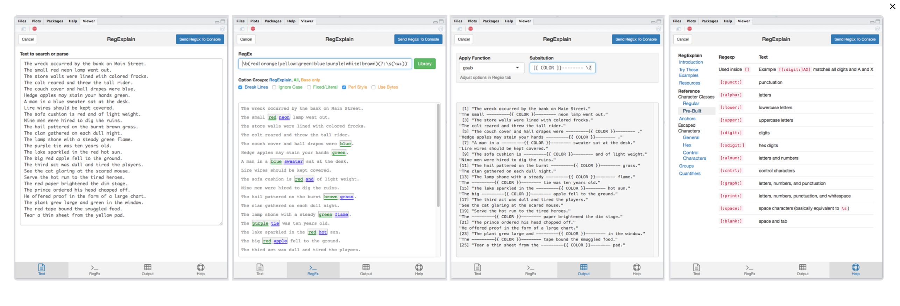

# Introduction

Load packages:

```r
library(tidyverse)
library(stringr)  # package for manipulating strings (part of tidyverse)
library(lubridate)  # package for working with dates and times
library(rvest)  # package for reading and manipulating HTML
```

```
## Warning: package 'rvest' was built under R version 3.6.3
```

```
## Warning: package 'xml2' was built under R version 3.6.3
```


# HTML

__Markup Language__

> "A markup language is a computer language that uses tags to define elements within a document. It is human-readable, meaning markup files contain standard words, rather than typical programming syntax." 

*Credit: [Markup Language](https://techterms.com/definition/markup_language) from TechTerms*

<br>
__Hypertext Markup Language (HTML)__

- HTML is a markup language for the creation of websites
    - HTML puts the content on the webpage, but does not "style" the page (e.g., fonts, colors, background)
    - CSS (**C**ascading **S**tyle **S**heets) adds style to the webpage (e.g., fonts, colors, etc.)
    - Javascript adds functionality to the webpage

## HTML Basics  

__Intro to HTML (and CSS)__

- Watch this __excellent__ 12-minute introductory HTML tutorial by LearnCode.academy
    - Link: [HTML Tutorial for beginners](https://www.youtube.com/watch?v=RjHflb-QgVc)
- Watch this 7-minute introductory CSS tutorial by LearnCode.academy
    - Link: [HTML CSS Tutorial for Beginners](https://youtu.be/J35jug1uHzE)

<br>
__A Simple HTML Document__ (From [w3schools](https://www.w3schools.com/html/html_intro.asp))

- HTML consists of a series of **elements**
  - Elements are defined by a start tag, some content, and an end tag:
    - `<tagname> Content </tagname>`
  - Elements can be nested within one another
- Components of a basic HTML document:
  - Begin with `<!DOCTYPE html>` to indicate it is an HTML document
  - The `<html>` element is the root element of an HTML page, where all other elements are nested
  - The `<head>` element contains meta information about the document (ie. not displayed on webpage)
    - Including CSS style to apply to html content
  - The `<body>` element contains the visible page content

```
<!DOCTYPE html>
<html>
<head>
<title>Page Title</title>
</head>
<body>

<h1>My First Heading</h1>
<p>My first paragraph.</p>

</body>
</html>
```

<br>

## Tags

What are **HTML tags**?

- HTML tags are element names surrounded by angle brackets
    - Tags usually come in pairs (e.g. `<p>` and `</p>`)
    - The first tag is the start tag and the second tag is the end tag
    
*Credit: [HTML introduction](https://www.w3schools.com/html/html_intro.asp) from W3schools*   

<br>
Some **common HTML tags** (_not inclusive_): 

Tag                Description    
------------------ ------------------  
\<h1\> - \<h6\>    Heading     
\<p\>              Paragraph
\<a\>              Link
\            Image
\<div\>            Division (can think of it as a container to group other elements)
\<strong\>         Bold
\<em\>             Italics
\<ul\>             Unordered list (consists of \<li\> elements)
\<ol\>             Ordered list (consists of \<li\> elements)
&nbsp;&nbsp;\<li\> &nbsp;&nbsp;&nbsp;&nbsp;List item
\<table\>          Table (consists of \<tr\>, \<td\>, & \<th\> elements)
&nbsp;&nbsp;\<tr\> &nbsp;&nbsp;Table row
&nbsp;&nbsp;\<td\> &nbsp;&nbsp;Table data/cell 
&nbsp;&nbsp;\<th\> &nbsp;&nbsp;Table header 

<br>


## Attributes  

What are **attributes**?

- Attributed in HTML elements are optional, but all HTML elements can have attributes
- Attributes are used to specify additional characteristics of elements
- Attributes are __always__ specified in the start tag
- Attributes usually come in name/value pairs like: `name="value"`

*Credit: [HTML attributes](https://www.w3schools.com/html/html_attributes.asp) from W3schools*

<br>
Some **common attributes** you may encounter:

- The `href` attribute for an `<a>` tag (_specifies url to link to_):
  ```
  <a href="https://www.w3schools.com">This is a link</a>
  ```
- The `src` attribute for an `` tag (_specifies image to display_):
  ```
  
  ```
- You can add more than one attribute to an element:
  ```
  
  ```
- The `class` and `id` attributes are also commonly added to elements to be able to identify and select for them

<br>

### Class  

- The `class` attribute can specify one or more class names for an HTML element
- An element can be identified by its class
- You can select for an element by its class using `.` followed by the class name (more from GeekstoGeeks [here](https://www.geeksforgeeks.org/html-class-attribute/?ref=lbp))
  - For example, this can be used in CSS to select for and style all elements with a specific class

__HTML__:


```html
<div class="countries">
  <h3>United States</h3>
  <p class="place">Washington D.C.</p>
  
</div>
    
<div class="countries">
  <h3>Mexico</h3>
  <p class="place">Guadalajara</p>
  
</div>
```
 
__CSS__:
 

```css
<style>   
.countries {
  background-color: #e6e6e6;
  color: #336699;
  margin: 10px;
  padding: 15px;
}

.place {
  color: black;
}
</style>
```

__Result__:

<style>
.countries {
  background-color: #e6e6e6;
  color: #336699;
  margin: 10px;
  padding: 15px;
  display: inline-block;
}

.place {
  color: black;
}

.countries img {
  width: 200px;
  height: 100px;
  overflow: hidden;
}
</style>

<div class="countries">
<h3>United States</h3>
<p class="place">Washington D.C </p>

</div>


<div class="countries">
<h3>Mexico</h3>
<p class="place">Guadalajara</p>

</div>

*Credit: [HTML Classes](https://www.w3schools.com/html/html_classes.asp) from W3schools*


### `id`

- The `id` attribute is used to specify one unique HTML element within the HTML document
- An element can be identified by its id
- You can select for an element by its id using `#` followed by the id name (more from GeekstoGeeks [here](https://www.w3schools.com/html/html_id.asp))
  - For example, this can be used in CSS to select for and style a specific element with a certain id

__HTML__:


```html
<div id="banner">My Banner</div>
```

__CSS__:


```css
<style>
#banner {
  background-color: #e6e6e6;
  font-size: 40px;
  padding: 20px;
  text-align: center;
}
</style>
```

__Result__:

<style>
#banner {
  background-color: #e6e6e6;
  font-size: 40px;
  padding: 20px;
  text-align: center;
}
</style>

<div id="banner">My Banner</div>

*Credit: [HTML Id](https://www.w3schools.com/html/html_id.asp) from W3schools*


<br>

## Student Exercise

- Spend 5-10 minutes playing with the simple HTML text below; experiment with whichever additional elements/tags/attributes/etc you want
- Paste the below code into [TryIt Editor](https://www.w3schools.com/html/tryit.asp?filename=tryhtml_default) and click __Run__


```html
<!DOCTYPE html>
<html>
<head>
  <title>Page title (in head tag)</title>
</head>
<body>

  <h1>Title of level 1 heading</h1>
  
  <p>My first paragraph.</p>
  <p>My second paragraph.</p>
  <p>Add some bold text <strong>right here</strong></p>
  <p>Add some italics text <em>right here</em></p>
  

  <p>Include a hyperlink tag within a paragraph tag. this book looks interesting : <a href="https://bookdown.org/rdpeng/rprogdatascience/">R Programming for Data Science</a></p>  
  
  <p>Include another hyperlink tag within a paragraph tag. chapter on <a href="https://bookdown.org/rdpeng/rprogdatascience/regular-expressions.html">Regular Expressions</a></p>    
  <p> put a button inside this paragraph <button>I am a button!</button></p>
  
  <p>Here are some items in a list, but items not placed within an unordered list </p>
  
  <li> text you want in item</li>
  <li> text you want in another item</li>
  
  <p>Here are some items in an unordered list</p>
  
  <ul>
  <li> first item in unordered list </li>
  <li> second item in unordered list </li>
  </ul>

</body>
  
</html>
```

<br>

## HTML Resources

Lots of wonderful resources on the web to learn HTML!

- Use this website to create/modify HTML code and view the result after it is compiled
    - [TryIt Editor](https://www.w3schools.com/html/tryit.asp?filename=tryhtml_default)
- HTML cheat sheets 
    - [Link to HTML cheat sheet (PDF)](https://web.stanford.edu/group/csp/cs21/htmlcheatsheet.pdf)
    - [Link to another HTML cheat sheet ](http://www.cheat-sheets.org/saved-copy/html-cheat-sheet.png), (shown below) 


[](https://sharethis.com/best-practices/2020/02/best-html-and-css-cheat-sheets/)

# Web scraping using `rvest`

__The `rvest` package__

> `rvest` helps you scrape information from web pages. It is designed to work with magrittr to make it easy to express common web scraping tasks, inspired by libraries like beautiful soup.

- *Source: `rvest` [webpage](http://rvest.tidyverse.org/)*

> [`rvest` package contains] Wrappers around the `xml2` and `httr` packages to make it easy to download, then manipulate, HTML and XML.

- *Source: `rvest` package documentation*

__Why use the `rvest` package?__

- `rvest` makes it easy to parse HTML
- First, we use the `read_html()` function to [read in the HTML](#reading-html) and convert it to an `xml_document`/`xml_node` object
- A **node** is just an HTML **element**
- HTML is made up of nested elements, so once we've read in the HTML to a `xml_node` object, we can easily traverse the nested nodes (ie. children elements) and [parse the HTML](#parsing-html)
- `rvest` comes with many helpful functions to search and extract various parts of the HTML
  - `html_node()`/`html_nodes()`: Search and extract node(s) (ie. HTML elements)
  - `html_text()`: Extract the content between HTML tags
  - `html_attr()`/`html_attrs()`: Extract the attribute(s) of HTML tags


## Reading HTML

__The `read_html()` function__:


```r
?read_html

# SYNTAX AND DEFAULT VALUES
read_html(x, encoding = "", ..., options = c("RECOVER", "NOERROR", "NOBLANKS"))
```

- Arguments:
  - `x`: The input can be a string containing HTML or url to the webpage you want to scrape
- Output:
  - The HTML that is read in will be returned as an `rvest` `xml_document`/`xml_node` object and can be easily parsed
  - You can also view the raw HTML using `as.character()`
  
__Scraping HTML from a webpage__:

- Navigate to the webpage (e.g., https://corona.help/) in your browser
  - If possible, use Google Chrome or Mozilla Firefox
- View the HTML of the page by right clicking > `View Page Source`
  - This will be the raw HTML that is scraped when we use `read_html()`
- When you right click, you may notice another option called `Inspect` (Chrome) or `Inspect Element` (Firefox) that will pop up a side panel
  - This can be helpful for visualizing the HTML elements on the page
  - You can also click on this side panel and hit `ctrl` + `f` (Windows) or `cmd` + `f` (Macs) to search for elements using a selector
  - But note that the HTML you see here might not be the same as what you see in `View Page Source` (i.e., _what is scraped_), since it also reflects changes made to the HTML _after_ the page was loaded (e.g., _by JavaScript_)

<br>
<details><summary>**Example**: Using `read_html()` to read in HTML from string</summary>


```r
html <- read_html("<h1>This is a heading.</h1><p>This is a paragraph.</p>")

# View object
html
```

```
## {html_document}
## <html>
## [1] <body>\n<h1>This is a heading.</h1>\n<p>This is a paragraph.</p>\n</body>
```

```r
# View class of object
class(html)
```

```
## [1] "xml_document" "xml_node"
```

```r
# View raw HTML
as.character(html)
```

```
## [1] "<!DOCTYPE html PUBLIC \"-//W3C//DTD HTML 4.0 Transitional//EN\" \"http://www.w3.org/TR/REC-html40/loose.dtd\">\n<html><body>\n<h1>This is a heading.</h1>\n<p>This is a paragraph.</p>\n</body></html>\n"
```

</details>

<br>
<details><summary>**Example**: Using `read_html()` to scrape the page `https://corona.help/`</summary>


```r
corona <- read_html("https://corona.help/")

# View object
corona
```

```
## {html_document}
## <html class="loading" lang="en" data-textdirection="ltr">
## [1] <head>\n<meta http-equiv="Content-Type" content="text/html; charset=UTF-8 ...
## [2] <body class="horizontal-layout horizontal-menu dark-layout 2-columns navb ...
```

```r
# View class of object
class(corona)
```

```
## [1] "xml_document" "xml_node"
```


```r
# View raw HTML [output omitted]
as.character(corona)
```


```r
# Inspect raw HTML
str(as.character(corona))
```

```
##  chr "<!DOCTYPE html>\n<html class=\"loading\" lang=\"en\" data-textdirection=\"ltr\">\n<!-- BEGIN: Head--><head>\n<m"| __truncated__
```

</details>

## Parsing HTML

__The `html_node()` and `html_nodes()` functions__:


```r
?html_node

# SYNTAX
html_node(x, css, xpath)


?html_nodes

# SYNTAX
html_nodes(x, css, xpath)
```

- Arguments:
  - `x`: An `rvest` `xml_document`/`xml_node` object (use `read_html()` to get this)
  - `css`: Selector (can select by HTML tag name, its attributes, etc.)
- Output:
  - `html_node()` returns the first element that it finds as an `rvest` `xml_node` object
    - Recall that a node is just an HTML element
  - `html_nodes()` returns all elements that it finds as an `rvest` `xml_nodeset` object
    - All elements that are selected will be returned in a nodeset
  - Again, you can view the raw HTML using `as.character()`
    - Syntax: `as.character(html_node(...))`

__Selecting for HTML elements__:

- HTML elements can be selected in many ways
  - Selecting by tagname: `'p'`, `'table'`, etc.
  - Selecting by class using `.`: `'.my-class'`
  - Selecting by id using `#`: `'#my-id'`
  - Selecting nested elements: `'table tr'` (_selects all rows within a table_)
- You can test your selector in your browser
  - Right click and select `Inspect` (Chrome) or `Inspect Element` (Firefox) to bring up a side panel
  - Hit `ctrl` + `f` (Windows) or `cmd` + `f` (Macs) and enter your selector to search for elements


<br>
<details><summary>**Example**: Using `html_node()` and `html_nodes()` I</summary>

Remember that the input to `html_node()`/`html_nodes()` should be an `rvest` `xml_document`/`xml_node` object, which we can obtain from `read_html()`:


```r
html <- read_html("<p>Paragraph #1</p><p>Paragraph #2</p><p>Paragraph #3</p>")

# View class of object
class(html)
```

```
## [1] "xml_document" "xml_node"
```

```r
# View raw HTML to see what elements are there
as.character(html)
```

```
## [1] "<!DOCTYPE html PUBLIC \"-//W3C//DTD HTML 4.0 Transitional//EN\" \"http://www.w3.org/TR/REC-html40/loose.dtd\">\n<html><body>\n<p>Paragraph #1</p>\n<p>Paragraph #2</p>\n<p>Paragraph #3</p>\n</body></html>\n"
```

<br>
If we search for the `<p>` element using `html_node()`, it will return the first result:


```r
first_p <- html_node(html, 'p')

# View class of object
class(first_p)
```

```
## [1] "xml_node"
```

```r
# View raw HTML
as.character(first_p)
```

```
## [1] "<p>Paragraph #1</p>\n"
```

<br>
If we search for the `<p>` element using `html_nodes()`, it will return all results:


```r
all_p <- html_nodes(html, 'p')

# View class of object
class(all_p)
```

```
## [1] "xml_nodeset"
```

```r
# View raw HTML
as.character(all_p)
```

```
## [1] "<p>Paragraph #1</p>\n" "<p>Paragraph #2</p>\n" "<p>Paragraph #3</p>"
```

<br>
Note that we could also use `%>%`:


```r
# These are equivalent to the above
first_p <- html %>% html_node('p')
all_p <- html %>% html_nodes('p')
```

</details>


<br>
<details><summary>**Example**: Using `html_node()` and `html_nodes()` II</summary>


Let's revisit the HTML we scraped from https://corona.help/ in the previous example

  - We will try selecting for the "Total by country" table off of that page
  - In your browser, right click > `View Page Source` to check that the `table` element is indeed in the scraped HTML
  - Then, you can right click the table on the page and inspect it to better visualize the elements


```r
# Scraped HTML is stored in this `xml_document`/`xml_node` object
class(corona)
```

```
## [1] "xml_document" "xml_node"
```

<br>
Select for the `<table>` element on that page using `html_node()`:


```r
# Since this table is the only table on the page, we can just use `html_node()`
corona_table <- corona %>% html_node('table')
corona_table
```

```
## {html_node}
## <table class="table table-striped table-hover-animation mb-0" id="table">
## [1] <thead id="thead"><tr>\n<th>COUNTRY</th>\n                          <th>I ...
## [2] <tbody>\n<tr>\n<td><a href="https://corona.help/country/united-states">\n ...
```

```r
# View class of object
class(corona_table)
```

```
## [1] "xml_node"
```


```r
# View raw HTML of `corona_table` [output omitted]
as.character(corona_table)
```

<br>
Select all rows in the table (i.e., `<tr>` elements) using `html_nodes()`

- It makes sense to select by row (rather than column) because each row usually represent an observation
- The way HTML tables are structured also makes it easier to extract information by row because each `<tr>` element (i.e., row) has `<th>`/`<td>` elements (i.e., column cells) nested within it, and not the other way around
- But if you wanted to select a certain column, there are ways to do that as well (e.g., `table tr td:nth-child(1)` selects the first cell in each row a.k.a. the first column in table)


```r
# We can chain `html_node()`/`html_nodes()` functions
corona_rows <- corona %>% html_node('table') %>% html_nodes('tr')

# Alternatively, we can use `table tr` as the selector to select all `tr` elements within a `table`
corona_rows <- corona %>% html_nodes('table tr')

# Investigate object
head(corona_rows) # View first few rows
```

```
## {xml_nodeset (6)}
## [1] <tr>\n<th>COUNTRY</th>\n                          <th>INFECTED</th>\n     ...
## [2] <tr>\n<td><a href="https://corona.help/country/united-states">\n          ...
## [3] <tr>\n<td><a href="https://corona.help/country/spain">\n                  ...
## [4] <tr>\n<td><a href="https://corona.help/country/united-kingdom">\n         ...
## [5] <tr>\n<td><a href="https://corona.help/country/italy">\n                  ...
## [6] <tr>\n<td><a href="https://corona.help/country/russia">\n                 ...
```

```r
typeof(corona_rows)
```

```
## [1] "list"
```

```r
class(corona_rows)
```

```
## [1] "xml_nodeset"
```

```r
length(corona_rows) # Number of elements
```

```
## [1] 218
```

</details>

<br>

### Practicing regex

The following examples use the Coronavirus data from https://corona.help/

  - Recall that we have selected for all rows in the data table on that page in the previous example
  - If we wanted to try and create a dataframe out of this table, we could further select each cell in the table (i.e., `<td>` elements from each row), but this would involve loops which will be covered in a later lecture
  - For now, we will be practicing parsing data from each row using regex

View `corona_rows` we selected from previous example:


```r
# View first few rows
head(corona_rows)
```

```
## {xml_nodeset (6)}
## [1] <tr>\n<th>COUNTRY</th>\n                          <th>INFECTED</th>\n     ...
## [2] <tr>\n<td><a href="https://corona.help/country/united-states">\n          ...
## [3] <tr>\n<td><a href="https://corona.help/country/spain">\n                  ...
## [4] <tr>\n<td><a href="https://corona.help/country/united-kingdom">\n         ...
## [5] <tr>\n<td><a href="https://corona.help/country/italy">\n                  ...
## [6] <tr>\n<td><a href="https://corona.help/country/russia">\n                 ...
```

```r
corona_rows[1:5] # first five rows
```

```
## {xml_nodeset (5)}
## [1] <tr>\n<th>COUNTRY</th>\n                          <th>INFECTED</th>\n     ...
## [2] <tr>\n<td><a href="https://corona.help/country/united-states">\n          ...
## [3] <tr>\n<td><a href="https://corona.help/country/spain">\n                  ...
## [4] <tr>\n<td><a href="https://corona.help/country/united-kingdom">\n         ...
## [5] <tr>\n<td><a href="https://corona.help/country/italy">\n                  ...
```

```r
corona_rows[c(1)] # header row
```

```
## {xml_nodeset (1)}
## [1] <tr>\n<th>COUNTRY</th>\n                          <th>INFECTED</th>\n     ...
```

```r
corona_rows[1] # header row
```

```
## {xml_nodeset (1)}
## [1] <tr>\n<th>COUNTRY</th>\n                          <th>INFECTED</th>\n     ...
```

<br>
Let's convert this to raw HTML using `as.character()` to practice writing regular expressions. Refer back to this output to help you determine what pattern you want to match:


```r
# Convert rows to raw HTML
rows <- as.character(corona_rows)[-c(1)] # [-c(1)] means skip header row

# View first few rows as raw HTML
writeLines(head(rows, 2))  # printing via writeLines() is much prettier than printing via print()
```

```
## <tr>
## <td><a href="https://corona.help/country/united-states">
##                               <div style="height:100%;width:100%">United States</div>
##                             </a></td>
##                           <td class="text-warning">1,367,638</td>
##                           <td class="text-warning text-bold-700">844</td>
##                           <td class="text-danger">80,787</td>
##                           <td class="text-danger text-bold-700">30</td>
##                           <td class="text-success">256,336</td>
##                           <td class="text-success text-bold-700">682</td>
##                           <td class="text-warning">1,030,515</td>
##                           <td class="text-danger">16,514</td>
##                           <td class="text-warning">9,444,525</td>
## 
##                           
##                         </tr>
## 
## <tr>
## <td><a href="https://corona.help/country/spain">
##                               <div style="height:100%;width:100%">Spain</div>
##                             </a></td>
##                           <td class="text-warning">264,663</td>
##                           <td class="text-warning text-bold-700">0</td>
##                           <td class="text-danger">26,621</td>
##                           <td class="text-danger text-bold-700">0</td>
##                           <td class="text-success">176,439</td>
##                           <td class="text-success text-bold-700">0</td>
##                           <td class="text-warning">61,603</td>
##                           <td class="text-danger">1,650</td>
##                           <td class="text-warning">2,467,761</td>
## 
##                           
##                         </tr>
```

```r
# Investgate object named `rows`, which is a character vector
typeof(rows)
```

```
## [1] "character"
```

```r
class(rows)
```

```
## [1] "character"
```

```r
length(rows)
```

```
## [1] 217
```

<br>
<details><summary>**Example**: Using `str_subset()` to subset rows</summary>

Let's filter for rows whose country name starts with `'United'`. First, preview what our regular expression matches using `str_view()`:


```r
str_view_all(string = head(rows), pattern = 'United \\w+')
```

<!--html_preserve--><div id="htmlwidget-6df4e188c014cdc4079b" style="width:960px;height:100%;" class="str_view html-widget"></div>
<script type="application/json" data-for="htmlwidget-6df4e188c014cdc4079b">{"x":{"html":"<ul>\n  <li><tr>\n<td><a href=\"https://corona.help/country/united-states\">\n                              <div style=\"height:100%;width:100%\"><span class='match'>United States<\/span><\/div>\n                            <\/a><\/td>\n                          <td class=\"text-warning\">1,367,638<\/td>\n                          <td class=\"text-warning text-bold-700\">844<\/td>\n                          <td class=\"text-danger\">80,787<\/td>\n                          <td class=\"text-danger text-bold-700\">30<\/td>\n                          <td class=\"text-success\">256,336<\/td>\n                          <td class=\"text-success text-bold-700\">682<\/td>\n                          <td class=\"text-warning\">1,030,515<\/td>\n                          <td class=\"text-danger\">16,514<\/td>\n                          <td class=\"text-warning\">9,444,525<\/td>\n\n                          \n                        <\/tr>\n<\/li>\n  <li><tr>\n<td><a href=\"https://corona.help/country/spain\">\n                              <div style=\"height:100%;width:100%\">Spain<\/div>\n                            <\/a><\/td>\n                          <td class=\"text-warning\">264,663<\/td>\n                          <td class=\"text-warning text-bold-700\">0<\/td>\n                          <td class=\"text-danger\">26,621<\/td>\n                          <td class=\"text-danger text-bold-700\">0<\/td>\n                          <td class=\"text-success\">176,439<\/td>\n                          <td class=\"text-success text-bold-700\">0<\/td>\n                          <td class=\"text-warning\">61,603<\/td>\n                          <td class=\"text-danger\">1,650<\/td>\n                          <td class=\"text-warning\">2,467,761<\/td>\n\n                          \n                        <\/tr>\n<\/li>\n  <li><tr>\n<td><a href=\"https://corona.help/country/united-kingdom\">\n                              <div style=\"height:100%;width:100%\"><span class='match'>United Kingdom<\/span><\/div>\n                            <\/a><\/td>\n                          <td class=\"text-warning\">220,322<\/td>\n                          <td class=\"text-warning text-bold-700\">0<\/td>\n                          <td class=\"text-danger\">31,926<\/td>\n                          <td class=\"text-danger text-bold-700\">0<\/td>\n                          <td class=\"text-success\">925<\/td>\n                          <td class=\"text-success text-bold-700\">0<\/td>\n                          <td class=\"text-warning\">187,471<\/td>\n                          <td class=\"text-danger\">1,559<\/td>\n                          <td class=\"text-warning\">1,821,280<\/td>\n\n                          \n                        <\/tr>\n<\/li>\n  <li><tr>\n<td><a href=\"https://corona.help/country/italy\">\n                              <div style=\"height:100%;width:100%\">Italy<\/div>\n                            <\/a><\/td>\n                          <td class=\"text-warning\">219,070<\/td>\n                          <td class=\"text-warning text-bold-700\">0<\/td>\n                          <td class=\"text-danger\">30,560<\/td>\n                          <td class=\"text-danger text-bold-700\">0<\/td>\n                          <td class=\"text-success\">105,186<\/td>\n                          <td class=\"text-success text-bold-700\">0<\/td>\n                          <td class=\"text-warning\">83,324<\/td>\n                          <td class=\"text-danger\">1,027<\/td>\n                          <td class=\"text-warning\">2,565,912<\/td>\n\n                          \n                        <\/tr>\n<\/li>\n  <li><tr>\n<td><a href=\"https://corona.help/country/russia\">\n                              <div style=\"height:100%;width:100%\">Russia<\/div>\n                            <\/a><\/td>\n                          <td class=\"text-warning\">209,688<\/td>\n                          <td class=\"text-warning text-bold-700\">0<\/td>\n                          <td class=\"text-danger\">1,915<\/td>\n                          <td class=\"text-danger text-bold-700\">0<\/td>\n                          <td class=\"text-success\">34,306<\/td>\n                          <td class=\"text-success text-bold-700\">0<\/td>\n                          <td class=\"text-warning\">173,467<\/td>\n                          <td class=\"text-danger\">2,300<\/td>\n                          <td class=\"text-warning\">5,448,463<\/td>\n\n                          \n                        <\/tr>\n<\/li>\n  <li><tr>\n<td><a href=\"https://corona.help/country/france\">\n                              <div style=\"height:100%;width:100%\">France<\/div>\n                            <\/a><\/td>\n                          <td class=\"text-warning\">176,970<\/td>\n                          <td class=\"text-warning text-bold-700\">0<\/td>\n                          <td class=\"text-danger\">26,380<\/td>\n                          <td class=\"text-danger text-bold-700\">0<\/td>\n                          <td class=\"text-success\">56,217<\/td>\n                          <td class=\"text-success text-bold-700\">0<\/td>\n                          <td class=\"text-warning\">94,373<\/td>\n                          <td class=\"text-danger\">2,776<\/td>\n                          <td class=\"text-warning\">1,384,633<\/td>\n\n                          \n                        <\/tr>\n<\/li>\n<\/ul>"},"evals":[],"jsHooks":[]}</script><!--/html_preserve-->


Inspect the output from `str_detect()`, which returns `TRUE` if there is a match and `FALSE` if not. For example, we see there is a `TRUE` for the first element (United States) and third element (United Kingdom):


```r
str_detect(string = head(rows), pattern = 'United \\w+')
```

```
## [1]  TRUE FALSE  TRUE FALSE FALSE FALSE
```

Finally, subset rows by country name using `str_subset()`, which keeps elements of character vector for which `str_detect()` is `TRUE` (i.e., keeps elements where the pattern "matches"):


```r
subset_by_country <- str_subset(string = rows, pattern = 'United \\w+')
writeLines(subset_by_country)
```

```
## <tr>
## <td><a href="https://corona.help/country/united-states">
##                               <div style="height:100%;width:100%">United States</div>
##                             </a></td>
##                           <td class="text-warning">1,367,638</td>
##                           <td class="text-warning text-bold-700">844</td>
##                           <td class="text-danger">80,787</td>
##                           <td class="text-danger text-bold-700">30</td>
##                           <td class="text-success">256,336</td>
##                           <td class="text-success text-bold-700">682</td>
##                           <td class="text-warning">1,030,515</td>
##                           <td class="text-danger">16,514</td>
##                           <td class="text-warning">9,444,525</td>
## 
##                           
##                         </tr>
## 
## <tr>
## <td><a href="https://corona.help/country/united-kingdom">
##                               <div style="height:100%;width:100%">United Kingdom</div>
##                             </a></td>
##                           <td class="text-warning">220,322</td>
##                           <td class="text-warning text-bold-700">0</td>
##                           <td class="text-danger">31,926</td>
##                           <td class="text-danger text-bold-700">0</td>
##                           <td class="text-success">925</td>
##                           <td class="text-success text-bold-700">0</td>
##                           <td class="text-warning">187,471</td>
##                           <td class="text-danger">1,559</td>
##                           <td class="text-warning">1,821,280</td>
## 
##                           
##                         </tr>
## 
## <tr>
## <td><a href="https://corona.help/country/united-arab-emirates">
##                               <div style="height:100%;width:100%">United Arab Emirates</div>
##                             </a></td>
##                           <td class="text-warning">18,198</td>
##                           <td class="text-warning text-bold-700">0</td>
##                           <td class="text-danger">198</td>
##                           <td class="text-danger text-bold-700">0</td>
##                           <td class="text-success">4,804</td>
##                           <td class="text-success text-bold-700">0</td>
##                           <td class="text-warning">13,196</td>
##                           <td class="text-danger">1</td>
##                           <td class="text-warning">1,200,000</td>
## 
##                           
##                         </tr>
```


</details>

<br>
<details><summary>**Example**: Using `str_extract()` to extract link for each row</summary>

Since all links follow the same pattern, we can use regex to extract this info:


```r
links <- str_extract(string = rows, pattern = 'https://corona.help/country/[-a-z]+')

# View first few links
head(links)
```

```
## [1] "https://corona.help/country/united-states" 
## [2] "https://corona.help/country/spain"         
## [3] "https://corona.help/country/united-kingdom"
## [4] "https://corona.help/country/italy"         
## [5] "https://corona.help/country/russia"        
## [6] "https://corona.help/country/france"
```

</details>

<br>
<details><summary>**Example**: Using `str_match()` to extract country for each row</summary>

Since all countries are in a `div` element with the same attributes, we can use the following regex to extract the country name:


```r
countries <- str_match(string = rows, pattern = '<div style="height:100%;width:100%">([\\w ]+)</div>')

# View first few countries
# We used a capturing group to extract the country name from between the tags
head(countries)
```

```
##      [,1]                                                        
## [1,] "<div style=\"height:100%;width:100%\">United States</div>" 
## [2,] "<div style=\"height:100%;width:100%\">Spain</div>"         
## [3,] "<div style=\"height:100%;width:100%\">United Kingdom</div>"
## [4,] "<div style=\"height:100%;width:100%\">Italy</div>"         
## [5,] "<div style=\"height:100%;width:100%\">Russia</div>"        
## [6,] "<div style=\"height:100%;width:100%\">France</div>"        
##      [,2]            
## [1,] "United States" 
## [2,] "Spain"         
## [3,] "United Kingdom"
## [4,] "Italy"         
## [5,] "Russia"        
## [6,] "France"
```

</details>

<br>
<details><summary>**Example**: Using `str_match_all()` to extract number deaths and critical for each row</summary>

Since both the number of deaths and critical are in a `<td>` element with the same `class` attribute, we can use the following regex to extract both numbers:


```r
num_danger <- str_match_all(string = rows, pattern = '<td class="text-danger">([\\d,]+)</td>')

# View matches for first few rows
# We used a capturing group to extract the numbers from between the tags
head(num_danger)
```

```
## [[1]]
##      [,1]                                    [,2]    
## [1,] "<td class=\"text-danger\">80,787</td>" "80,787"
## [2,] "<td class=\"text-danger\">16,514</td>" "16,514"
## 
## [[2]]
##      [,1]                                    [,2]    
## [1,] "<td class=\"text-danger\">26,621</td>" "26,621"
## [2,] "<td class=\"text-danger\">1,650</td>"  "1,650" 
## 
## [[3]]
##      [,1]                                    [,2]    
## [1,] "<td class=\"text-danger\">31,926</td>" "31,926"
## [2,] "<td class=\"text-danger\">1,559</td>"  "1,559" 
## 
## [[4]]
##      [,1]                                    [,2]    
## [1,] "<td class=\"text-danger\">30,560</td>" "30,560"
## [2,] "<td class=\"text-danger\">1,027</td>"  "1,027" 
## 
## [[5]]
##      [,1]                                   [,2]   
## [1,] "<td class=\"text-danger\">1,915</td>" "1,915"
## [2,] "<td class=\"text-danger\">2,300</td>" "2,300"
## 
## [[6]]
##      [,1]                                    [,2]    
## [1,] "<td class=\"text-danger\">26,380</td>" "26,380"
## [2,] "<td class=\"text-danger\">2,776</td>"  "2,776"
```

</details>

<br>
<details><summary>**Example**: Using `str_replace_all()` to convert numeric values to thousands for each row</summary>

Rewrite all numeric values greater than one thousand in terms of `k`:


```r
num_to_k <- str_replace_all(string = rows, pattern = '>([\\d,]+),\\d{3}<', replacement = '>\\1k<')

# View replacements for first few rows
writeLines(head(num_to_k))
```

```
## <tr>
## <td><a href="https://corona.help/country/united-states">
##                               <div style="height:100%;width:100%">United States</div>
##                             </a></td>
##                           <td class="text-warning">1,367k</td>
##                           <td class="text-warning text-bold-700">844</td>
##                           <td class="text-danger">80k</td>
##                           <td class="text-danger text-bold-700">30</td>
##                           <td class="text-success">256k</td>
##                           <td class="text-success text-bold-700">682</td>
##                           <td class="text-warning">1,030k</td>
##                           <td class="text-danger">16k</td>
##                           <td class="text-warning">9,444k</td>
## 
##                           
##                         </tr>
## 
## <tr>
## <td><a href="https://corona.help/country/spain">
##                               <div style="height:100%;width:100%">Spain</div>
##                             </a></td>
##                           <td class="text-warning">264k</td>
##                           <td class="text-warning text-bold-700">0</td>
##                           <td class="text-danger">26k</td>
##                           <td class="text-danger text-bold-700">0</td>
##                           <td class="text-success">176k</td>
##                           <td class="text-success text-bold-700">0</td>
##                           <td class="text-warning">61k</td>
##                           <td class="text-danger">1k</td>
##                           <td class="text-warning">2,467k</td>
## 
##                           
##                         </tr>
## 
## <tr>
## <td><a href="https://corona.help/country/united-kingdom">
##                               <div style="height:100%;width:100%">United Kingdom</div>
##                             </a></td>
##                           <td class="text-warning">220k</td>
##                           <td class="text-warning text-bold-700">0</td>
##                           <td class="text-danger">31k</td>
##                           <td class="text-danger text-bold-700">0</td>
##                           <td class="text-success">925</td>
##                           <td class="text-success text-bold-700">0</td>
##                           <td class="text-warning">187k</td>
##                           <td class="text-danger">1k</td>
##                           <td class="text-warning">1,821k</td>
## 
##                           
##                         </tr>
## 
## <tr>
## <td><a href="https://corona.help/country/italy">
##                               <div style="height:100%;width:100%">Italy</div>
##                             </a></td>
##                           <td class="text-warning">219k</td>
##                           <td class="text-warning text-bold-700">0</td>
##                           <td class="text-danger">30k</td>
##                           <td class="text-danger text-bold-700">0</td>
##                           <td class="text-success">105k</td>
##                           <td class="text-success text-bold-700">0</td>
##                           <td class="text-warning">83k</td>
##                           <td class="text-danger">1k</td>
##                           <td class="text-warning">2,565k</td>
## 
##                           
##                         </tr>
## 
## <tr>
## <td><a href="https://corona.help/country/russia">
##                               <div style="height:100%;width:100%">Russia</div>
##                             </a></td>
##                           <td class="text-warning">209k</td>
##                           <td class="text-warning text-bold-700">0</td>
##                           <td class="text-danger">1k</td>
##                           <td class="text-danger text-bold-700">0</td>
##                           <td class="text-success">34k</td>
##                           <td class="text-success text-bold-700">0</td>
##                           <td class="text-warning">173k</td>
##                           <td class="text-danger">2k</td>
##                           <td class="text-warning">5,448k</td>
## 
##                           
##                         </tr>
## 
## <tr>
## <td><a href="https://corona.help/country/france">
##                               <div style="height:100%;width:100%">France</div>
##                             </a></td>
##                           <td class="text-warning">176k</td>
##                           <td class="text-warning text-bold-700">0</td>
##                           <td class="text-danger">26k</td>
##                           <td class="text-danger text-bold-700">0</td>
##                           <td class="text-success">56k</td>
##                           <td class="text-success text-bold-700">0</td>
##                           <td class="text-warning">94k</td>
##                           <td class="text-danger">2k</td>
##                           <td class="text-warning">1,384k</td>
## 
##                           
##                         </tr>
```

</details>


# Appendix


## `rtweet` package
__rtweet package__ (from rtweet [website](https://rtweet.info/))  

> All you need is a Twitter account (user name and password) and you can be up in running in minutes!

> Simply send a request to Twitter’s API (with a function like search_tweets(), get_timeline(), get_followers(), get_favorites(), etc.) during an interactive session of R, authorize the embedded rstats2twitter app (approve the browser popup), and your token will be created and saved/stored (for future sessions) for you!

  
- This package allows users to interact with Twitter's REST and stream APIs.

### search_tweets function

`rtweet` documentation (from [CRAN](https://cloud.r-project.org/web/packages/rtweet/rtweet.pdf))  

- In the following weeks we will get an opportunity to interact more with the rtweet package and explore other `rwteet` functions. For now, let's focus on the `search_tweets` function.  

`search_tweets()`: Get tweets data on statuses identified via search query.

- __Description__   

    - Returns Twitter statuses matching a user provided search query. ONLY RETURNS DATA FROM THE PAST 6-9 DAYS. To return more than 18,000 statuses in a single call, set "retryonratelimit" to TRUE. search_tweets2 Passes all arguments to search_tweets. Returns data from one OR MORE search queries.  
    
- __Usage__  

    - `search_tweets`(q,
          n = 100,
          type = "recent",
          include_rts = TRUE,
          geocode = NULL,
          max_id = NULL,
          parse = TRUE,
          token = NULL,
          retryonratelimit = FALSE,
          verbose = TRUE,
          ...
    )`

- __Arguments__  
    
    - `q`: Query to be searched, used to filter and select tweets to return from Twitter’s REST API. Must be a character string not to exceed maximum of 500 characters. Spaces behave like boolean "AND" operator. To search for tweets containing at least one of multiple possible terms, separate each search term with spaces and "OR" (in caps). For example, the search q = "data science" looks for tweets containing both "data" and "science" located anywhere in the tweets and in any order. When "OR" is entered between search terms, query = "data OR science", Twitter’s REST API should return any tweet that contains either "data" or "science." It is also possible to search for exact phrases using double quotes. To do this, either wrap single quotes around a search query using double quotes, e.g., q = '"data science"' or escape each internal double quote with a single backslash, e.g., q = "\"data science\"". Some other useful query tips:  
    
        - Exclude retweets via "-filter:retweets"
        - Exclude quotes via "-filter:quote"
        - Exclude replies via "-filter:replies"
        - Filter (return only) verified via "filter:verified"
        - Exclude verified via "-filter:verified"
        - Get everything (firehose for free) via "-filter:verified OR filter:verified"
        - Filter (return only) tweets with links to news articles via "filter:news"
        - Filter (return only) tweets with media "filter:media"
        
    - `n`:  Integer, specifying the total number of desired tweets to return. Defaults to 100. Maximum number of tweets returned from a single token is 18,000. To return more than 18,000 tweets, users are encouraged to set retryonratelimit to TRUE. See details for more information.
    - `type`: Character string specifying which type of search results to return from Twitter’s REST API. The current default is type = "recent", other valid types include type = "mixed" and type = "popular".
    - `include_rts`: Logical, indicating whether to include retweets in search results. Retweets are classified as any tweet generated by Twitter’s built-in "retweet" (recycle arrows) function. These are distinct from quotes (retweets with additional text provided from sender) or manual retweets (old school method of manually entering "RT" into the text of one’s tweets).
    - `geocode`: Geographical limiter of the template "latitude,longitude,radius" e.g., geocode = "37.78,-122.40,1mi".
    - `max_id`: Character, returns results with an ID less than (that is, older than) or equal to ‘max_id‘. Especially useful for large data returns that require multiple iterations interrupted by user time constraints. For searches exceeding 18,000 tweets, users are encouraged to take advantage of rtweet’s internal automation procedures for waiting on rate limits by setting retryonratelimit argument to TRUE. It some cases, it is possible that due to processing time and rate limits, retrieving several million tweets can take several hours or even multiple days. In these cases, it would likely be useful to leverage retryonratelimit for sets of tweets and max_id to allow results to continue where previous efforts left off.
    - `parse`: Logical, indicating whether to return parsed data.frame, if true, or nested list, if false. By default, parse = TRUE saves users from the wreck of time and frustration associated with disentangling the nasty nested list returned from Twitter’s API. As Twitter’s APIs are subject to change, this argument would be especially useful when changes to Twitter’s APIs affect performance of internal parsers. Setting parse = FALSE also ensures the maximum amount of possible information is returned. By default, the rtweet parse process returns nearly all bits of information returned from Twitter. However, users may occasionally encounter new or omitted variables. In these rare cases, the nested list object will be the only way to access these variables.
    - `token`: Every user should have their own Oauth (Twitter API) token. By default token = NULL this function looks for the path to a saved Twitter token via environment variables (which is what ‘create_token()‘ sets up by default during initial token creation). For instruction on how to create a Twitter token see the tokens vignette, i.e., ‘vignettes("auth", "rtweet")‘ or see ?tokens.
    - `retryonratelimit`: Logical indicating whether to wait and retry when rate limited. This argument is only relevant if the desired return (n) exceeds the remaining limit of available requests (assuming no other searches have been conducted in the past 15 minutes, this limit is 18,000 tweets). Defaults to false. Set to TRUE to automate process of conducting big searches (i.e., n > 18000). For many search queries, esp. specific or specialized searches, there won’t be more than 18,000 tweets to return. But for broad, generic, or popular topics, the total number of tweets within the REST window of time (7-10 days) can easily reach the millions. 
    - `verbose`: Logical, indicating whether or not to include output processing/retrieval messages. Defaults to TRUE. For larger searches, messages include rough estimates for time remaining between searches. It should be noted, however, that these time estimates only describe the amount of time between searches and not the total time remaining. For large searches conducted with retryonratelimit set to TRUE, the estimated retrieval time can be estimated by dividing the number of requested tweets by 18,000 and then multiplying the quotient by 15 (token reset time, in minutes).
    - `...`: Further arguments passed as query parameters in request sent to Twitter’s REST API. To return only English language tweets, for example, use lang = "en". For more options see Twitter’s API documentation.

### search_tweets example


```r
#load packages
library(tidyverse)
#install.packages("rtweet")
library(rtweet)

#Create an object called p12 that is a vector of pac 12 admissions Twitter handles
p12 <- c("uaadmissions", "FutureSunDevils", "caladmissions", "UCLAAdmission",
         "futurebuffs", "uoregon", "BeaverVIP", "USCAdmission",
         "engagestanford", "UtahAdmissions", "UW", "WSUPullman")

#Use search_tweets to load 500 tweets using the p12 object
p12_full_df <- search_tweets(paste0("from:", p12, collapse = " OR "), n = 500)

#saveRDS(p12_full_df, "p12_dataset.RDS")
```


## RegExplain Addin  

> Regular expressions are tricky. RegExplain makes it easier to see what you’re doing.

RegExplain is an RStudio addin that allows the user to check their regex matching functions interactively.


*Credit: Garrick Aden-Buie ([RegExplain](https://www.garrickadenbuie.com/project/regexplain/))*


[](https://www.garrickadenbuie.com/project/regexplain/) 


Installation

```r
devtools::install_github("gadenbuie/regexplain")
library(regexplain)
```


