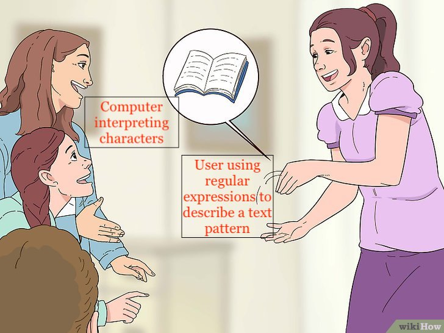

```{r setup, include=FALSE}
knitr::opts_chunk$set(echo = TRUE)
```
<!--
TO DO:
- "NEED TO KNOW SECTION"
    - REVIEW OF SPECIAL CHARACTERS IN NON-REGEX WAY
    - REVIEW OF SPECIAL CHARACTERS USING REGEX
- INTRODUCE STRING_VIEW & STRING_VIEW_ALL
- INTRODUCE REGEXPLAIN ADDIN
- INTRODUCE REGEX COMMON PATTERNS
-->
# Introduction
Load packages:
```{r, message=FALSE}
library(tidyverse)
library(stringr)
library(rtweet)
```

Resources used to create this lecture:  

- https://evoldyn.gitlab.io/evomics-2018/ref-sheets/R_strings.pdf 
- https://stat545.com/character-vectors.html#regular-expressions-with-stringr

## Dataset we will use 

We will be using Twitter data from the PAC-12 universities. This data was pulled from Twitter using the `rtweet` package. We will use the university admissions Twitter handle if there is one, or the main Twitter handle for the university if there isn't one:

```{r}
#Code to pull data from Twitter
# library(rtweet)
# 
# p12 <- c("uaadmissions", "FutureSunDevils", "caladmissions", "UCLAAdmission",
#          "futurebuffs", "uoregon", "BeaverVIP", "USCAdmission",
#          "engagestanford", "UtahAdmissions", "UW", "WSUPullman")
# p12_full_df <- search_tweets(paste0("from:", p12, collapse = " OR "), n = 500)
#
# saveRDS(p12_full_df, "p12_dataset.RDS")

# Load previously pulled Twitter data
# p12_full_df <- readRDS("p12_dataset.RDS")

p12_full_df <- readRDS(url("https://github.com/Rucla-ed/rclass2/raw/master/lectures/strings/p12_dataset.RDS", "rb"))
#glimpse(p12_full_df)

#Subset dataframe to a few variables
p12_df <- p12_full_df %>% select("user_id", "created_at", "screen_name", "text", "location")
head(p12_df)
```


## Why use Regular Expressions (Regex)  
[](https://www.rexegg.com/regex-humor.html)  

*Credit: Regex Humor ([Rex Egg](https://www.rexegg.com/regex-humor.html))*
  
\newline

# First things first

## Special characters  

Recall from the lecture on strings we talked about special characters and escape sequences.

> "A sequence in a string that starts with a `\` is called an **escape sequence** and allows us to include special characters in our strings."

*Credit: [Escape sequences](https://campus.datacamp.com/courses/string-manipulation-with-stringr-in-r/string-basics?ex=4) from DataCamp*

Common **special characters**:

- `\'`: literal single quote
- `\"`: literal double quote
- `\\`: literal backslash
- `\n`: newline
- `\t`: tab

<br>
__The `writeLines()` function__:

```{r, eval = FALSE}
?writeLines

# SYNTAX AND DEFAULT VALUES
writeLines(text, con = stdout(), sep = "\n", useBytes = FALSE)
```

- "`writeLines()` displays quotes and backslashes as they would be read, rather than as R stores them." (From [writeLines](https://www.rdocumentation.org/packages/base/versions/3.6.2/topics/writeLines) documentation)
- When we include **escape sequences** in the string, it is helpful to use `writeLines()` to see how the escaped string looks
- `writeLines()` will also output the string without showing the outer pair of double quotes that R uses to store it, so we only see the content of the string

<br>
<details><summary>**Example**: Escaping backslashes </summary>

```{r}
my_string <- "This backslash \\"
my_string
```

Using `writeLines()` shows us only the content of the string without the second backslash:

```{r}
writeLines(my_string)
```
</details>

<br>

<details><summary>**Example**: Escaping double quotes </summary>

```{r}
my_string <- "I called my mom and she said \"Echale ganas!\""
my_string
```

Using `writeLines()` shows us only the content of the string without the backslashes:

```{r}
writeLines(my_string)
```
</details>

<br>

### Escape special characters using Twitter data   

Let's take a look at some tweets from our PAC-12 universities. 

- Let's start by grabbing observations 1-3 from the `text` column.

```{r}
#Twitter example of \n newline special characters
p12_df$text[1:3]
```


- Using `writeLines()` we can see the contents of the strings as they would be read, rather than as R stores them.
```{r}
writeLines(p12_df$text[1:3])
```

<br>

- Using Twitter data you may encounter a lot of strings with double quotes.

    - In the example below, our string includes special characters `\"` and `\n` to escape the double quotes and the newline character. 
```{r}
#Twitter example of \" double quotes special characters
p12_df$text[107]
```

- Using `writeLines()` we can see the contents of the strings as they would be read, rather than as R stores them.  

    - We no longer see the escaped characters `\"` or `\n`
```{r}
writeLines(p12_df$text[107])
```

## Special characters in regular expressions  

| STRING  <br>  *(type string that represents regex)* | REGEX <br> *(to have this appear in your regex)* | MATCHES <br> *(to match with this text)* |
|--------------|-----------------|---------|
| `\\.`  |    `\.`    | . |
| `\\"`  |    `\"`   | " (double quote)|
| `\\'`  |    `\'`   | ' (single quote)|
| `\\!`  |    `\!`   | !  |
| `\\?`  |    `\?`   | ?  |
| `\\\\` |    `\\`   | \\\  |
| `\\(`  |    `\(`   | ( |
| `\\)`  |    `\)`   | ) |
| `\\{`  |    `\{`   | { |
| `\\}`  |    `\}`   |}  |
| `\\n`  |    `\n`   | new line (return)  |
| `\\t`  |    `\t`   | tab |
| `\\s`  |    `\s`   |  any whitespace |
| `\\S`  |    `\S`   |  any non-whitespace |
| `\\d`  |    `\d`   |  any digit |
| `\\D`  |    `\D`   |  any non-digit|
| `\\w`  |    `\w`   |  any word character |
| `\\W`  |    `\W`   |  any non-word character|
| `\\b`  |    `\b`   |  word-boundary |
| `\\B`  |    `\B`   |  non-word-boundary |


*Credit: [Working with strings in stringr](https://evoldyn.gitlab.io/evomics-2018/ref-sheets/R_strings.pdf) Cheat sheet*

### `str_view` and `str_view_all`

<br>
__The `str_c()` function__:

```{r, eval = FALSE}
?str_view

# SYNTAX AND DEFAULT VALUES
str_view(string, pattern, match = NA)
str_view_all(string, pattern, match = NA)
```

- Function: `str_view` shows the first match of a regex pattern; `str_view_all` shows all the matches of a regex pattern.
- Arguments:
  - `string`: Input vector. Either a character vector, or something coercible to one.
  - `pattern`: Pattern to look for.
      - The default interpretation is a regular expression, as described in stringi::stringi-search-regex. Control options with regex().
  - `match`: If TRUE, shows only strings that match the pattern. If FALSE, shows only the strings that don't match the pattern. Otherwise (the default, NA) displays both matches and non-matches.


```{r}
str_view(p12_df$text[107], regex('\\"'))
```

```{r}
str_view(p12_df$text[107], "\\n")
```

```{r}
str_view_all(p12_df$text[107], "\\.")
```

```{r}
str_view_all(p12_df$text[107], "\\s")
```

```{r}
str_view_all(p12_df$text[107], "\\b")
```

```{r}
str_view_all(p12_df$text[107], "\\d")
```

## RegExplain Addin

# What are regular expressions? 

What are regular expressions? from [Geeks for Geeks](https://www.geeksforgeeks.org/write-regular-expressions/)

- Regular expressions are "a sequence of characters that define a search pattern" similar to the [command + f] function you use to find text in a pdf or word document. 
    
    {width=60%}

*Credit: Crystal Han, Ozan Jaquette, & Karina Salazar ([Recruiting the Out-Of-State University](https://emraresearch.org/sites/default/files/2019-03/joyce_report.pdf))*

\newline

- You could think of regular expressions like playing a game of charades. Assume a player grabs a playing card with an image of a person reading a book. Their task is to pantomine this action (reading a book) so that other players can guess what they are doing. Through the use of physical expressions and symbols, the player with the card is helping the other players guess what playing card they got. 

    {width=55%}  
*Credit: wikiHow staff ([How to Play Charades](https://www.wikihow.com/Play-Charades))*

    - The player with the playing card is the __user__.
    - The players trying to guess the user's card is your __computer__.
    - The user uses physical expression and symbols (__regular expressions__) to tell the players (__computer__) what expression/word they have (__characters you are looking for in a text__). 

[^4]: https://www.geeksforgeeks.org/write-regular-expressions/


# Regular expression characters {.tabset .tabset-fade .tabset-pills}

Some common regular expression patterns include (not inclusive):  

* Character classes
* Anchors  
* Quantifiers  
* Groups and ranges  

source: https://cheatography.com/davechild/cheat-sheets/regular-expressions/ 

**Select each tab**


## Character classes
Character  Description     
---------- ----------------------------------------------------------
\\c         Control character
\\s         White space
\\S         Not white space
\\d         Digit
\\D         Not digit
\\w         Word
\\W         Not word
\\x         Hexadecimal digit
\\O         Octal digit

```{r}
d <- c("25 days", "Hi, my name is", "What is your name?")
```

Using the escape character followed by the letter `s` and then the letter `d`, we are searching for a white space and a letter `d`.
```{r}
grepl("\\sd", d) 
```

Combining some characters we learned earlier like the `^` , `+`, and the `\\s`, we are searching a character string that begins with a one or more digits followed by a white space.
```{r}
grepl("^\\d+\\s", d)
```

Give it a try. Use the `grepl` function to search for the word `name`.  


***  
\newline  

## Anchors

Character  Description     
---------- ----------------------------------------------------------  
     ^       Start of string, or start of line in multi-line pattern        
    \\A                                              Start of string      
     $           End of string, or end of line in multi-line pattern    
    \\Z                                                End of string
    \\b                                                Word boundary
    \\B                                            Not word boundary
    \\<                                                Start of word
    \\>                                                  End of word  

The `grep` and `grepl` functions are part of Base R. Notice the difference between their output. `grepl` returns a logical vector (TRUE, FALSE) whereas `grep` returns numbers which represent the index location of the pattern. I created this character vector and assigned it the name `a`. There are five character objects inside this vector. The `grep` function tells R to look for the pattern where the object starts with the letter a ("^a"), returning the values 1, 2, 5.  
```{r}
a <- c("aabd", "aacd", "caad", "cbde", "abcb")

grepl("^a", a) #Logical vector
grep("^a", a) #indexed location 
```

Give it a try. Use the `grep` function to look for instances in this vector that end with the letter `d`. What regular expression character would you use?

***
\newline

## Quantifiers


Character  Description     Code      Result
---------- ------------    --------  -------
*          0 or more       {3}       Exactly 3
+          1 or more       {3,}      3 or more
?          0 or 1          {3,5}     3, 4 or 5  
\\         Escape character  \\s     white space


We use quantifiers to specify the number of times we want to search for a particular pattern. 
```{r}
b <- c("aaa", "abc", "bca", "dd c", "abbc")
```
In the first `grepl` function below we use the `+` to search for patterns in the `b` vector where the beginning of a string begins with an `a` one or more times.
```{r}
grepl("^a+", b) #searching for pattern where objects start with a 1 or more times
```
The second `grepl` function is searching for the letter `a` exactly three times. 
```{r}
grepl("a{3}", b) #searching for pattern that has exactly 3 a's
```
Lastly, notice how we use two `\\` backward slashes to escape the letter `s` suggesting we are referring to white space and not the literal letter s. More on this later.
```{r}
grepl("\\sc", b) #searching for pattern that has a white space followed by a c
```

Give it a try, Use the `grepl` function to look for instances in this vector that have 1 or more instances of the letter `b`. What regular expression character would you use?  

***  
\newline  

## Groups and ranges

Character  Description     
---------- ----------------------------------------------------------
.          Any character except new line (\n)
(a|b)      a or b
(...)      Group
(?:...)    Passive (non-capturing) group
[abc]      Range (a or b or c)
[^abc]     Not (a or b or c)
[a-z]      Lower case letter from a to q
[A-Z]      Upper case letter from A to Q
[0-7]      Digit from 0 to 7
\\x         Group/subpattern number "x"

We use grouping characters to specify a range of characters.  
```{r}
c <- c("Is", "it", "Saturday", "today", "?")
```

We use parentheses and a | to search for a **or** o.
```{r}
grepl("(a|o)", c) #search for a or o in a pattern
```

The second `grepl` function with square brackets indicates a range. In the code below, we are searching for the letters `a`, `i`, or `o`.
```{r}
grepl("[aio]", c)
```

The square brackets with the range from `a-z` indicate any lowercase alphabetical letters.
```{r}
grepl("[a-z]", c)
```

Give it a try. Use the `grepl` function to look for instances in this vector that begin with the letter `i` or end with the letter `y`. What regular expression character would you use?  


***  
\newline


