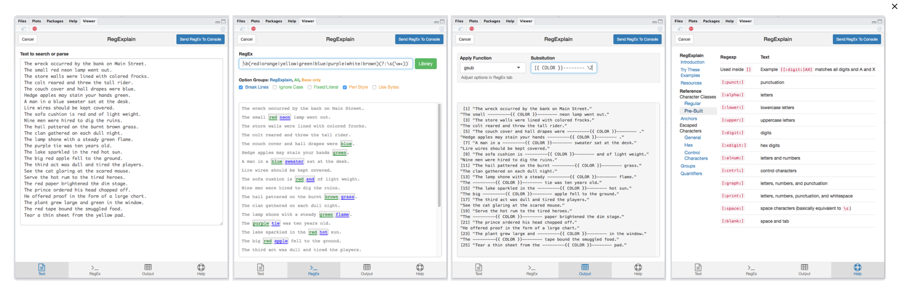

# Introduction

Load packages:
```{r, message=FALSE}
library(tidyverse)
library(stringr)  # package for manipulating strings (part of tidyverse)
library(lubridate)  # package for working with dates and times
```

Resources used to create this lecture:

- https://r4ds.had.co.nz/strings.html
- https://www.tutorialspoint.com/r/r_strings.htm
- https://swcarpentry.github.io/r-novice-inflammation/13-supp-data-structures/
- https://www.statmethods.net/input/datatypes.html
- https://www.stat.berkeley.edu/~s133/dates.html

## Dataset we will use

We will use `rtweet` to pull Twitter data from the PAC-12 universities. We will use the university admissions Twitter handle if there is one, or the main Twitter handle for the university if there isn't one:

```{r}
# library(rtweet)
# 
# p12 <- c("uaadmissions", "FutureSunDevils", "caladmissions", "UCLAAdmission",
#          "futurebuffs", "uoregon", "BeaverVIP", "USCAdmission",
#          "engagestanford", "UtahAdmissions", "UW", "WSUPullman")
# p12_full_df <- search_tweets(paste0("from:", p12, collapse = " OR "), n = 500)
#
# saveRDS(p12_full_df, "p12_dataset.RDS")

# Load previously pulled Twitter data
# p12_full_df <- readRDS("p12_dataset.RDS")
p12_full_df <- readRDS(url("https://github.com/Rucla-ed/rclass2/raw/master/lectures/strings/p12_dataset.RDS", "rb"))
glimpse(p12_full_df)

p12_df <- p12_full_df %>% select("user_id", "created_at", "screen_name", "text", "location")
head(p12_df)
```


# Data structures and types

What is an **object**?

- Everything in R is an object
- We can classify objects based on their class and type
  - The class of the object determines what kind of functions we can apply to it
- Objects may be combined to form data structures

[{width=400px}](https://r4ds.had.co.nz/vectors.html)

*Credit: [R for Data Science](https://r4ds.had.co.nz/vectors.html)*

<br>
Basic **data structures**:

- [Atomic vectors](#atomtic-vectors)
- [Lists](#lists)
  - [Dataframes](#dataframes)
  
Basic **data types**:

- Logical (`TRUE`, `FALSE`)
- Numeric (e.g., `5`, `2.5`)
- Integer (e.g., `1L`, `4L`, where `L` tells R to store as `integer` type)
- Character (e.g., `"R is fun"`)

Functions for investigating R objects (From [Data Types and Structures](https://swcarpentry.github.io/r-novice-inflammation/13-supp-data-structures/))

- `str()`: Compactly display the internal structure of an R object
- `class()`: What kind of object is it (high-level)?
- `typeof()`: What is the object's data type (low-level)?

## Atomtic vectors

What are **atomic vectors**?

- **Atomic vectors** are objects that contains elements
- Elements must be of the same data type (i.e., _homogeneous_)
- The `class()` and `typeof()` a vector describes the elements it contains

<br>
<details><summary>**Example**: Investigating logical vectors</summary>

```{r}
v <- c(TRUE, FALSE, FALSE, TRUE)
str(v)
class(v)
typeof(v)
```

</details>

<br>
<details><summary>**Example**: Investigating numeric vectors</summary>

```{r}
v <- c(1, 3, 5, 7)
str(v)
class(v)
typeof(v)
```
</details>

<br>
<details><summary>**Example**: Investigating integer vectors</summary>

```{r}
v <- c(1L, 3L, 5L, 7L)
str(v)
class(v)
typeof(v)
```

</details>

<br>
<details><summary>**Example**: Investigating character vectors</summary>

Each element in a `character` vector is a **string** (covered in next section):

```{r}
v <- c("a", "b", "c", "d")
str(v)
class(v)
typeof(v)
```

</details>


## Lists

What are **lists**?

- **Lists** are objects that contains elements
- Elements do not need to be of the same type (i.e., _heterogeneous_)
  - Elements can be atomic vectors or even other lists
- The `class()` and `typeof()` a list is `list`

<br>
<details><summary>**Example**: Investigating heterogeneous lists</summary>

```{r}
l <- list(2.5, "abc", TRUE, c(1L, 2L, 3L))
str(l)
class(l)
typeof(l)
```

</details>

<br>
<details><summary>**Example**: Investigating nested lists</summary>

```{r}
l <- list(list(TRUE, c(1, 2, 3), list(c("a", "b", "c"))), FALSE, 10L)
str(l)
class(l)
typeof(l)
```

</details>


### Dataframes

What are **dataframes**?

- **Dataframes** are a special kind of **list** with the following characteristics:
  - Each element is a **vector** (i.e., _a column in the dataframe_)
  - The element should be named (i.e., _column name in the dataframe_)
  - Each of the vectors must be the same length (i.e., _same number of rows in the dataframe_)
  - The data type of each vector may be different
- Dataframes can be created using the function `data.frame()`
- The `class()` of  a dataframe is `data.frame`
- The `typeof()` a dataframe is `list`


<br>
<details><summary>**Example**: Investigating dataframe</summary>

```{r}
df <- data.frame(
  colA = c(1, 2, 3),
  colB = c("a", "b", "c"),
  colC = c(TRUE, FALSE, TRUE),
  stringsAsFactors = FALSE
)
df
str(df)
class(df)
typeof(df)
```

</details>

## Converting between classes

Functions for converting between classes:

- `as.logical()`: Convert to `logical`
- `as.numeric()`: Convert to `numeric`
- `as.integer()`: Convert to `integer`
- `as.character()`: Convert to `character`
- `as.list()`: Convert to `list`
- `as.data.frame()`: Convert to `data.frame`


<br>
<details><summary>**Example**: Using `as.logical()` to convert to `logical`</summary>

Character vector coerced to logical vector:

```{r}
# Only "TRUE"/"FALSE", "True"/"False", "T"/"F", "true"/"false" are able to be coerced to logical type
as.logical(c("TRUE", "FALSE", "True", "False", "true", "false", "T", "F", "t", "f", ""))
```

Numeric vector coerced to logical vector:

```{r}
# 0 is treated as FALSE, while all other numeric values are treated as TRUE
as.logical(c(0, 0.0, 1, -1, 20, 5.5))
```

</details>

<br>
<details><summary>**Example**: Using `as.numeric()` to convert to `numeric`</summary>

Logical vector coerced to numeric vector:

```{r}
# FALSE is mapped to 0 and TRUE is mapped to 1
as.numeric(c(FALSE, TRUE))
```

Character vector coerced to numeric vector:

```{r, warning = FALSE}
# Strings containing numeric values can be coerced to numeric (leading 0's are dropped) 
# All other characters become NA
as.numeric(c("0", "007", "2.5", "abc", "."))
```

</details>

<br>
<details><summary>**Example**: Using `as.integer()` to convert to `integer`</summary>

Logical vector coerced to integer vector:

```{r}
# FALSE is mapped to 0 and TRUE is mapped to 1
as.integer(c(FALSE, TRUE))
```

Character vector coerced to integer vector:

```{r, warning = FALSE}
# Strings containing numeric values can be coerced to integer (leading 0's are dropped, decimals are truncated) 
# All other characters become NA
as.integer(c("0", "007", "2.5", "abc", "."))
```

Numeric vector coerced to integer vector:

```{r, warning = FALSE}
# All decimal places are truncated
as.integer(c(0, 2.1, 10.5, 8.8, -1.8))
```

</details>

<br>
<details><summary>**Example**: Using `as.character()` to convert to `character`</summary>

Logical vector coerced to character vector:

```{r}
as.character(c(FALSE, TRUE))
```

Numeric vector coerced to character vector:

```{r, warning = FALSE}
as.character(c(-5, 0, 2.5))
```

Integer vector coerced to character vector:

```{r, warning = FALSE}
as.character(c(-2L, 0L, 10L))
```

</details>

<br>
<details><summary>**Example**: Using `as.list()` to convert to `list`</summary>

Atomic vectors coerced to list:

```{r}
# Logical vector
as.list(c(TRUE, FALSE))

# Character vector
as.list(c("a", "b", "c"))

# Numeric vector
as.list(1:3)
```

</details>

<br>
<details><summary>**Example**: Using `as.data.frame()` to convert to `data.frame`</summary>

Lists coerced to dataframe:

```{r}
# Create a list
l <- list(A = c("x", "y", "z"), B = c(1, 2, 3))
str(l)

# Convert to class `data.frame`
df <- as.data.frame(l, stringsAsFactors = F)
str(df)
```

</details>

# String basics

What are **strings**?

- String is a type of data in R
- You can create strings using either single quotes (`'`) or double quotes (`"`)
  - Internally, R stores strings using double quotes
- The `class()` and `typeof()` a string is `character`

<br>
**Example**: Creating string using single quotes

Notice how R stores strings using double quotes internally:

```{r}
my_string <- 'This is a string'
my_string
```

<br>
**Example**: Creating string using double quotes

```{r}
my_string <- "Strings can also contain numbers: 123"
my_string
```

<br>
**Example**: Checking class and type of strings

```{r}
class(my_string)
typeof(my_string)
```


## Escape sequence and `writeLines()`

> "A sequence in a string that starts with a `\` is called an **escape sequence** and allows us to include special characters in our strings."

*Credit: [Escape sequences](https://campus.datacamp.com/courses/string-manipulation-with-stringr-in-r/string-basics?ex=4) from DataCamp*

Common **special characters**:

- `\'`: literal single quote
- `\"`: literal double quote
- `\\`: literal backslash
- `\n`: newline
- `\t`: tab


<br>
__The `writeLines()` function__:

```{r, eval = FALSE}
?writeLines

# SYNTAX AND DEFAULT VALUES
writeLines(text, con = stdout(), sep = "\n", useBytes = FALSE)
```

- "`writeLines()` displays quotes and backslashes as they would be read, rather than as R stores them." (From [writeLines](https://www.rdocumentation.org/packages/base/versions/3.6.2/topics/writeLines) documentation)
- When we include **escape sequences** in the string, it is helpful to use `writeLines()` to see how the escaped string looks
- `writeLines()` will also output the string without showing the outer pair of double quotes that R uses to store it, so we only see the content of the string


<br>
<details><summary>**Example**: Escaping single quotes</summary>

```{r}
my_string <- 'Escaping single quote \' within single quotes'
my_string
```

Alternatively, we could've just created the string using double quotes:

```{r}
my_string <- "Single quote ' within double quotes does not need escaping"
my_string
```

Using `writeLines()` shows us only the content of the string without the outer pair of double quotes that R uses to store strings:

```{r}
writeLines(my_string)
```
</details>

<br>
<details><summary>**Example**: Escaping double quotes</summary>

```{r}
my_string <- "Escaping double quote \" within double quotes"
my_string
```

Alternatively, we could've just created the string using single quotes:

```{r}
my_string <- 'Double quote " within single quotes does not need escaping'
my_string
```

Notice how the backslash still showed up in the above output to escape our double quote from the outer pair of double quotes that R uses to store the string. This is no longer an issue if we use `writeLines()` to only show the string content:

```{r}
writeLines(my_string)
```
</details>

<br>
<details><summary>**Example**: Escaping double quotes within double quotes </summary>

```{r}
my_string <- "I called my mom and she said \"Echale ganas!\""
my_string
```

Using `writeLines()` shows us only the content of the string without the backslashes:

```{r}
writeLines(my_string)
```
</details>


<br>
<details><summary>**Example**: Escaping backslashes</summary>

To include a literal backslash in the string, we need to escape the backslash with another backslash:

```{r}
my_string <- "The executable is located in C:\\Program Files\\Git\\bin"
my_string
```

Use `writeLines()` to see the escaped string:

```{r}
writeLines(my_string)
```
</details>

<br>
<details><summary>**Example**: Other special characters</summary>

```{r}
my_string <- "A\tB\nC\tD"
my_string
```

Use `writeLines()` to see the escaped string:

```{r}
writeLines(my_string)
```
</details>

<br>

### Escape special characters using Twitter data   

Let's take a look at some tweets from our PAC-12 universities. 

- Let's start by grabbing observations 1-3 from the `text` column.

```{r}
#Twitter example of \n newline special characters
p12_df$text[1:3]
```


- Using `writeLines()` we can see the contents of the strings as they would be read, rather than as R stores them.
```{r}
writeLines(p12_df$text[1:3])
```

<br>
<details><summary>**Example**: Escaping double quotes using Twitter data </summary>  

- Using Twitter data you may encounter a lot of strings with double quotes.

    - In the example below, our string includes special characters `\"` and `\n` to escape the double quotes and the newline character. 
```{r}
#Twitter example of \" double quotes special characters
p12_df$text[24]
```

- Using `writeLines()` we can see the contents of the strings as they would be read, rather than as R stores them.  

    - We no longer see the escaped characters `\"` or `\n`
```{r}
writeLines(p12_df$text[24])
```
</details>
<br>

## Special characters in regular expressions  

There are special characters in regular strings as we have seen above and there are also certain characters in regex that have a special meaning (table below).

> What if you really need the plus sign to be a literal plus sign and not a regex quantifier? You will need to escape it by prepending a backslash. But wait … there’s more! Before a regex is interpreted as a regular expression, it is also interpreted by R as a string. And backslash is used to escape there as well. So, in the end, you need to preprend two backslashes in order to match a literal plus sign in a regex.

*Credit: [Escaping sequences](https://stat545.com/character-vectors.html#escaping) from Stat 545*


| STRING  <br>  *(type string that represents regex)* | REGEX <br> *(to have this appear in your regex)* | MATCHES <br> *(to match with this text)* |
|--------------|-----------------|---------|
| `\\.`  |    `\.`    | . |
| `\\"`  |    `\"`   | " (double quote)|
| `\\'`  |    `\'`   | ' (single quote)|
| `\\!`  |    `\!`   | !  |
| `\\?`  |    `\?`   | ?  |
| `\\\\` |    `\\`   | \\\  |
| `\\(`  |    `\(`   | ( |
| `\\)`  |    `\)`   | ) |
| `\\{`  |    `\{`   | { |
| `\\}`  |    `\}`   |}  |
| `\\n`  |    `\n`   | new line (return)  |
| `\\t`  |    `\t`   | tab |
| `\\s`  |    `\s`   |  any whitespace |
| `\\S`  |    `\S`   |  any non-whitespace |
| `\\d`  |    `\d`   |  any digit |
| `\\D`  |    `\D`   |  any non-digit|
| `\\w`  |    `\w`   |  any word character |
| `\\W`  |    `\W`   |  any non-word character|
| `\\b`  |    `\b`   |  word-boundary |
| `\\B`  |    `\B`   |  non-word-boundary |


*Credit: [Working with strings in stringr](https://evoldyn.gitlab.io/evomics-2018/ref-sheets/R_strings.pdf) Cheat sheet*


### Escape special character backslashes

> If \\ is used as an escape character in regular expressions, how do you match a literal \\? Well you need to escape it, creating the regular expression \\\\. To create that regular expression, you need to use a string, which also needs to escape \\ . That means to match a literal \\ you need to write "\\\\\\\\" — you need four backslashes to match one!

*Credit: [R for Data Science](https://r4ds.had.co.nz/strings.html#basic-matches) Strings Chapter*

The character vector below has one, two, three, and four backslashes.  

- Notice once we print this vector, the single backslash returns an empty string and the three backslashes return two backslashes.
```{r}
backslash <- c("\ ","\\", "\\\ ", "\\\\")

backslash
```

<br>

- Using `writeLines()` we can see view the contents of the strings.
```{r}
writeLines(backslash)
```

```{r}
text <- "This is a backslash \\"
str_view(string = text, pattern = "\\\\")
```
<br>

### `str_view` and `str_view_all`

<br>
__The `str_c()` function__:

```{r, eval = FALSE}
?str_view

# SYNTAX AND DEFAULT VALUES
str_view(string, pattern, match = NA)
str_view_all(string, pattern, match = NA)
```

- Function: `str_view` shows the first match of a regex pattern; `str_view_all` shows all the matches of a regex pattern.
- Arguments:
  - `string`: Input vector. Either a character vector, or something coercible to one.
  - `pattern`: Pattern to look for.
      - The default interpretation is a regular expression, as described in stringi::stringi-search-regex. Control options with regex().
  - `match`: If TRUE, shows only strings that match the pattern. If FALSE, shows only the strings that don't match the pattern. Otherwise (the default, NA) displays both matches and non-matches.

<br>

`str_view` will show us the first regex pattern match

```{r}
str_view(string = p12_df$text[119], pattern = ('\\"'))
```

Notice how we can see all the regex pattern matches with `str_view_all`
```{r}
str_view_all(string = p12_df$text[119], pattern = ('\\"'))
```


<br>

<details><summary>**Example**: `str_view` & `str_view_all` regex for newline </summary> 
```{r}
str_view_all(string = p12_df$text[119], pattern = ("\\n"))
```
</details>

<br>

<details><summary>**Example**: `str_view` & `str_view_all` regex for period </summary> 
```{r}
str_view_all(string = p12_df$text[119], pattern = ("\\."))
```
</details>

<br>

<details><summary>**Example**: `str_view` & `str_view_all` regex for white space </summary> 
```{r}
str_view_all(string = p12_df$text[119], pattern = ("\\s"))
```
</details>

<br>

<details><summary>**Example**: `str_view` & `str_view_all` regex for word bound </summary> 
```{r}
str_view_all(string = p12_df$text[119], pattern = ("\\b"))
```
</details>

<br>

<details><summary>**Example**: `str_view` & `str_view_all` regex for digit(s) </summary> 
```{r}
str_view_all(string = p12_df$text[119], pattern = ("\\d"))
```
</details>

<br>

## RegExplain Addin  

> Regular expressions are tricky. RegExplain makes it easier to see what you’re doing.

RegExplain is an RStudio addin that allows the user to check their regex matching functions interactively.


*Credit: Garrick Aden-Buie ([RegExplain](https://www.garrickadenbuie.com/project/regexplain/))*


[](https://www.garrickadenbuie.com/project/regexplain/) 


Installation
```{r eval=FALSE}
devtools::install_github("gadenbuie/regexplain")
library(regexplain)
```


# `stringr` package

> "A consistent, simple and easy to use set of wrappers around the fantastic `stringi` package. All function and argument names (and positions) are consistent, all functions deal with `NA`'s and zero length vectors in the same way, and the output from one function is easy to feed into the input of another."

*Credit: `stringr` [R documentation](https://www.rdocumentation.org/packages/stringr/versions/1.4.0)*

The `stringr` package:

- The `stringr` package is based off the `stringi` package and is part of __Tidyverse__ 
- `stringr` contains functions to work with strings
- For many functions in the `stringr` package, there are equivalent "base R" functions 
- But `stringr` functions all follow the same rules, while rules often differ across different "base R" string functions, so we will focus exclusively on `stringr` functions
- Most `stringr` functions start with `str_` (e.g., `str_length`)


## `str_length()`

<br>
__The `str_length()` function__:

```{r, eval = FALSE}
?str_length

# SYNTAX
str_length(string)
```

- Function: Find string length
- Arguments:
  - `string`: Character vector (or vector coercible to character)
- Note that `str_length()` calculates the length of a string, whereas the `length()` function (which is not part of `stringr` package) calculates the number of elements in an object

<br>
<details><summary>**Example**: Using `str_length()` on string</summary>

```{r}
str_length("cats")
```

Compare to `length()`, which treats the string as a single object:

```{r}
length("cats")
```

</details>

<br>
<details><summary>**Example**: Using `str_length()` on character vector</summary>

```{r}
str_length(c("cats", "in", "hat"))
```

Compare to `length()`, which finds the number of elements in the vector:

```{r}
length(c("cats", "in", "hat"))
```

</details>

<br>
<details><summary>**Example**: Using `str_length()` on other vectors coercible to character</summary>

Logical vectors can be coerced to character vectors:

```{r}
str_length(c(TRUE, FALSE))
```

Numeric vectors can be coerced to character vectors:

```{r}
str_length(c(1, 2.5, 3000))
```

Integer vectors can be coerced to character vectors:

```{r}
str_length(c(2L, 100L))
```

</details>

<br>
<details><summary>**Example**: Using `str_length()` on dataframe column</summary>

Recall that the columns in a dataframe are just vectors, so we can use `str_length()` as long as the vector is coercible to character type. Let's look at the `screen_name` column from the `p12_df`:

```{r}
# `p12_df` is a dataframe object
str(p12_df)

# `screen_name` column is a character vector
str(p12_df$screen_name)
```

<br>
**[Base R method]** Use `str_length()` to calculate the length of each `screen_name`:

```{r}
# Let's focus on just the unique screen names
unique(p12_df$screen_name)

str_length(unique(p12_df$screen_name))
```

<br>
**[Tidyverse method]** Use `str_length()` to calculate the length of each `screen_name`:

```{r}
# Let's focus on just the unique screen names
p12_df %>% select(screen_name) %>% unique()

p12_df %>% select(screen_name) %>% unique() %>% str_length()
```

Notice that the above line does not work as expected because we passed in a dataframe to `str_length()` and it is trying to coerce that to character:

```{r}
class(p12_df %>% select(screen_name) %>% unique())
```

An alternative way is to add a column to the dataframe that contains the result of applying `str_length()` to the `screen_name` vector:

```{r}
p12_df %>% select(screen_name) %>% unique() %>% 
  mutate(screen_name_len = str_length(screen_name))
```

</details>

## `str_c()`

<br>
__The `str_c()` function__:

```{r, eval = FALSE}
?str_c

# SYNTAX AND DEFAULT VALUES
str_c(..., sep = "", collapse = NULL)
```

- Function: Concatenate strings between vectors (element-wise)
- Arguments:
  - The input is one or more character vectors (or vectors coercible to character)
    - Zero length arguments are removed
    - Short arguments are recycled to the length of the longest
  - `sep`: String to insert between input vectors
  - `collapse`: Optional string used to combine input vectors into single string

<br>
<details><summary>**Example**: Using `str_c()` on strings</summary>

Each string input is treated as a character vector of size 1:

```{r}
str_c("a", "b", "c")
```

We can use `sep` to specify how the elements are separated:

```{r}
str_c("a", "b", "c", sep = "~")
```

Note that we can also use any other input that can be coerced to character:

```{r}
str_c(TRUE, 1.5, 2L, "X")
```

</details>

<br>
<details><summary>**Example**: Using `str_c()` on single vector</summary>

Since we only provided one input vector, each individual element has nothing to concatenate with:

```{r}
str_c(c("a", "b", "c"))
```

But we can still specify the `collapse` argument to collapse the elements to a single string:

```{r}
str_c(c("a", "b", "c"), collapse = "|")
```

</details>

<br>
<details><summary>**Example**: Using `str_c()` on multiple vectors</summary>

When multiple vectors are provided, they are joined together element-wise, recycling the elements of the shorter vectors:

```{r, warning = FALSE}
str_c("#", c("a", "b", "c", "d"), c(1, 2, 3), c(TRUE, FALSE))
```

We can specify `sep` and `collapse`:

```{r, warning = FALSE}
str_c("#", c("a", "b", "c", "d"), c(1, 2, 3), c(TRUE, FALSE), sep = "~", collapse = "|")
```

</details>

<br>
<details><summary>**Example**: Using `str_c()` on dataframe columns</summary>

Let's combine the `user_id` and `screen_name` columns from `p12_df`. We'll focus on unique Twitter handles:

```{r}
p12_unique_df <- p12_df %>% select(user_id, screen_name) %>% unique()
p12_unique_df
```

<br>
**[Base R method]** Use `str_c()` to combine `user_id` and `screen_name`:

```{r}
str_c(p12_unique_df$user_id, "=", p12_unique_df$screen_name, sep = " ", collapse = ", ")
```

<br>
**[Tidyverse method]** Use `str_c()` to combine `user_id` and `screen_name`:

```{r}
p12_unique_df %>% mutate(twitter_handle = str_c("User #", user_id, " is @", screen_name))
```

</details>

## `str_sub()`

<br>
__The `str_sub()` function__:

```{r, eval = FALSE}
?str_sub

# SYNTAX AND DEFAULT VALUES
str_sub(string, start = 1L, end = -1L)
str_sub(string, start = 1L, end = -1L, omit_na = FALSE) <- value
```

- Function: Subset strings
- Arguments:
  - `string`: Character vector (or vector coercible to character)
  - `start`: Position of first character to be included in substring (default: `1`)
  - `end`: Position of last character to be included in substring (default: `-1`)
    - Negative index means counting backwards from the end of the string
    - If an element in the vector is shorter than the specified `end`, it will just include all the available characters that it does have
  - `omit_na`: If `TRUE`, missing values in any of the arguments provided will result in an unchanged input
- When `str_sub()` is used in the assignment form, you can replace the subsetted part of the string with a `value` of your choice
  - If an element in the vector is too short to meet the subset specification, the replacement `value` will be concatenated to the end of that element
  - Note that this modifies your input vector directly, so you must have the vector saved to a variable (see example below)


<br>
<details><summary>**Example**: Using `str_sub()` to subset strings</summary>

If no `start` and `end` positions are specified, `str_sub()` will by default return the entire (original) string:

```{r}
str_sub(c("abcdefg", 123, TRUE))
```

Note that if an element is shorter than the specified `end` (i.e., `123` in the example below), it will just include all the available characters that it does have:

```{r}
str_sub(c("abcdefg", 123, TRUE), start = 2, end = 4)
```

Remember we can also use negative index to count the position starting from the back:

```{r}
str_sub(c("abcdefg", 123, TRUE), start = 2, end = -2)
```

</details>

<br>
<details><summary>**Example**: Using `str_sub()` to replace strings</summary>

If no `start` and `end` positions are specified, `str_sub()` will by default return the original string, so the entire string would be replaced:

```{r}
v <- c("A", "AB", "ABC", "ABCD", "ABCDE")
str_sub(v) <- "*"
v
```

If an element in the vector is too short to meet the subset specification, the replacement `value` will be concatenated to the end of that element:

```{r}
v <- c("A", "AB", "ABC", "ABCD", "ABCDE")
str_sub(v, 2, 3) <- "*"
v
```

Note that because the replacement form of `str_sub()` modifies the input vector directly, we need to save it in a variable first. Directly passing in the vector to `str_sub()` would give us an error:

```{r, eval = FALSE}
# Does not work
str_sub(c("A", "AB", "ABC", "ABCD", "ABCDE")) <- "*"
```

</details>

<br>
<details><summary>**Example**: Using `str_sub()` on dataframe column</summary>

We can use `as.character()` to turn the `created_at` value to a string, then use `str_sub()` to extract out various date/time components from the string:

```{r}
p12_datetime_df <- p12_df %>% select(created_at) %>%
  mutate(
      dt_chr = as.character(created_at),
      date_chr = str_sub(dt_chr, 1, 10),
      yr_chr = str_sub(dt_chr, 1, 4),
      mth_chr = str_sub(dt_chr, 6, 7),
      day_chr = str_sub(dt_chr, 9, 10),
      hr_chr = str_sub(dt_chr, -8, -7),
      min_chr = str_sub(dt_chr, -5, -4),
      sec_chr = str_sub(dt_chr, -2, -1)
    )
p12_datetime_df
```

</details>

## Other `stringr` functions

Other useful `stringr` functions:

- `str_to_upper()`: Turn strings to uppercase
- `str_to_lower()`: Turn strings to lowercase
- `str_sort()`: Sort a character vector
- `str_trim()`: Trim whitespace from strings (including `\n`, `\t`, etc.)
- `str_pad()`: Pad strings with specified character


<br>
<details><summary>**Example**: Using `str_to_upper()` to turn strings to uppercase</summary>

Turn column names of `p12_df` to uppercase:

```{r}
# Column names are originally lowercase
names(p12_df)

# Turn column names to uppercase
names(p12_df) <- str_to_upper(names(p12_df))
names(p12_df)
```

</details>

<br>
<details><summary>**Example**: Using `str_to_lower()` to turn strings to lowercase</summary>

Turn column names of `p12_df` to lowercase:

```{r}
# Column names are originally uppercase
names(p12_df)

# Turn column names to lowercase
names(p12_df) <- str_to_lower(names(p12_df))
names(p12_df)
```

</details>

<br>
<details><summary>**Example**: Using `str_sort()` to sort character vector</summary>

Sort the vector of `p12_df` column names:

```{r}
# Before sort
names(p12_df)

# Sort alphabetically (default)
str_sort(names(p12_df))

# Sort reverse alphabetically
str_sort(names(p12_df), decreasing = TRUE)
```

</details>

<br>
<details><summary>**Example**: Using `str_trim()` to trim whitespace from string</summary>

```{r}
# Trim whitespace from both left and right sides (default)
str_trim(c("\nABC ", " XYZ\t"))

# Trim whitespace from left side
str_trim(c("\nABC ", " XYZ\t"), side = "left")

# Trim whitespace from right side
str_trim(c("\nABC ", " XYZ\t"), side = "right")
```

</details>

<br>
<details><summary>**Example**: Using `str_pad()` to pad string with character</summary>

Let's say we have a vector of zip codes that has lost all leading 0's. We can use `str_pad()` to add that back in:

```{r}
# Pad the left side of strings with "0" until width of 5 is reached
str_pad(c(95035, 90024, 5009, 5030), width = 5, side = "left", pad = "0")
```

</details>


# Dates and times

> "Date-time data can be frustrating to work with in R. R commands for date-times are generally unintuitive and change depending on the type of date-time object being used. Moreover, the methods we use with date-times must be robust to time zones, leap days, daylight savings times, and other time related quirks, and R lacks these capabilities in some situations. Lubridate makes it easier to do the things R does with date-times and possible to do the things R does not."

*Credit: `lubridate` [documentation](https://lubridate.tidyverse.org/)*

How are dates and times stored in R? (From [Dates and Times in R](https://www.stat.berkeley.edu/~s133/dates.html))

- The `Date` class is used for storing dates
  - "Internally, `Date` objects are stored as the number of days since January 1, 1970, using negative numbers for earlier dates. The `as.numeric()` function can be used to convert a `Date` object to its internal form."
- POSIX classes can be used for storing date plus times
  - "The `POSIXct` class stores date/time values as the number of seconds since January 1, 1970"
  - "The `POSIXlt` class stores date/time values as a list of components (hour, min, sec, mon, etc.) making it easy to extract these parts"
- There is no native R class for storing only time


Why use date/time objects?

- Using date/time objects makes it easier to fetch or modify various date/time components (e.g., year, month, day, day of the week)
  - Compared to if the date/time is just stored in a string, these components are not as readily accessible and need to be parsed
- You can perform certain arithmetics with date/time objects (e.g., find the "difference" between date/time points)


## Creating date/time objects

### Creating date/time objects by parsing input

Functions that create date/time objects **by parsing character or numeric input**:

- Create `Date` object: `ymd()`, `ydm()`, `mdy()`, `myd()`, `dmy()`, `dym()`
  - `y` stands for year, `m` stands for month, `d` stands for day
  - Select the function that represents the order in which your date input is formatted, and the function will be able to parse your input and create a `Date` object
- Create `POSIXct` object: `ymd_h()`, `ymd_hm()`, `ymd_hms()`, etc.
  - `h` stands for hour, `m` stands for minute, `s` stands for second
  - For any of the previous 6 date functions, you can append `h`, `hm`, or `hms` if you want to provide additional time information in order to create a `POSIXct` object
  - To force a `POSIXct` object without providing any time information, you can just provide a timezone (using `tz`) to one of the date functions and it will assume midnight as the time
  - You can use `Sys.timezone()` to get the timezone for your location
  

<br>
<details><summary>**Example**: Creating `Date` object from character or numeric input</summary>

The `lubridate` functions are flexible and can parse dates in various formats:

```{r}
d <- mdy("1/1/2020")
d

d <- mdy("1-1-2020")
d

d <- mdy("Jan. 1, 2020")
d

d <- ymd(20200101)
d
```

<br>
Investigate the `Date` object:

```{r}
class(d)
typeof(d)

# Number of days since January 1, 1970
as.numeric(d)
```

</details>


<br>
<details><summary>**Example**: Creating `POSIXct` object from character or numeric input</summary>

The `lubridate` functions are flexible and can parse AM/PM in various formats:

```{r}
dt <- mdy_h("12/31/2019 11pm")
dt

dt <- mdy_hm("12/31/2019 11:59 pm")
dt

dt <- mdy_hms("12/31/2019 11:59:59 PM")
dt

dt <- ymd_hms(20191231235959)
dt
```

<br>
Investigate the `POSIXct` object:

```{r}
class(dt)
typeof(dt)

# Number of seconds since January 1, 1970
as.numeric(dt)
```

<br>
We can also create a `POSIXct` object from a date function by providing a timezone. The time would default to midnight:

```{r}
dt <- mdy("1/1/2020", tz = "UTC")
dt

# Number of seconds since January 1, 1970
as.numeric(dt)  # Note that this is indeed 1 sec after the previous example
```

</details>


<br>
<details><summary>**Example**: Creating `Date` objects from dataframe column</summary>

Using the `p12_datetime_df` we created earlier, we can create `Date` objects from the `date_chr` column:

```{r}
# Use `ymd()` to parse the string stored in the `date_chr` column
p12_datetime_df %>% select(created_at, dt_chr, date_chr) %>%
  mutate(date_ymd = ymd(date_chr))
```

</details>

<br>
<details><summary>**Example**: Creating `POSIXct` objects from dataframe column</summary>

Using the `p12_datetime_df` we created earlier, we can recreate the `created_at` column (class `POSIXct`) from the `dt_chr` column (class `character`):

```{r}
# Use `ymd_hms()` to parse the string stored in the `dt_chr` column
p12_datetime_df %>% select(created_at, dt_chr) %>%
  mutate(datetime_ymd_hms = ymd_hms(dt_chr))
```

</details>


### Creating date/time objects from individual components

Functions that create date/time objects **from various date/time components**:

- Create `Date` object: `make_date()`
  - Syntax and default values: `make_date(year = 1970L, month = 1L, day = 1L)`
  - All inputs are coerced to integer
- Create `POSIXct` object: `make_datetime()`
  - Syntax and default values: `make_datetime(year = 1970L, month = 1L, day = 1L, hour = 0L, min = 0L, sec = 0, tz = "UTC")`

<br>
<details><summary>**Example**: Creating `Date` object from individual components</summary>

There are various ways to pass in the inputs to create the same `Date` object:

```{r}
d <- make_date(2020, 1, 1)
d

# Characters can be coerced to integers
d <- make_date("2020", "01", "01")
d

# Remember that the default values for month and day would be 1L
d <- make_date(2020)
d
```

</details>


<br>
<details><summary>**Example**: Creating `POSIXct` object from individual components</summary>

```{r}
# Inputs should be numeric
d <- make_datetime(2019, 12, 31, 23, 59, 59)
d
```

</details>

<br>
<details><summary>**Example**: Creating `Date` objects from dataframe columns</summary>

Using the `p12_datetime_df` we created earlier, we can create `Date` objects from the various date component columns:

```{r}
# Use `make_date()` to create a `Date` object from the `yr_chr`, `mth_chr`, `day_chr` fields
p12_datetime_df %>% select(created_at, dt_chr, yr_chr, mth_chr, day_chr) %>%
  mutate(date_make_date = make_date(yr_chr, mth_chr, day_chr))
```

</details>

<br>
<details><summary>**Example**: Creating `POSIXct` objects from dataframe columns</summary>

Using the `p12_datetime_df` we created earlier, we can recreate the `created_at` column (class `POSIXct`) from the various date and time component columns (class `character`):

```{r}
# Use `make_datetime()` to create a `POSIXct` object from the `yr_chr`, `mth_chr`, `day_chr`, `hr_chr`, `min_chr`, `sec_chr` fields
# Convert inputs to integers first
p12_datetime_df %>%
  mutate(datetime_make_datetime = make_datetime(
    as.integer(yr_chr), as.integer(mth_chr), as.integer(day_chr), 
    as.integer(hr_chr), as.integer(min_chr), as.integer(sec_chr)
  )) %>%
  select(datetime_make_datetime, yr_chr, mth_chr, day_chr, hr_chr, min_chr, sec_chr)
```

</details>

## Date/time object components

Storing data using date/time objects makes it easier to **get and set** the various date/time components.

- Basic accessor functions:
  - `date()`: Date component
  - `year()`: Year
  - `month()`: Month
  - `day()`: Day
  - `hour()`: Hour
  - `minute()`: Minute
  - `second()`: Second
  - `week()`: Week of the year
  - `wday()`: Day of the week (`1` for Sunday to `7` for Saturday)
  - `am()`: Is it in the am? (returns `TRUE` or `FALSE`)
  - `pm()`: Is it in the pm? (returns `TRUE` or `FALSE`)
- To **get** a date/time component, you can simply pass a date/time object to the function
  - Syntax: `accessor_function(<date/time_object>)`
- To **set** a date/time component, you can assign into the accessor function to change the component
  - Syntax: `accessor_function(<date/time_object>) <- "new_component"`
  - Note that `am()` and `pm()` can't be set. Modify the time components instead.

<br>
<details><summary>**Example**: Getting date/time components</summary>

```{r}
# Create datetime for New Year's Eve
dt <- make_datetime(2019, 12, 31, 23, 59, 59)
dt

# Get date
date(dt)

# Get hour
hour(dt)

# Is it pm?
pm(dt)

# Day of the week (3 = Tuesday)
wday(dt)
```

</details>

<br>
<details><summary>**Example**: Setting date/time components</summary>

```{r}
# Create datetime for New Year's Eve
dt <- make_datetime(2019, 12, 31, 23, 59, 59)
dt

# Get week of year
week(dt)

# Set week of year (move back 1 week)
week(dt) <- week(dt) - 1

# Date now moved from New Year's Eve to Christmas Eve
dt

# Set day to Christmas Day
day(dt) <- 25

# Date now moved from Christmas Eve to Christmas Day
dt
```

</details>

<br>
<details><summary>**Example**: Getting date/time components from dataframe column</summary>

Using the `p12_datetime_df` we created earlier, we can isolate the various date/time components from the `POSIXct` object in the `created_at` column:

```{r}
# The extracted date/time components will be of numeric type
p12_datetime_df %>% select(created_at) %>%
  mutate(
    yr_num = year(created_at),
    mth_num = month(created_at),
    day_num = day(created_at),
    hr_num = hour(created_at),
    min_num = minute(created_at),
    sec_num = second(created_at),
    ampm = ifelse(am(created_at), 'AM', 'PM')  # am()/pm() returns TRUE/FALSE
  )
```

</details>


## Time spans


3 ways to represent time spans (From [lubridate cheatsheet](https://rawgit.com/rstudio/cheatsheets/master/lubridate.pdf))

- **Intervals** represent specific intervals of the timeline, bounded by start and end date-times
  - Example: People with birthdays between the **interval** October 23 to November 22 are Scorpios
- **Periods** track changes in clock times, which ignore time line irregularities
  - Example: Daylight savings time ends at the beginning of November and we gain an hour - this extra hour is _ignored_ when determining the **period** between October 23 to November 22
- **Durations** track the passage of physical time, which deviates from clock time when irregularities occur
  - Example: Daylight savings time ends at the beginning of November and we gain an hour - this extra hour is _added_ when determining the **duration** between October 23 to November 22


### Time spans using `lubridate`

Using the `lubridate` package for time spans:

- **Interval**
  - Create an interval using `interval()` or `%--%`
    - Syntax: `interval(<date/time_object1>, <date/time_object2>)` or `<date/time_object1> %--% <date/time_object2>`
- **Periods**
  - "Periods are time spans but don’t have a fixed length in seconds, instead they work with '_human_' times, like days and months." (From [R for Data Science](https://r4ds.had.co.nz/dates-and-times.html#periods))
  - Create periods using functions whose name is the time unit pluralized (e.g., `years()`, `months()`, `weeks()`, `days()`, `hours()`, `minutes()`, `seconds()`)
    - Example: `days(1)` creates a period of 1 day - it does not matter if this day happened to have an extra hour due to daylight savings ending, since periods do not have a physical length
      ```{r}
      days(1)
      ```
  - You can add and subtract periods
  - You can also use `as.period()` to get period of an interval
- **Durations**
  - Durations keep track of the physical amount of time elapsed, so it is "stored as seconds, the only time unit with a consistent length" (From [lubridate cheatsheet](https://rawgit.com/rstudio/cheatsheets/master/lubridate.pdf))
  - Create durations using functions whose name is the time unit prefixed with a `d` (e.g., `dyears()`, `dweeks()`, `ddays()`, `dhours()`, `dminutes()`, `dseconds()`)
    - Example: `ddays(1)` creates a duration of `86400s`, using the standard conversion of `60` seconds in an minute, `60` minutes in an hour, and `24` hours in a day:
      ```{r}
      ddays(1)
      ```
      Notice that the output says this is equivalent to _approximately_ `1` day, since it acknowledges that not all days have `24` hours. In the case of daylight savings, one particular day may have `25` hours, so the duration of that day should be represented as:
      ```{r}
      ddays(1) + dhours(1)
      ```
  - You can add and subract durations
  - You can also use `as.duration()` to get duration of an interval


<br>
<details><summary>**Example**: Working with interval</summary>

```{r}
# Use `Sys.timezone()` to get timezone for your location (time is midnight by default)
scorpio_start <- ymd("2019-10-23", tz = Sys.timezone())
scorpio_end <- ymd("2019-11-22", tz = Sys.timezone())

# These datetime objects have class `POSIXct`
class(scorpio_start)

# Create interval for the datetimes
scorpio_interval <- scorpio_start %--% scorpio_end  # or `interval(scorpio_start, scorpio_end)`
scorpio_interval

# The object has class `Interval`
class(scorpio_interval)
```

</details>

<br>
<details><summary>**Example**: Working with period</summary>

If we use `as.period()` to get the period of `scorpio_interval`, we see that it is a period of `30` days. We do not worry about the extra `1` hour gained due to daylight savings ending:

```{r}
# Period is 30 days
scorpio_period <- as.period(scorpio_interval)
scorpio_period

# The object has class `Period`
class(scorpio_period)
```

<br>
Because periods work with "human" times like days, it is more intuitive. For example, if we add a period of `30` days to the `scorpio_start` datetime object, we get the expected end datetime that is `30` days later:

```{r}
# Start datetime for Scorpio birthdays (time is midnight)
scorpio_start

# After adding 30 day period, we get the expected end datetime (time is midnight)
scorpio_start + days(30)
```

</details>

<br>
<details><summary>**Example**: Working with duration</summary>

If we use `as.duration()` to get the duration of `scorpio_interval`, we see that it is a duration of `2595600` seconds. It takes into account the extra `1` hour gained due to daylight savings ending:

```{r}
# Duration is 2595600 seconds, which is equivalent to 30 24-hr days + 1 additional hour
scorpio_duration <- as.duration(scorpio_interval)
scorpio_duration

# The object has class `Duration`
class(scorpio_duration)

# Using the standard 60s/min, 60min/hr, 24hr/day conversion,
# confirm duration is slightly more than 30 "standard" (ie. 24-hr) days
2595600 / (60 * 60 * 24)

# Specifically, it is 30 days + 1 hour, if we define a day to have 24 hours
seconds_to_period(scorpio_duration)
```


<br>
Because durations work with physical time, when we add a duration of `30` days to the `scorpio_start` datetime object, we do not get the end datetime we'd expect:

```{r}
# Start datetime for Scorpio birthdays (time is midnight)
scorpio_start

# After adding 30 day duration, we do not get the expected end datetime
# `ddays(30)` adds the number of seconds in 30 standard 24-hr days, but one of the days has 25 hours
scorpio_start + ddays(30)

# We need to add the additional 1 hour of physical time that elapsed during this time span
scorpio_start + ddays(30) + dhours(1)
```

</details>

# What are regular expressions? 

What are regular expressions? from [Geeks for Geeks](https://www.geeksforgeeks.org/write-regular-expressions/)

- Regular expressions are "a sequence of characters that define a search pattern" similar to the [command + f] function you use to find text in a pdf or word document. 
    
    {width=60%}

*Credit: Crystal Han, Ozan Jaquette, & Karina Salazar ([Recruiting the Out-Of-State University](https://emraresearch.org/sites/default/files/2019-03/joyce_report.pdf))*

\newline

- You could think of regular expressions like playing a game of charades. Assume a player grabs a playing card with an image of a person reading a book. Their task is to pantomine this action (reading a book) so that other players can guess what they are doing. Through the use of physical expressions and symbols, the player with the card is helping the other players guess what playing card they got. 

    {width=55%}  
*Credit: wikiHow staff ([How to Play Charades](https://www.wikihow.com/Play-Charades))*

    - The player with the playing card is the __user__.
    - The players trying to guess the user's card is your __computer__.
    - The user uses physical expression and symbols (__regular expressions__) to tell the players (__computer__) what expression/word they have (__characters you are looking for in a text__). 

[^4]: https://www.geeksforgeeks.org/write-regular-expressions/


# Regular expression characters {.tabset .tabset-fade .tabset-pills}

Some common regular expression patterns include (not inclusive):  

* Character classes
* Quantifiers 
* Anchors  
* Groups and ranges  

source: https://cheatography.com/davechild/cheat-sheets/regular-expressions/ 

**Select each tab**


## Character classes
Character  Description     
---------- ----------------------------------------------------------
\\s         White space
\\S         Not white space
\\d         Digit
\\D         Not digit
\\w         Word
\\W         Not word


```{r}
writeLines(p12_df$text[39])
```

Using double backslashes `\\` followed by the letter `s` and then another double backslashes `\\` followed by the letter `w`, we are searching for a white space and a word.
```{r}
str_view_all(string = p12_df$text[39], pattern = "\\s\\w")
```

Now let's search for non words. 
```{r}
str_view_all(string = p12_df$text[39], pattern = "\\s\\W")
```

__Student exercise__

- Using the string vector from above `p12_df$text[39]`, search for a digit followed by a word.

<details><summary>**Student exercise**: solution </summary> 

```{r}
str_view_all(string = p12_df$text[39], pattern = ("\\d\\w"))
```
</details>

<br>


***  
\newline 

## Quantifiers


Character  Description     Code      Result
---------- ------------    --------  -------
*          0 or more       {3}       Exactly 3
+          1 or more       {3,}      3 or more
?          0 or 1          {3,5}     3, 4 or 5  
\\         Escape character  \\s     white space


We use quantifiers to specify the number of times we want to search for a particular pattern. 
```{r}
writeLines(p12_df$text[32])
```

In the `str_view_all` function below we use the `+` to search for a pattern one or more times. Say we want to search for a pattern that begins with a space and is followed by a non word one or more times. 

```{r}
str_view_all(string = p12_df$text[32], pattern = "\\s\\W+")
```

Say we wanted to search for the letter t exactly 2 times in the string. 
```{r}
str_view_all(string = p12_df$text[32], pattern = "t{2}")
```

__Student exercise__

- Using the string vector from above `p12_df$text[32]`, search for the beginning of a link "https://"

<details><summary>**Student exercise**: solution </summary> 

```{r}
str_view_all(string = p12_df$text[32], pattern = ("https\\W*"))
```
</details>

<br>

***  
\newline 

## Anchors

Character  Description     
---------- ----------------------------------------------------------  
     ^       Start of string, or start of line in multi-line pattern        
    \\A                                              Start of string      
     $           End of string, or end of line in multi-line pattern    
    \\Z                                                End of string
    \\b                                                Word boundary
    \\B                                            Not word boundary

 

```{r}
writeLines(p12_df$text[8])
```

Using the caret symbol `^` and a double backslashes `\\` followed by the letter `w` and then an asterik `*`, we are searching for the first word in a string. 
```{r}
str_view_all(string = p12_df$text[8], pattern = ("^\\w*"))
```

We could use the `\\b` word bound character followed by the `\\d` digits character and the asterik to search for digits in the text (e.g. year)
```{r}
str_view_all(string = p12_df$text[8], pattern = ("\\b\\d*"))
```

__Student exercise__

- Using the string vector from above `p12_df$text[8]`, search for word bounds followed by non words 

<details><summary>**Student exercise**: solution </summary> 

```{r}
str_view_all(string = p12_df$text[8], pattern = ("\\b\\W"))
```
</details>

<br>

***
\newline


## Groups and ranges

Character  Description     
---------- ----------------------------------------------------------
.          Any character except new line (\n)
(a|b)      a or b
(...)      Group
[abc]      Range (a or b or c)
[^abc]     Not (a or b or c)
[a-z]      Lower case letter from a to q
[A-Z]      Upper case letter from A to Q
[0-7]      Digit from 0 to 7


We use grouping characters to specify a range of characters.  
```{r}
writeLines(p12_df$text[10])
```

Say we wanted to search for the letter a or o. 
```{r}
str_view_all(string = p12_df$text[10], pattern = ("(a|o)"))
```

What about vowels? We use the square brackets to indicate a range.
```{r}
str_view_all(string = p12_df$text[10], pattern = ("[aeiou]"))
```

If we do not want any vowels we could add the caret `^` symbol to our pattern from above. 
```{r}
str_view_all(string = p12_df$text[10], pattern = ("[^aeiou]"))
```

__Student exercise__

- Using the string vector from above `p12_df$text[10]`, search for upper case letters.

<details><summary>**Student exercise**: solution </summary> 

```{r}
str_view_all(string = p12_df$text[10], pattern = ("[A-Z]"))
```
</details>

<br>


# Regex with `stringr` functions

Using regex in `stringr` functions (From [R for Data Science](https://r4ds.had.co.nz/strings.html#other-types-of-pattern))

- When we specify a pattern in a `stringr` function, such as `str_view()`, it is automatically wrapped in a call to `regex()` (ie. _treated as a regular expression_)
  ```{r}
  # This function call:
  str_view(string = "Turn to page 394...", pattern = "\\d+")
  
  # Is shorthand for:
  str_view(string = "Turn to page 394...", pattern = regex("\\d+"))
  ```
- For simplicity, we can omit the call to `regex()`
- But, there are additional arguments we can supply to `regex()` if we wanted
  - `regex(pattern, ignore_case = FALSE, multiline = FALSE, comments = FALSE, ...)`
  - `ignore_case`: If `TRUE`, allows characters to match either their uppercase or lowercase forms
  - `multiline`: If `TRUE`, allows `^` and `$` to match the start and end of each line rather than the start and end of the complete string
  - `comments`: If `TRUE`, allows you to use comments and white space to make complex regular expressions more understandable
    - Spaces are ignored, as is everything after `#`
    - To match a literal space, you’ll need to escape it: `"\\ "`

<br>
<details><summary>**Example**: Specifying `ignore_case = TRUE` in `regex()`</summary>

Let's say we have the following string:

```{r}
s <- "The assigned readings for EDUC 263\nPage 391\nAnd page 392\nAnd page 393... NO WAIT! PAGE 394"
writeLines(s)
```

<br>
We can match all the pages mentioned using the following regex:

```{r}
str_view_all(string = s, pattern = "[Pp][Aa][Gg][Ee] \\d+")
```

<br>
Equivalently, we can specify `ignore_case = TRUE` to avoid dealing with casing variations:

```{r}
str_view_all(string = s, pattern = regex("page \\d+", ignore_case = TRUE))
```

</details>

<br>
<details><summary>**Example**: Specifying `multiline = TRUE` in `regex()`</summary>

Continuing with the previous example string:

```{r}
writeLines(s)
```

<br>
If we wanted to match only the correct pages, we can take advantage of the fact that they are all located at the end of their line:

```{r}
# When multiline = TRUE, `$` matches the end of a line instead of end of the string
str_view_all(string = s, pattern = regex("page \\d+$", ignore_case = TRUE, multiline = TRUE))
```

<br>
Compared to if we did not specify `multiline = TRUE`:

```{r}
# When multiline = FALSE, `$` matches the end of the string
str_view_all(string = s, pattern = regex("page \\d+$", ignore_case = TRUE))
```

</details>

<br>
<details><summary>**Example**: Specifying `comments = TRUE` in `regex()`</summary>

`comments = TRUE` allows us to write comments inside the `regex()` function:

```{r}
pattern <- regex("
                 page\\     # Notice how we have to use `\\ ` for a literal space now
                 \\d+       # This is to match a sequence of 1 or more digits
                 $          # This is to indicate the end of a line when `multiline = TRUE`
                 ", ignore_case = TRUE, multiline = TRUE, comments = TRUE)

str_view_all(string = s, pattern = pattern)
```

</details>


## `str_detect()`

<br>
__The `str_detect()` function__:

```{r, eval = FALSE}
?str_detect

# SYNTAX AND DEFAULT VALUES
str_detect(string, pattern, negate = FALSE)
```

- Function: Detects the presence or absence of a pattern in a string
  - Returns logical vector (`TRUE` if there is a match, `FALSE` if there is not)
- Arguments:
  - `string`: Character vector (or vector coercible to character) to search
  - `pattern`: Pattern to look for
  - `negate`: If set to `TRUE`, the returned logical vector will contain `TRUE` if there is not a match and `FALSE` if there is one

<br>
<details><summary>**Example**: Using `str_detect()` on string</summary>

```{r}
# Detects if there is a digit in the string
str_detect(string = "P. Sherman 42 Wallaby Way", pattern = "\\d")
```

</details>

<br>
<details><summary>**Example**: Using `str_detect()` on character vector</summary>

```{r}
# Detects if there is a digit in each string in the vector
str_detect(string = c("One", "25th", "3000"), pattern = "\\d")
```

</details>

<br>
<details><summary>**Example**: Using `str_detect()` on dataframe column</summary>

Let's create new columns in `p12_df` called `is_am` and `is_pm` that indicates whether or not each tweet's `created_at` time is in the AM or PM, respectively:

```{r}
p12_df %>%
  mutate(
    # Returns `TRUE` if the hour is 0#, 10, or 11, `FALSE` otherwise
    is_am = str_detect(string = created_at, pattern = " 0\\d| 1[01]"),
    # Recall we can set the `negate` argument to switch the returned `TRUE`/`FALSE`
    is_pm = str_detect(string = created_at, pattern = " 0\\d| 1[01]", negate = TRUE)
  ) %>% select(created_at, is_am, is_pm)
```

<br>
Because `TRUE` evaluates to 1 and `FALSE` evaluates to 0 in a numerical context, we could also sum the returned logical vector to see how many of the elements in the vector had a match:

```{r}
# Number of tweets that were created in the AM
num_am_tweets <- sum(str_detect(string = p12_df$created_at, pattern = " 0\\d| 1[01]"))
num_am_tweets
```

<br>
Additionally, we can take the average of the logical vector to get the proportion of elements in the input vector that had a match:

```{r}
# Proportion of tweets that were created in the AM
pct_am_tweets <- mean(str_detect(string = p12_df$created_at, pattern = " 0\\d| 1[01]"))
pct_am_tweets
```

<br>
We can also use the logical vector returned from `str_detect()` to filter `p12_df` to only include rows that had a match:

```{r}
# Keep only rows whose tweet was created in the AM
p12_df %>%
  filter(str_detect(string = created_at, pattern = " 0\\d| 1[01]"))
```

</details>

## `str_subset()`

<br>
__The `str_subset()` function__:

```{r, eval = FALSE}
?str_subset

# SYNTAX AND DEFAULT VALUES
str_subset(string, pattern, negate = FALSE)
```

- Function: Keeps strings that match a pattern
  - Returns input vector filtered to only keep elements that match the specified pattern
- Arguments:
  - `string`: Character vector (or vector coercible to character) to search
  - `pattern`: Pattern to look for
  - `negate`: If set to `TRUE`, the returned vector will contain only elements that did not match the specified pattern

<br>
<details><summary>**Example**: Using `str_subset()` on character vector</summary>

```{r}
# Subsets the input vector to only keep elements that contain a digit
str_subset(string = c("One", "25th", "3000"), pattern = "\\d")
```

</details>

<br>
<details><summary>**Example**: Using `str_subset()` on dataframe column</summary>

```{r}
# Subsets the `created_at` vector of `p12_df` to only keep elements that occured in the AM
str_subset(string = p12_df$created_at, pattern = " 0\\d| 1[01]")
```

</details>

## `str_extract()` and `str_extract_all()`

<br>
__The `str_extract()` and `str_extract_all()` functions__:

```{r, eval = FALSE}
?str_extract

# SYNTAX
str_extract(string, pattern)


?str_extract_all

# SYNTAX AND DEFAULT VALUES
str_extract_all(string, pattern, simplify = FALSE)
```

- Function: Extracts matching patterns from a string
  - Returns first match (`str_extract()`) or all matches (`str_extract_all()`) for input vector
- Arguments:
  - `string`: Character vector (or vector coercible to character) to search
  - `pattern`: Pattern to look for
  - `simplify`: If set to `TRUE`, the returned matches will be in a character matrix rather than the default list of character vectors


<br>
<details><summary>**Example**: Using `str_extract()` and `str_extract_all()` on character vector</summary>

**[`str_extract()`]** Extract the first occurrence of a word for each string:

```{r}
# Extracts first match of a word
str_extract(string = c("Three French hens", "Two turtle doves", "A partridge in a pear tree"),
            pattern = "\\w+")
```

**[`str_extract_all()`]** Extract all occurrences of a word for each string:

```{r}
# Extracts all matches of a word, returning a list of character vectors
str_extract_all(string = c("Three French hens", "Two turtle doves", "A partridge in a pear tree"), 
                pattern = "\\w+")

# Extracts all matches of a word, returning a character matrix
str_extract_all(string = c("Three French hens", "Two turtle doves", "A partridge in a pear tree"), 
                pattern = "\\w+", simplify = TRUE)
```

</details>

<br>
<details><summary>**Example**: Using `str_extract()` and `str_extract_all()` on dataframe column</summary>

**[`str_extract()`]** Extract first hashtag:

```{r}
# Extracts first match of a hashtag (if there is one)
p12_df %>% 
  mutate(
    hashtag = str_extract(string = text, pattern = "#\\S+")
  ) %>% select(text, hashtag)
```

**[`str_extract_all()`]** Extract all hashtags:

```{r}
# Extracts all matches of hashtags (if there are any)
p12_df %>% 
  mutate(
    hashtag_vector = str_extract_all(string = text, pattern = "#\\S+"),
    # Use `as.character()` so we can see the content of the character vector of matches
    hashtags = as.character(hashtag_vector)
  ) %>% select(text, hashtag_vector, hashtags)
```

</details>

## `str_match()` and `str_match_all()`

<br>
__The `str_match()` and `str_match_all()` functions__:

```{r, eval = FALSE}
?str_match

# SYNTAX
str_match(string, pattern)


?str_match_all

# SYNTAX
str_match_all(string, pattern)
```

- Function: Extracts matched groups from a string
  - Returns a character matrix containing the full match in the first column, then additional columns for matches from each capturing group
- Arguments:
  - `string`: Character vector (or vector coercible to character) to search
  - `pattern`: Pattern to look for

<br>
<details><summary>**Example**: Using `str_match()` and `str_match_all()` on character vector</summary>

**[`str_match()`]** Extract the first month, day, year for each string:

```{r}
# Extracts first match of month, day, year
str_match(string = c("5-1-2020", "12/25/17", "01.01.13 to 01.01.14"),
          pattern = "(\\d+)[-/\\.](\\d+)[-/\\.](\\d+)")
```

**[`str_match_all()`]** Extract all month, day, year for each string:

```{r}
# Extracts all matches of month, day, year
str_match_all(string = c("5-1-2020", "12/25/17", "01.01.13 to 01.01.14"),
              pattern = "(\\d+)[-/\\.](\\d+)[-/\\.](\\d+)")
```

</details>

<br>
<details><summary>**Example**: Using `str_match()` on dataframe column</summary>

```{r}
datetime_regex <- "([\\d-]+) ([\\d:]+)"
p12_df %>%
  mutate(
    # The 1st capturing group will be in the 2nd column of the matrix returned from `str_match()`
    date = str_match(string = created_at, pattern = datetime_regex)[, 2],
    # The 2nd capturing group will be in the 3rd column of the matrix returned from `str_match()`
    time = str_match(string = created_at, pattern = datetime_regex)[, 3]
  ) %>% select(created_at, date, time)
```

</details>


## `str_replace()` and `str_replace_all()`

<br>
__The `str_replace()` and `str_replace_all()` functions__:

```{r, eval = FALSE}
?str_replace

# SYNTAX
str_replace(string, pattern, replacement)


?str_replace_all

# SYNTAX
str_replace_all(string, pattern, replacement)
```

- Function: Replaces matched patterns in a string
  - Returns input vector with first match (`str_replace()`) or all matches (`str_replace_all()`) for each string replaced with specified replacement
- Arguments:
  - `string`: Character vector (or vector coercible to character) to search
  - `pattern`: Pattern to look for
  - `replacement`: What the matched pattern should be replaced with
- `str_replace_all()` also supports multiple replacements, where you can omit the `replacement` argument and just provide a named vector of replacements as the `pattern`

<br>
<details><summary>**Example**: Using `str_replace()` and `str_replace_all()`</summary>

**[`str_replace()`]** Replace the first occurrence of a vowel:

```{r}
# Replace first vowel with empty string
str_replace(string = "Thanks for the Memories", pattern = "[aeiou]", replacement = "")
```

**[`str_replace_all()`]** Replace all occurrences of a vowel:

```{r}
# Replace all vowels with empty strings
str_replace_all(string = "Thanks for the Memories", pattern = "[aeiou]", replacement = "")
```

</details>

<br>
<details><summary>**Example**: Using backreferences with `str_replace()` and `str_replace_all()`</summary>

**[`str_replace()`]** Reorders the first date that is matched:

```{r}
# Use \\1, \\2, and \\3 to refer to the capturing groups (ie. month, day, year)
str_replace(string = "12/31/19 to 01/01/20", pattern = "(\\d+)/(\\d+)/(\\d+)",
            replacement = "20\\3-\\1-\\2")
```

**[`str_replace_all()`]** Reorders all dates that are matched:

```{r}
# Use \\1, \\2, and \\3 to refer to the capturing groups (ie. month, day, year)
str_replace_all(string = "12/31/19 to 01/01/20", pattern = "(\\d+)/(\\d+)/(\\d+)",
                replacement = "20\\3-\\1-\\2")
```

</details>

<br>
<details><summary>**Example**: Using `str_replace_all()` for multiple replacements</summary>

```{r}
# Replace all occurrences of "at" with "@", and all digits with "#"
str_replace_all(string = "Tomorrow at 10:30AM", pattern = c("at" = "@", "\\d" = "#"))
```

</details>

<br>
<details><summary>**Example**: Using `str_replace_all()` on dataframe column</summary>

```{r}
p12_df %>%
  mutate(
    # Replace all hashtags and handles from tweet with an empty string
    removed_hashtags_handles = str_replace_all(string = text, pattern = "[@#]\\S+", replacement = "")
  ) %>% select(text, removed_hashtags_handles)
```

</details>


## `str_split()`

<br>
__The `str_split()` function__:

```{r, eval = FALSE}
?str_split

# SYNTAX AND DEFAULT VALUES
str_split(string, pattern, n = Inf, simplify = FALSE)
```

- Function: Splits a string by specified pattern
  - Returns character vector containing the split substrings
- Arguments:
  - `string`: Character vector (or vector coercible to character) to search
  - `pattern`: Pattern to look for and split by
  - `n`: Maximum number of substrings to return
  - `simplify`: If set to `TRUE`, the returned matches will be in a character matrix rather than the default list of character vectors

<br>
<details><summary>**Example**: Using `str_split()` on character vector</summary>

```{r}
# Split by comma or the word "and"
str_split(string = c("The Lion, the Witch, and the Wardrobe", "Peanut butter and jelly"),
          pattern = ",? and |, ")
```

<br>
We can specify `n` to control the maximum number of substrings we want to return:

```{r}
# Limit split to only return 2 substrings
str_split(string = c("The Lion, the Witch, and the Wardrobe", "Peanut butter and jelly"),
          pattern = ",? and |, ", n = 2)
```

<br>
We can specify `simplify = TRUE` to return a character matrix instead of a list:

```{r}
# Return split substrings in a character matrix
str_split(string = c("The Lion, the Witch, and the Wardrobe", "Peanut butter and jelly"),
          pattern = ",? and |, ", simplify = TRUE)
```

</details>

<br>
<details><summary>**Example**: Using `str_split()` on dataframe column</summary>

When we split the `created_at` field at either a hyphen or space, we can separated out the year, month, day, and time components of the string:

```{r}
p12_df %>%
  mutate(
    # Use `as.character()` so we can see the content of the character vector of splitted strings
    year_month_day_time = as.character(str_split(string = created_at, pattern = "[- ]"))
  ) %>% select(created_at, year_month_day_time)
```

</details>

## `str_count()`

<br>
__The `str_count()` function__:

```{r, eval = FALSE}
?str_count

# SYNTAX AND DEFAULT VALUES
str_count(string, pattern = "")
```

- Function: Counts the number of matches in a string
  - Returns the number of matches
- Arguments:
  - `string`: Character vector (or vector coercible to character) to search
  - `pattern`: Pattern to look for

<br>
<details><summary>**Example**: Using `str_count()` on character vector</summary>

```{r}
# Counts the number of digits
str_count(string = c("H2O2", "Year 3000", "4th of July"), pattern = "\\d")
```

</details>

<br>
<details><summary>**Example**: Using `str_count()` on dataframe column</summary>

```{r}
p12_df %>%
  mutate(
    # Counts the total number of hashtags and mentions
    num_hashtags_and_mentions = str_count(string = text, pattern = "[@#]\\S+")
  ) %>% select(text, num_hashtags_and_mentions)
```

</details>


## `str_locate()` and `str_locate_all()`

<br>
__The `str_locate()` and `str_locate_all()` functions__:

```{r, eval = FALSE}
?str_locate

# SYNTAX
str_locate(string, pattern)


?str_locate_all

# SYNTAX
str_locate_all(string, pattern)
```

- Function: Locates the position of patterns in a string
  - Returns an integer matrix containing the start position of match in the first column and end position of match in second column
- Arguments:
  - `string`: Character vector (or vector coercible to character) to search
  - `pattern`: Pattern to look for

<br>
<details><summary>**Example**: Using `str_locate()` and `str_locate_all()` on character vector</summary>

**[`str_locate()`]** Locate the start and end positions for first stretch of numbers:

```{r}
# Locate positions for first stretch of numbers
str_locate(string = c("555.123.4567", "(555) 135-7900 and (555) 246-8000"),
           pattern = "\\d+")
```

**[`str_locate_all()`]** Locate the start and end positions for all stretches of numbers:

```{r}
# Locate positions for all stretches of numbers
str_locate_all(string = c("555.123.4567", "(555) 135-7900 and (555) 246-8000"),
               pattern = "\\d+")
```

</details>

<br>
<details><summary>**Example**: Using `str_locate()` on dataframe column</summary>

```{r}
p12_df %>%
  mutate(
    # Start position of first hashtag in tweet (ie. 1st column of matrix returned from `str_locate()`)
    start_of_first_hashtag = str_locate(string = text, pattern = "#\\S+")[, 1],
    # End position of first hashtag in tweet (ie. 2nd column of matrix returned from `str_locate()`)
    end_of_first_hashtag = str_locate(string = text, pattern = "#\\S+")[, 2],
    # Length of first hashtag in tweet (ie. difference between start and end positions)
    length_of_first_hashtag = end_of_first_hashtag - start_of_first_hashtag
  ) %>% select(text, start_of_first_hashtag, end_of_first_hashtag, length_of_first_hashtag)
```

</details>


# Appendix

__rtweet package__ (from rtweet [website](https://rtweet.info/))  

> All you need is a Twitter account (user name and password) and you can be up in running in minutes!

> Simply send a request to Twitter’s API (with a function like search_tweets(), get_timeline(), get_followers(), get_favorites(), etc.) during an interactive session of R, authorize the embedded rstats2twitter app (approve the browser popup), and your token will be created and saved/stored (for future sessions) for you!

  
- This package allows users to interact with Twitter's REST and stream APIs.

## search_tweets function

`rtweet` documentation (from [CRAN](https://cloud.r-project.org/web/packages/rtweet/rtweet.pdf))  

- In the following weeks we will get an opportunity to interact more with the rtweet package and explore other `rwteet` functions. For now, let's focus on the `search_tweets` function.  

`search_tweets()`: Get tweets data on statuses identified via search query.

- __Description__   

    - Returns Twitter statuses matching a user provided search query. ONLY RETURNS DATA FROM THE PAST 6-9 DAYS. To return more than 18,000 statuses in a single call, set "retryonratelimit" to TRUE. search_tweets2 Passes all arguments to search_tweets. Returns data from one OR MORE search queries.  
    
- __Usage__  

    - `search_tweets`(q,
          n = 100,
          type = "recent",
          include_rts = TRUE,
          geocode = NULL,
          max_id = NULL,
          parse = TRUE,
          token = NULL,
          retryonratelimit = FALSE,
          verbose = TRUE,
          ...
    )`

- __Arguments__  
    
    - `q`: Query to be searched, used to filter and select tweets to return from Twitter’s REST API. Must be a character string not to exceed maximum of 500 characters. Spaces behave like boolean "AND" operator. To search for tweets containing at least one of multiple possible terms, separate each search term with spaces and "OR" (in caps). For example, the search q = "data science" looks for tweets containing both "data" and "science" located anywhere in the tweets and in any order. When "OR" is entered between search terms, query = "data OR science", Twitter’s REST API should return any tweet that contains either "data" or "science." It is also possible to search for exact phrases using double quotes. To do this, either wrap single quotes around a search query using double quotes, e.g., q = '"data science"' or escape each internal double quote with a single backslash, e.g., q = "\"data science\"". Some other useful query tips:  
    
        - Exclude retweets via "-filter:retweets"
        - Exclude quotes via "-filter:quote"
        - Exclude replies via "-filter:replies"
        - Filter (return only) verified via "filter:verified"
        - Exclude verified via "-filter:verified"
        - Get everything (firehose for free) via "-filter:verified OR filter:verified"
        - Filter (return only) tweets with links to news articles via "filter:news"
        - Filter (return only) tweets with media "filter:media"
        
    - `n`:  Integer, specifying the total number of desired tweets to return. Defaults to 100. Maximum number of tweets returned from a single token is 18,000. To return more than 18,000 tweets, users are encouraged to set retryonratelimit to TRUE. See details for more information.
    - `type`: Character string specifying which type of search results to return from Twitter’s REST API. The current default is type = "recent", other valid types include type = "mixed" and type = "popular".
    - `include_rts`: Logical, indicating whether to include retweets in search results. Retweets are classified as any tweet generated by Twitter’s built-in "retweet" (recycle arrows) function. These are distinct from quotes (retweets with additional text provided from sender) or manual retweets (old school method of manually entering "RT" into the text of one’s tweets).
    - `geocode`: Geographical limiter of the template "latitude,longitude,radius" e.g., geocode = "37.78,-122.40,1mi".
    - `max_id`: Character, returns results with an ID less than (that is, older than) or equal to ‘max_id‘. Especially useful for large data returns that require multiple iterations interrupted by user time constraints. For searches exceeding 18,000 tweets, users are encouraged to take advantage of rtweet’s internal automation procedures for waiting on rate limits by setting retryonratelimit argument to TRUE. It some cases, it is possible that due to processing time and rate limits, retrieving several million tweets can take several hours or even multiple days. In these cases, it would likely be useful to leverage retryonratelimit for sets of tweets and max_id to allow results to continue where previous efforts left off.
    - `parse`: Logical, indicating whether to return parsed data.frame, if true, or nested list, if false. By default, parse = TRUE saves users from the wreck of time and frustration associated with disentangling the nasty nested list returned from Twitter’s API. As Twitter’s APIs are subject to change, this argument would be especially useful when changes to Twitter’s APIs affect performance of internal parsers. Setting parse = FALSE also ensures the maximum amount of possible information is returned. By default, the rtweet parse process returns nearly all bits of information returned from Twitter. However, users may occasionally encounter new or omitted variables. In these rare cases, the nested list object will be the only way to access these variables.
    - `token`: Every user should have their own Oauth (Twitter API) token. By default token = NULL this function looks for the path to a saved Twitter token via environment variables (which is what ‘create_token()‘ sets up by default during initial token creation). For instruction on how to create a Twitter token see the tokens vignette, i.e., ‘vignettes("auth", "rtweet")‘ or see ?tokens.
    - `retryonratelimit`: Logical indicating whether to wait and retry when rate limited. This argument is only relevant if the desired return (n) exceeds the remaining limit of available requests (assuming no other searches have been conducted in the past 15 minutes, this limit is 18,000 tweets). Defaults to false. Set to TRUE to automate process of conducting big searches (i.e., n > 18000). For many search queries, esp. specific or specialized searches, there won’t be more than 18,000 tweets to return. But for broad, generic, or popular topics, the total number of tweets within the REST window of time (7-10 days) can easily reach the millions. 
    - `verbose`: Logical, indicating whether or not to include output processing/retrieval messages. Defaults to TRUE. For larger searches, messages include rough estimates for time remaining between searches. It should be noted, however, that these time estimates only describe the amount of time between searches and not the total time remaining. For large searches conducted with retryonratelimit set to TRUE, the estimated retrieval time can be estimated by dividing the number of requested tweets by 18,000 and then multiplying the quotient by 15 (token reset time, in minutes).
    - `...`: Further arguments passed as query parameters in request sent to Twitter’s REST API. To return only English language tweets, for example, use lang = "en". For more options see Twitter’s API documentation.

## search_tweets example

```{r message=FALSE, eval=FALSE}
#load packages
library(tidyverse)
#install.packages("rtweet")
library(rtweet)

#Create an object called p12 that is a vector of pac 12 admissions Twitter handles
p12 <- c("uaadmissions", "FutureSunDevils", "caladmissions", "UCLAAdmission",
         "futurebuffs", "uoregon", "BeaverVIP", "USCAdmission",
         "engagestanford", "UtahAdmissions", "UW", "WSUPullman")

#Use search_tweets to load 500 tweets using the p12 object
p12_full_df <- search_tweets(paste0("from:", p12, collapse = " OR "), n = 500)

#saveRDS(p12_full_df, "p12_dataset.RDS")
```


