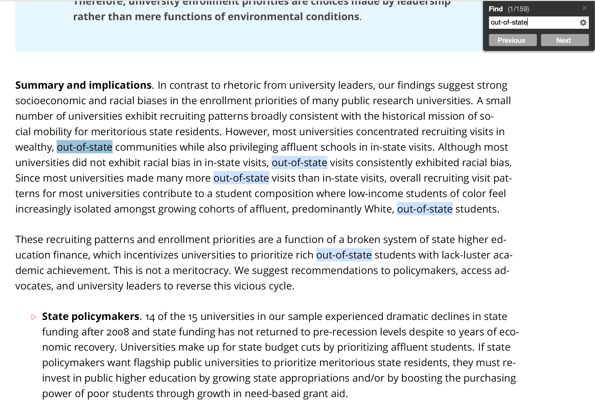

# Introduction

Load packages:

```r
library(tidyverse)
library(stringr)  # package for manipulating strings (part of tidyverse)
library(lubridate)  # package for working with dates and times
library(rvest)  # package for reading and manipulating HTML
```

Resources used to create this lecture:

- https://r4ds.had.co.nz/strings.html
- https://www.tutorialspoint.com/r/r_strings.htm
- https://swcarpentry.github.io/r-novice-inflammation/13-supp-data-structures/
- https://www.statmethods.net/input/datatypes.html
- https://www.stat.berkeley.edu/~s133/dates.html

## Dataset we will use

We will use `rtweet` to pull Twitter data from the PAC-12 universities. We will use the university admissions Twitter handle if there is one, or the main Twitter handle for the university if there isn't one:


```r
# library(rtweet)
# 
# p12 <- c("uaadmissions", "FutureSunDevils", "caladmissions", "UCLAAdmission",
#          "futurebuffs", "uoregon", "BeaverVIP", "USCAdmission",
#          "engagestanford", "UtahAdmissions", "UW", "WSUPullman")
# p12_full_df <- search_tweets(paste0("from:", p12, collapse = " OR "), n = 500)
#
# saveRDS(p12_full_df, "p12_dataset.RDS")

# Load previously pulled Twitter data
# p12_full_df <- readRDS("p12_dataset.RDS")
p12_full_df <- readRDS(url("https://github.com/Rucla-ed/rclass2/raw/master/lectures/strings/p12_dataset.RDS", "rb"))
glimpse(p12_full_df)
```

```
## Observations: 328
## Variables: 90
## $ user_id                 <chr> "22080148", "22080148", "22080148", "220…
## $ status_id               <chr> "1254177694599675904", "1253431405993840…
## $ created_at              <dttm> 2020-04-25 22:37:18, 2020-04-23 21:11:4…
## $ screen_name             <chr> "WSUPullman", "WSUPullman", "WSUPullman"…
## $ text                    <chr> "Big Dez is headed to Indy!\n\n#GoCougs …
## $ source                  <chr> "Twitter for iPhone", "Twitter Web App",…
## $ display_text_width      <dbl> 125, 58, 246, 83, 56, 64, 156, 271, 69, …
## $ reply_to_status_id      <chr> NA, NA, NA, NA, NA, NA, NA, NA, "1252615…
## $ reply_to_user_id        <chr> NA, NA, NA, NA, NA, NA, NA, NA, "2208014…
## $ reply_to_screen_name    <chr> NA, NA, NA, NA, NA, NA, NA, NA, "WSUPull…
## $ is_quote                <lgl> FALSE, FALSE, FALSE, FALSE, FALSE, FALSE…
## $ is_retweet              <lgl> TRUE, FALSE, FALSE, FALSE, FALSE, FALSE,…
## $ favorite_count          <int> 0, 322, 30, 55, 186, 53, 22, 44, 11, 0, …
## $ retweet_count           <int> 230, 32, 1, 5, 0, 3, 2, 6, 2, 6, 3, 4, 5…
## $ quote_count             <int> NA, NA, NA, NA, NA, NA, NA, NA, NA, NA, …
## $ reply_count             <int> NA, NA, NA, NA, NA, NA, NA, NA, NA, NA, …
## $ hashtags                <list> [<"GoCougs", "NFLDraft2020", "NFLCougs"…
## $ symbols                 <list> [NA, NA, NA, NA, NA, NA, NA, NA, NA, NA…
## $ urls_url                <list> [NA, NA, NA, NA, NA, NA, NA, "commencem…
## $ urls_t.co               <list> [NA, NA, NA, NA, NA, NA, NA, "https://t…
## $ urls_expanded_url       <list> [NA, NA, NA, NA, NA, NA, NA, "https://c…
## $ media_url               <list> ["http://pbs.twimg.com/ext_tw_video_thu…
## $ media_t.co              <list> ["https://t.co/NdGsvXnij7", "https://t.…
## $ media_expanded_url      <list> ["https://twitter.com/WSUCougarFB/statu…
## $ media_type              <list> ["photo", "photo", "photo", "photo", "p…
## $ ext_media_url           <list> ["http://pbs.twimg.com/ext_tw_video_thu…
## $ ext_media_t.co          <list> ["https://t.co/NdGsvXnij7", "https://t.…
## $ ext_media_expanded_url  <list> ["https://twitter.com/WSUCougarFB/statu…
## $ ext_media_type          <chr> NA, NA, NA, NA, NA, NA, NA, NA, NA, NA, …
## $ mentions_user_id        <list> [<"1250265324", "1409024796", "18088404…
## $ mentions_screen_name    <list> [<"WSUCougarFB", "dadpat7", "Colts">, N…
## $ lang                    <chr> "en", "en", "en", "en", "en", "en", "en"…
## $ quoted_status_id        <chr> NA, NA, NA, NA, NA, NA, NA, NA, NA, NA, …
## $ quoted_text             <chr> NA, NA, NA, NA, NA, NA, NA, NA, NA, NA, …
## $ quoted_created_at       <dttm> NA, NA, NA, NA, NA, NA, NA, NA, NA, NA,…
## $ quoted_source           <chr> NA, NA, NA, NA, NA, NA, NA, NA, NA, NA, …
## $ quoted_favorite_count   <int> NA, NA, NA, NA, NA, NA, NA, NA, NA, NA, …
## $ quoted_retweet_count    <int> NA, NA, NA, NA, NA, NA, NA, NA, NA, NA, …
## $ quoted_user_id          <chr> NA, NA, NA, NA, NA, NA, NA, NA, NA, NA, …
## $ quoted_screen_name      <chr> NA, NA, NA, NA, NA, NA, NA, NA, NA, NA, …
## $ quoted_name             <chr> NA, NA, NA, NA, NA, NA, NA, NA, NA, NA, …
## $ quoted_followers_count  <int> NA, NA, NA, NA, NA, NA, NA, NA, NA, NA, …
## $ quoted_friends_count    <int> NA, NA, NA, NA, NA, NA, NA, NA, NA, NA, …
## $ quoted_statuses_count   <int> NA, NA, NA, NA, NA, NA, NA, NA, NA, NA, …
## $ quoted_location         <chr> NA, NA, NA, NA, NA, NA, NA, NA, NA, NA, …
## $ quoted_description      <chr> NA, NA, NA, NA, NA, NA, NA, NA, NA, NA, …
## $ quoted_verified         <lgl> NA, NA, NA, NA, NA, NA, NA, NA, NA, NA, …
## $ retweet_status_id       <chr> "1254159118996127746", NA, NA, NA, NA, N…
## $ retweet_text            <chr> "Big Dez is headed to Indy!\n\n#GoCougs …
## $ retweet_created_at      <dttm> 2020-04-25 21:23:29, NA, NA, NA, NA, NA…
## $ retweet_source          <chr> "Twitter for iPhone", NA, NA, NA, NA, NA…
## $ retweet_favorite_count  <int> 1402, NA, NA, NA, NA, NA, NA, NA, NA, 26…
## $ retweet_retweet_count   <int> 230, NA, NA, NA, NA, NA, NA, NA, NA, 6, …
## $ retweet_user_id         <chr> "1250265324", NA, NA, NA, NA, NA, NA, NA…
## $ retweet_screen_name     <chr> "WSUCougarFB", NA, NA, NA, NA, NA, NA, N…
## $ retweet_name            <chr> "Washington State Football", NA, NA, NA,…
## $ retweet_followers_count <int> 77527, NA, NA, NA, NA, NA, NA, NA, NA, 9…
## $ retweet_friends_count   <int> 1448, NA, NA, NA, NA, NA, NA, NA, NA, 31…
## $ retweet_statuses_count  <int> 15363, NA, NA, NA, NA, NA, NA, NA, NA, 1…
## $ retweet_location        <chr> "Pullman, WA", NA, NA, NA, NA, NA, NA, N…
## $ retweet_description     <chr> "Official Twitter home of Washington Sta…
## $ retweet_verified        <lgl> TRUE, NA, NA, NA, NA, NA, NA, NA, NA, FA…
## $ place_url               <chr> NA, NA, NA, NA, NA, "https://api.twitter…
## $ place_name              <chr> NA, NA, NA, NA, NA, "Pullman", NA, NA, N…
## $ place_full_name         <chr> NA, NA, NA, NA, NA, "Pullman, WA", NA, N…
## $ place_type              <chr> NA, NA, NA, NA, NA, "city", NA, NA, NA, …
## $ country                 <chr> NA, NA, NA, NA, NA, "United States", NA,…
## $ country_code            <chr> NA, NA, NA, NA, NA, "US", NA, NA, NA, NA…
## $ geo_coords              <list> [<NA, NA>, <NA, NA>, <NA, NA>, <NA, NA>…
## $ coords_coords           <list> [<NA, NA>, <NA, NA>, <NA, NA>, <NA, NA>…
## $ bbox_coords             <list> [<NA, NA, NA, NA, NA, NA, NA, NA>, <NA,…
## $ status_url              <chr> "https://twitter.com/WSUPullman/status/1…
## $ name                    <chr> "WSU Pullman", "WSU Pullman", "WSU Pullm…
## $ location                <chr> "Pullman, Washington USA", "Pullman, Was…
## $ description             <chr> "We are an award-winning research univer…
## $ url                     <chr> "http://t.co/VxKZH9BuMS", "http://t.co/V…
## $ protected               <lgl> FALSE, FALSE, FALSE, FALSE, FALSE, FALSE…
## $ followers_count         <int> 43914, 43914, 43914, 43914, 43914, 43914…
## $ friends_count           <int> 9717, 9717, 9717, 9717, 9717, 9717, 9717…
## $ listed_count            <int> 556, 556, 556, 556, 556, 556, 556, 556, …
## $ statuses_count          <int> 15234, 15234, 15234, 15234, 15234, 15234…
## $ favourites_count        <int> 20124, 20124, 20124, 20124, 20124, 20124…
## $ account_created_at      <dttm> 2009-02-26 23:39:34, 2009-02-26 23:39:3…
## $ verified                <lgl> TRUE, TRUE, TRUE, TRUE, TRUE, TRUE, TRUE…
## $ profile_url             <chr> "http://t.co/VxKZH9BuMS", "http://t.co/V…
## $ profile_expanded_url    <chr> "http://www.wsu.edu", "http://www.wsu.ed…
## $ account_lang            <lgl> NA, NA, NA, NA, NA, NA, NA, NA, NA, NA, …
## $ profile_banner_url      <chr> "https://pbs.twimg.com/profile_banners/2…
## $ profile_background_url  <chr> "http://abs.twimg.com/images/themes/them…
## $ profile_image_url       <chr> "http://pbs.twimg.com/profile_images/576…
```

```r
p12_df <- p12_full_df %>% select("user_id", "created_at", "screen_name", "text", "location")
head(p12_df)
```

```
## # A tibble: 6 x 5
##   user_id  created_at          screen_name text                 location   
##   <chr>    <dttm>              <chr>       <chr>                <chr>      
## 1 22080148 2020-04-25 22:37:18 WSUPullman  "Big Dez is headed … Pullman, W…
## 2 22080148 2020-04-23 21:11:49 WSUPullman  Cougar Cheese. That… Pullman, W…
## 3 22080148 2020-04-21 04:00:00 WSUPullman  "Darien McLaughlin … Pullman, W…
## 4 22080148 2020-04-24 03:00:00 WSUPullman  6 houses, one pick.… Pullman, W…
## 5 22080148 2020-04-20 19:00:21 WSUPullman  Why did you choose … Pullman, W…
## 6 22080148 2020-04-20 02:20:01 WSUPullman  Tell us one of your… Pullman, W…
```


# Data structures and types

What is an **object**?

- Everything in R is an object
- We can classify objects based on their class and type
  - The class of the object determines what kind of functions we can apply to it
- Objects may be combined to form data structures

[{width=400px}](https://r4ds.had.co.nz/vectors.html)

*Credit: [R for Data Science](https://r4ds.had.co.nz/vectors.html)*

<br>
Basic **data structures**:

- [Atomic vectors](#atomtic-vectors)
- [Lists](#lists)
  - [Dataframes](#dataframes)
  
Basic **data types**:

- Logical (`TRUE`, `FALSE`)
- Numeric (e.g., `5`, `2.5`)
- Integer (e.g., `1L`, `4L`, where `L` tells R to store as `integer` type)
- Character (e.g., `"R is fun"`)

Functions for investigating R objects (From [Data Types and Structures](https://swcarpentry.github.io/r-novice-inflammation/13-supp-data-structures/))

- `str()`: Compactly display the internal structure of an R object
- `class()`: What kind of object is it (high-level)?
- `typeof()`: What is the object's data type (low-level)?

## Atomtic vectors

What are **atomic vectors**?

- **Atomic vectors** are objects that contains elements
- Elements must be of the same data type (i.e., _homogeneous_)
- The `class()` and `typeof()` a vector describes the elements it contains

<br>
<details><summary>**Example**: Investigating logical vectors</summary>


```r
v <- c(TRUE, FALSE, FALSE, TRUE)
str(v)
```

```
##  logi [1:4] TRUE FALSE FALSE TRUE
```

```r
class(v)
```

```
## [1] "logical"
```

```r
typeof(v)
```

```
## [1] "logical"
```

</details>

<br>
<details><summary>**Example**: Investigating numeric vectors</summary>


```r
v <- c(1, 3, 5, 7)
str(v)
```

```
##  num [1:4] 1 3 5 7
```

```r
class(v)
```

```
## [1] "numeric"
```

```r
typeof(v)
```

```
## [1] "double"
```
</details>

<br>
<details><summary>**Example**: Investigating integer vectors</summary>


```r
v <- c(1L, 3L, 5L, 7L)
str(v)
```

```
##  int [1:4] 1 3 5 7
```

```r
class(v)
```

```
## [1] "integer"
```

```r
typeof(v)
```

```
## [1] "integer"
```

</details>

<br>
<details><summary>**Example**: Investigating character vectors</summary>

Each element in a `character` vector is a **string** (covered in next section):


```r
v <- c("a", "b", "c", "d")
str(v)
```

```
##  chr [1:4] "a" "b" "c" "d"
```

```r
class(v)
```

```
## [1] "character"
```

```r
typeof(v)
```

```
## [1] "character"
```

</details>


## Lists

What are **lists**?

- **Lists** are objects that contains elements
- Elements do not need to be of the same type (i.e., _heterogeneous_)
  - Elements can be atomic vectors or even other lists
- The `class()` and `typeof()` a list is `list`

<br>
<details><summary>**Example**: Investigating heterogeneous lists</summary>


```r
l <- list(2.5, "abc", TRUE, c(1L, 2L, 3L))
str(l)
```

```
## List of 4
##  $ : num 2.5
##  $ : chr "abc"
##  $ : logi TRUE
##  $ : int [1:3] 1 2 3
```

```r
class(l)
```

```
## [1] "list"
```

```r
typeof(l)
```

```
## [1] "list"
```

</details>

<br>
<details><summary>**Example**: Investigating nested lists</summary>


```r
l <- list(list(TRUE, c(1, 2, 3), list(c("a", "b", "c"))), FALSE, 10L)
str(l)
```

```
## List of 3
##  $ :List of 3
##   ..$ : logi TRUE
##   ..$ : num [1:3] 1 2 3
##   ..$ :List of 1
##   .. ..$ : chr [1:3] "a" "b" "c"
##  $ : logi FALSE
##  $ : int 10
```

```r
class(l)
```

```
## [1] "list"
```

```r
typeof(l)
```

```
## [1] "list"
```

</details>


### Dataframes

What are **dataframes**?

- **Dataframes** are a special kind of **list** with the following characteristics:
  - Each element is a **vector** (i.e., _a column in the dataframe_)
  - The element should be named (i.e., _column name in the dataframe_)
  - Each of the vectors must be the same length (i.e., _same number of rows in the dataframe_)
  - The data type of each vector may be different
- Dataframes can be created using the function `data.frame()`
- The `class()` of  a dataframe is `data.frame`
- The `typeof()` a dataframe is `list`


<br>
<details><summary>**Example**: Investigating dataframe</summary>


```r
df <- data.frame(
  colA = c(1, 2, 3),
  colB = c("a", "b", "c"),
  colC = c(TRUE, FALSE, TRUE),
  stringsAsFactors = FALSE
)
df
```

```
## # A tibble: 3 x 3
##    colA colB  colC 
##   <dbl> <chr> <lgl>
## 1     1 a     TRUE 
## 2     2 b     FALSE
## 3     3 c     TRUE
```

```r
str(df)
```

```
## 'data.frame':	3 obs. of  3 variables:
##  $ colA: num  1 2 3
##  $ colB: chr  "a" "b" "c"
##  $ colC: logi  TRUE FALSE TRUE
```

```r
class(df)
```

```
## [1] "data.frame"
```

```r
typeof(df)
```

```
## [1] "list"
```

</details>

## Converting between classes

Functions for converting between classes:

- `as.logical()`: Convert to `logical`
- `as.numeric()`: Convert to `numeric`
- `as.integer()`: Convert to `integer`
- `as.character()`: Convert to `character`
- `as.list()`: Convert to `list`
- `as.data.frame()`: Convert to `data.frame`


<br>
<details><summary>**Example**: Using `as.logical()` to convert to `logical`</summary>

Character vector coerced to logical vector:


```r
# Only "TRUE"/"FALSE", "True"/"False", "T"/"F", "true"/"false" are able to be coerced to logical type
as.logical(c("TRUE", "FALSE", "True", "False", "true", "false", "T", "F", "t", "f", ""))
```

```
##  [1]  TRUE FALSE  TRUE FALSE  TRUE FALSE  TRUE FALSE    NA    NA    NA
```

Numeric vector coerced to logical vector:


```r
# 0 is treated as FALSE, while all other numeric values are treated as TRUE
as.logical(c(0, 0.0, 1, -1, 20, 5.5))
```

```
## [1] FALSE FALSE  TRUE  TRUE  TRUE  TRUE
```

</details>

<br>
<details><summary>**Example**: Using `as.numeric()` to convert to `numeric`</summary>

Logical vector coerced to numeric vector:


```r
# FALSE is mapped to 0 and TRUE is mapped to 1
as.numeric(c(FALSE, TRUE))
```

```
## [1] 0 1
```

Character vector coerced to numeric vector:


```r
# Strings containing numeric values can be coerced to numeric (leading 0's are dropped) 
# All other characters become NA
as.numeric(c("0", "007", "2.5", "abc", "."))
```

```
## [1] 0.0 7.0 2.5  NA  NA
```

</details>

<br>
<details><summary>**Example**: Using `as.integer()` to convert to `integer`</summary>

Logical vector coerced to integer vector:


```r
# FALSE is mapped to 0 and TRUE is mapped to 1
as.integer(c(FALSE, TRUE))
```

```
## [1] 0 1
```

Character vector coerced to integer vector:


```r
# Strings containing numeric values can be coerced to integer (leading 0's are dropped, decimals are truncated) 
# All other characters become NA
as.integer(c("0", "007", "2.5", "abc", "."))
```

```
## [1]  0  7  2 NA NA
```

Numeric vector coerced to integer vector:


```r
# All decimal places are truncated
as.integer(c(0, 2.1, 10.5, 8.8, -1.8))
```

```
## [1]  0  2 10  8 -1
```

</details>

<br>
<details><summary>**Example**: Using `as.character()` to convert to `character`</summary>

Logical vector coerced to character vector:


```r
as.character(c(FALSE, TRUE))
```

```
## [1] "FALSE" "TRUE"
```

Numeric vector coerced to character vector:


```r
as.character(c(-5, 0, 2.5))
```

```
## [1] "-5"  "0"   "2.5"
```

Integer vector coerced to character vector:


```r
as.character(c(-2L, 0L, 10L))
```

```
## [1] "-2" "0"  "10"
```

</details>

<br>
<details><summary>**Example**: Using `as.list()` to convert to `list`</summary>

Atomic vectors coerced to list:


```r
# Logical vector
as.list(c(TRUE, FALSE))
```

```
## [[1]]
## [1] TRUE
## 
## [[2]]
## [1] FALSE
```

```r
# Character vector
as.list(c("a", "b", "c"))
```

```
## [[1]]
## [1] "a"
## 
## [[2]]
## [1] "b"
## 
## [[3]]
## [1] "c"
```

```r
# Numeric vector
as.list(1:3)
```

```
## [[1]]
## [1] 1
## 
## [[2]]
## [1] 2
## 
## [[3]]
## [1] 3
```

</details>

<br>
<details><summary>**Example**: Using `as.data.frame()` to convert to `data.frame`</summary>

Lists coerced to dataframe:


```r
# Create a list
l <- list(A = c("x", "y", "z"), B = c(1, 2, 3))
str(l)
```

```
## List of 2
##  $ A: chr [1:3] "x" "y" "z"
##  $ B: num [1:3] 1 2 3
```

```r
# Convert to class `data.frame`
df <- as.data.frame(l, stringsAsFactors = F)
str(df)
```

```
## 'data.frame':	3 obs. of  2 variables:
##  $ A: chr  "x" "y" "z"
##  $ B: num  1 2 3
```

</details>

# String basics

What are **strings**?

- String is a type of data in R
- You can create strings using either single quotes (`'`) or double quotes (`"`)
  - Internally, R stores strings using double quotes
- The `class()` and `typeof()` a string is `character`

<br>
**Example**: Creating string using single quotes

Notice how R stores strings using double quotes internally:


```r
my_string <- 'This is a string'
my_string
```

```
## [1] "This is a string"
```

<br>
**Example**: Creating string using double quotes


```r
my_string <- "Strings can also contain numbers: 123"
my_string
```

```
## [1] "Strings can also contain numbers: 123"
```

<br>
**Example**: Checking class and type of strings


```r
class(my_string)
```

```
## [1] "character"
```

```r
typeof(my_string)
```

```
## [1] "character"
```


## Special Characters

> "A sequence in a string that starts with a `\` is called an **escape sequence** and allows us to include special characters in our strings."

*Credit: [Escape sequences](https://campus.datacamp.com/courses/string-manipulation-with-stringr-in-r/string-basics?ex=4) from DataCamp*

Common **special characters**:

- `\'`: literal single quote
- `\"`: literal double quote
- `\\`: literal backslash
- `\n`: newline
- `\t`: tab

These characters followed by a backslash `\` take on a new meaning. The `n` by itself is just an `n`. When you add a backslash to the `\n` you are escaping it and making it a special character where `\n` now represents a newline.

<br>
__The `writeLines()` function__:


```r
?writeLines

# SYNTAX AND DEFAULT VALUES
writeLines(text, con = stdout(), sep = "\n", useBytes = FALSE)
```

- "`writeLines()` displays quotes and backslashes as they would be read, rather than as R stores them." (From [writeLines](https://www.rdocumentation.org/packages/base/versions/3.6.2/topics/writeLines) documentation)
- When we include **escape sequences** in the string, it is helpful to use `writeLines()` to see how the escaped string looks
- `writeLines()` will also output the string without showing the outer pair of double quotes that R uses to store it, so we only see the content of the string


<br>
<details><summary>**Example**: Escaping single quotes</summary>


```r
my_string <- 'Escaping single quote \' within single quotes'
my_string
```

```
## [1] "Escaping single quote ' within single quotes"
```

Alternatively, we could've just created the string using double quotes:


```r
my_string <- "Single quote ' within double quotes does not need escaping"
my_string
```

```
## [1] "Single quote ' within double quotes does not need escaping"
```

Using `writeLines()` shows us only the content of the string without the outer pair of double quotes that R uses to store strings:


```r
writeLines(my_string)
```

```
## Single quote ' within double quotes does not need escaping
```
</details>

<br>
<details><summary>**Example**: Escaping double quotes</summary>


```r
my_string <- "Escaping double quote \" within double quotes"
my_string
```

```
## [1] "Escaping double quote \" within double quotes"
```

Alternatively, we could've just created the string using single quotes:


```r
my_string <- 'Double quote " within single quotes does not need escaping'
my_string
```

```
## [1] "Double quote \" within single quotes does not need escaping"
```

Notice how the backslash still showed up in the above output to escape our double quote from the outer pair of double quotes that R uses to store the string. This is no longer an issue if we use `writeLines()` to only show the string content:


```r
writeLines(my_string)
```

```
## Double quote " within single quotes does not need escaping
```
</details>

<br>
<details><summary>**Example**: Escaping double quotes within double quotes </summary>


```r
my_string <- "I called my mom and she said \"Echale ganas!\""
my_string
```

```
## [1] "I called my mom and she said \"Echale ganas!\""
```

Using `writeLines()` shows us only the content of the string without the backslashes:


```r
writeLines(my_string)
```

```
## I called my mom and she said "Echale ganas!"
```
</details>


<br>
<details><summary>**Example**: Escaping backslashes</summary>

To include a literal backslash in the string, we need to escape the backslash with another backslash:


```r
my_string <- "The executable is located in C:\\Program Files\\Git\\bin"
my_string
```

```
## [1] "The executable is located in C:\\Program Files\\Git\\bin"
```

Use `writeLines()` to see the escaped string:


```r
writeLines(my_string)
```

```
## The executable is located in C:\Program Files\Git\bin
```
</details>

<br>
<details><summary>**Example**: Other special characters</summary>


```r
my_string <- "A\tB\nC\tD"
my_string
```

```
## [1] "A\tB\nC\tD"
```

Use `writeLines()` to see the escaped string:


```r
writeLines(my_string)
```

```
## A	B
## C	D
```
</details>

<br>

### Escape special characters using Twitter data   

Let's take a look at some tweets from our PAC-12 universities. 

- Let's start by grabbing observations 1-3 from the `text` column.


```r
#Twitter example of \n newline special characters
p12_df$text[1:3]
```

```
## [1] "Big Dez is headed to Indy!\n\n#GoCougs | #NFLDraft2020 | @dadpat7 | @Colts | #NFLCougs https://t.co/NdGsvXnij7"                                                                                                                                                                                  
## [2] "Cougar Cheese. That's it. That's the tweet. \U0001f9c0#WSU #GoCougs https://t.co/0OWGvQlRZs"                                                                                                                                                                                                     
## [3] "Darien McLaughlin '19, and her dog, Yuki, went on a #Pullman distance walk this weekend. We will let you judge who was leading the way.\U0001f6b6‍♀️\U0001f415\n\nTweet a pic of how you are social distancing w/ the hashtag #CougsContain &amp; tag @WSUPullman #GoCougs https://t.co/EltXDy1tPt"
```


- Using `writeLines()` we can see the contents of the strings as they would be read, rather than as R stores them.

```r
writeLines(p12_df$text[1:3])
```

```
## Big Dez is headed to Indy!
## 
## #GoCougs | #NFLDraft2020 | @dadpat7 | @Colts | #NFLCougs https://t.co/NdGsvXnij7
## Cougar Cheese. That's it. That's the tweet. 🧀#WSU #GoCougs https://t.co/0OWGvQlRZs
## Darien McLaughlin '19, and her dog, Yuki, went on a #Pullman distance walk this weekend. We will let you judge who was leading the way.🚶‍♀️🐕
## 
## Tweet a pic of how you are social distancing w/ the hashtag #CougsContain &amp; tag @WSUPullman #GoCougs https://t.co/EltXDy1tPt
```

<br>
<details><summary>**Example**: Escaping double quotes using Twitter data </summary>  

- Using Twitter data you may encounter a lot of strings with double quotes.

    - In the example below, our string includes special characters `\"` and `\n` to escape the double quotes and the newline character. 

```r
#Twitter example of \" double quotes special characters
p12_df$text[24]
```

```
## [1] "\"I really am glad that inside Engineering Student Services, I’ve been able to connect with my ESS advisor and professional development advisors there.\"\n-Alexandro Garcia, Civil &amp; Environmental Engineering, 3rd year\n#imaberkeleyengineer #iamberkeley #voicesofberkeleyengineering https://t.co/ToVEynIUWH"
```

- Using `writeLines()` we can see the contents of the strings as they would be read, rather than as R stores them.  

    - We no longer see the escaped characters `\"` or `\n`

```r
writeLines(p12_df$text[24])
```

```
## "I really am glad that inside Engineering Student Services, I’ve been able to connect with my ESS advisor and professional development advisors there."
## -Alexandro Garcia, Civil &amp; Environmental Engineering, 3rd year
## #imaberkeleyengineer #iamberkeley #voicesofberkeleyengineering https://t.co/ToVEynIUWH
```
</details>
<br>

# `stringr` package

> "A consistent, simple and easy to use set of wrappers around the fantastic `stringi` package. All function and argument names (and positions) are consistent, all functions deal with `NA`'s and zero length vectors in the same way, and the output from one function is easy to feed into the input of another."

*Credit: `stringr` [R documentation](https://www.rdocumentation.org/packages/stringr/versions/1.4.0)*

The `stringr` package:

- The `stringr` package is based off the `stringi` package and is part of __Tidyverse__ 
- `stringr` contains functions to work with strings
- For many functions in the `stringr` package, there are equivalent "base R" functions 
- But `stringr` functions all follow the same rules, while rules often differ across different "base R" string functions, so we will focus exclusively on `stringr` functions
- Most `stringr` functions start with `str_` (e.g., `str_length`)


## `str_length()`

<br>
__The `str_length()` function__:


```r
?str_length

# SYNTAX
str_length(string)
```

- Function: Find string length
- Arguments:
  - `string`: Character vector (or vector coercible to character)
- Note that `str_length()` calculates the length of a string, whereas the `length()` function (which is not part of `stringr` package) calculates the number of elements in an object

<br>
<details><summary>**Example**: Using `str_length()` on string</summary>


```r
str_length("cats")
```

```
## [1] 4
```

Compare to `length()`, which treats the string as a single object:


```r
length("cats")
```

```
## [1] 1
```

</details>

<br>
<details><summary>**Example**: Using `str_length()` on character vector</summary>


```r
str_length(c("cats", "in", "hat"))
```

```
## [1] 4 2 3
```

Compare to `length()`, which finds the number of elements in the vector:


```r
length(c("cats", "in", "hat"))
```

```
## [1] 3
```

</details>

<br>
<details><summary>**Example**: Using `str_length()` on other vectors coercible to character</summary>

Logical vectors can be coerced to character vectors:


```r
str_length(c(TRUE, FALSE))
```

```
## [1] 4 5
```

Numeric vectors can be coerced to character vectors:


```r
str_length(c(1, 2.5, 3000))
```

```
## [1] 1 3 4
```

Integer vectors can be coerced to character vectors:


```r
str_length(c(2L, 100L))
```

```
## [1] 1 3
```

</details>

<br>
<details><summary>**Example**: Using `str_length()` on dataframe column</summary>

Recall that the columns in a dataframe are just vectors, so we can use `str_length()` as long as the vector is coercible to character type. Let's look at the `screen_name` column from the `p12_df`:


```r
# `p12_df` is a dataframe object
str(p12_df)
```

```
## Classes 'tbl_df', 'tbl' and 'data.frame':	328 obs. of  5 variables:
##  $ user_id    : chr  "22080148" "22080148" "22080148" "22080148" ...
##  $ created_at : POSIXct, format: "2020-04-25 22:37:18" "2020-04-23 21:11:49" ...
##  $ screen_name: chr  "WSUPullman" "WSUPullman" "WSUPullman" "WSUPullman" ...
##  $ text       : chr  "Big Dez is headed to Indy!\n\n#GoCougs | #NFLDraft2020 | @dadpat7 | @Colts | #NFLCougs https://t.co/NdGsvXnij7" "Cougar Cheese. That's it. That's the tweet. \U0001f9c0#WSU #GoCougs https://t.co/0OWGvQlRZs" "Darien McLaughlin '19, and her dog, Yuki, went on a #Pullman distance walk this weekend. We will let you judge "| __truncated__ "6 houses, one pick. Cougs, which one you got? Reply \u2b07️  #WSU #CougsContain #GoCougs https://t.co/lNDx7r71b2" ...
##  $ location   : chr  "Pullman, Washington USA" "Pullman, Washington USA" "Pullman, Washington USA" "Pullman, Washington USA" ...
```

```r
# `screen_name` column is a character vector
str(p12_df$screen_name)
```

```
##  chr [1:328] "WSUPullman" "WSUPullman" "WSUPullman" "WSUPullman" ...
```

<br>
**[Base R method]** Use `str_length()` to calculate the length of each `screen_name`:


```r
# Let's focus on just the unique screen names
unique(p12_df$screen_name)
```

```
##  [1] "WSUPullman"      "CalAdmissions"   "UW"             
##  [4] "USCAdmission"    "uoregon"         "FutureSunDevils"
##  [7] "UCLAAdmission"   "UtahAdmissions"  "futurebuffs"    
## [10] "uaadmissions"    "BeaverVIP"
```

```r
str_length(unique(p12_df$screen_name))
```

```
##  [1] 10 13  2 12  7 15 13 14 11 12  9
```

<br>
**[Tidyverse method]** Use `str_length()` to calculate the length of each `screen_name`:


```r
# Let's focus on just the unique screen names
p12_df %>% select(screen_name) %>% unique()
```

```
## # A tibble: 11 x 1
##    screen_name    
##    <chr>          
##  1 WSUPullman     
##  2 CalAdmissions  
##  3 UW             
##  4 USCAdmission   
##  5 uoregon        
##  6 FutureSunDevils
##  7 UCLAAdmission  
##  8 UtahAdmissions 
##  9 futurebuffs    
## 10 uaadmissions   
## 11 BeaverVIP
```

```r
p12_df %>% select(screen_name) %>% unique() %>% str_length()
```

```
## Warning in stri_length(string): argument is not an atomic vector; coercing
```

```
## [1] 163
```

Notice that the above line does not work as expected because we passed in a dataframe to `str_length()` and it is trying to coerce that to character:


```r
class(p12_df %>% select(screen_name) %>% unique())
```

```
## [1] "tbl_df"     "tbl"        "data.frame"
```

An alternative way is to add a column to the dataframe that contains the result of applying `str_length()` to the `screen_name` vector:


```r
p12_df %>% select(screen_name) %>% unique() %>% 
  mutate(screen_name_len = str_length(screen_name))
```

```
## # A tibble: 11 x 2
##    screen_name     screen_name_len
##    <chr>                     <int>
##  1 WSUPullman                   10
##  2 CalAdmissions                13
##  3 UW                            2
##  4 USCAdmission                 12
##  5 uoregon                       7
##  6 FutureSunDevils              15
##  7 UCLAAdmission                13
##  8 UtahAdmissions               14
##  9 futurebuffs                  11
## 10 uaadmissions                 12
## 11 BeaverVIP                     9
```

</details>

## `str_c()`

<br>
__The `str_c()` function__:


```r
?str_c

# SYNTAX AND DEFAULT VALUES
str_c(..., sep = "", collapse = NULL)
```

- Function: Concatenate strings between vectors (element-wise)
- Arguments:
  - The input is one or more character vectors (or vectors coercible to character)
    - Zero length arguments are removed
    - Short arguments are recycled to the length of the longest
  - `sep`: String to insert between input vectors
  - `collapse`: Optional string used to combine input vectors into single string

<br>
<details><summary>**Example**: Using `str_c()` on strings</summary>

Each string input is treated as a character vector of size 1:


```r
str_c("a", "b", "c")
```

```
## [1] "abc"
```

We can use `sep` to specify how the elements are separated:


```r
str_c("a", "b", "c", sep = "~")
```

```
## [1] "a~b~c"
```

Note that we can also use any other input that can be coerced to character:


```r
str_c(TRUE, 1.5, 2L, "X")
```

```
## [1] "TRUE1.52X"
```

</details>

<br>
<details><summary>**Example**: Using `str_c()` on single vector</summary>

Since we only provided one input vector, each individual element has nothing to concatenate with:


```r
str_c(c("a", "b", "c"))
```

```
## [1] "a" "b" "c"
```

But we can still specify the `collapse` argument to collapse the elements to a single string:


```r
str_c(c("a", "b", "c"), collapse = "|")
```

```
## [1] "a|b|c"
```

</details>

<br>
<details><summary>**Example**: Using `str_c()` on multiple vectors</summary>

When multiple vectors are provided, they are joined together element-wise, recycling the elements of the shorter vectors:


```r
str_c("#", c("a", "b", "c", "d"), c(1, 2, 3), c(TRUE, FALSE))
```

```
## [1] "#a1TRUE"  "#b2FALSE" "#c3TRUE"  "#d1FALSE"
```

We can specify `sep` and `collapse`:


```r
str_c("#", c("a", "b", "c", "d"), c(1, 2, 3), c(TRUE, FALSE), sep = "~", collapse = "|")
```

```
## [1] "#~a~1~TRUE|#~b~2~FALSE|#~c~3~TRUE|#~d~1~FALSE"
```

</details>

<br>
<details><summary>**Example**: Using `str_c()` on dataframe columns</summary>

Let's combine the `user_id` and `screen_name` columns from `p12_df`. We'll focus on unique Twitter handles:


```r
p12_unique_df <- p12_df %>% select(user_id, screen_name) %>% unique()
p12_unique_df
```

```
## # A tibble: 11 x 2
##    user_id    screen_name    
##    <chr>      <chr>          
##  1 22080148   WSUPullman     
##  2 15988549   CalAdmissions  
##  3 27103822   UW             
##  4 198643896  USCAdmission   
##  5 40940457   uoregon        
##  6 325014504  FutureSunDevils
##  7 2938776590 UCLAAdmission  
##  8 4922145709 UtahAdmissions 
##  9 45879674   futurebuffs    
## 10 44733626   uaadmissions   
## 11 403743606  BeaverVIP
```

<br>
**[Base R method]** Use `str_c()` to combine `user_id` and `screen_name`:


```r
str_c(p12_unique_df$user_id, "=", p12_unique_df$screen_name, sep = " ", collapse = ", ")
```

```
## [1] "22080148 = WSUPullman, 15988549 = CalAdmissions, 27103822 = UW, 198643896 = USCAdmission, 40940457 = uoregon, 325014504 = FutureSunDevils, 2938776590 = UCLAAdmission, 4922145709 = UtahAdmissions, 45879674 = futurebuffs, 44733626 = uaadmissions, 403743606 = BeaverVIP"
```

<br>
**[Tidyverse method]** Use `str_c()` to combine `user_id` and `screen_name`:


```r
p12_unique_df %>% mutate(twitter_handle = str_c("User #", user_id, " is @", screen_name))
```

```
## # A tibble: 11 x 3
##    user_id    screen_name     twitter_handle                     
##    <chr>      <chr>           <chr>                              
##  1 22080148   WSUPullman      User #22080148 is @WSUPullman      
##  2 15988549   CalAdmissions   User #15988549 is @CalAdmissions   
##  3 27103822   UW              User #27103822 is @UW              
##  4 198643896  USCAdmission    User #198643896 is @USCAdmission   
##  5 40940457   uoregon         User #40940457 is @uoregon         
##  6 325014504  FutureSunDevils User #325014504 is @FutureSunDevils
##  7 2938776590 UCLAAdmission   User #2938776590 is @UCLAAdmission 
##  8 4922145709 UtahAdmissions  User #4922145709 is @UtahAdmissions
##  9 45879674   futurebuffs     User #45879674 is @futurebuffs     
## 10 44733626   uaadmissions    User #44733626 is @uaadmissions    
## 11 403743606  BeaverVIP       User #403743606 is @BeaverVIP
```

</details>

## `str_sub()`

<br>
__The `str_sub()` function__:


```r
?str_sub

# SYNTAX AND DEFAULT VALUES
str_sub(string, start = 1L, end = -1L)
str_sub(string, start = 1L, end = -1L, omit_na = FALSE) <- value
```

- Function: Subset strings
- Arguments:
  - `string`: Character vector (or vector coercible to character)
  - `start`: Position of first character to be included in substring (default: `1`)
  - `end`: Position of last character to be included in substring (default: `-1`)
    - Negative index means counting backwards from the end of the string
    - If an element in the vector is shorter than the specified `end`, it will just include all the available characters that it does have
  - `omit_na`: If `TRUE`, missing values in any of the arguments provided will result in an unchanged input
- When `str_sub()` is used in the assignment form, you can replace the subsetted part of the string with a `value` of your choice
  - If an element in the vector is too short to meet the subset specification, the replacement `value` will be concatenated to the end of that element
  - Note that this modifies your input vector directly, so you must have the vector saved to a variable (see example below)


<br>
<details><summary>**Example**: Using `str_sub()` to subset strings</summary>

If no `start` and `end` positions are specified, `str_sub()` will by default return the entire (original) string:


```r
str_sub(c("abcdefg", 123, TRUE))
```

```
## [1] "abcdefg" "123"     "TRUE"
```

Note that if an element is shorter than the specified `end` (i.e., `123` in the example below), it will just include all the available characters that it does have:


```r
str_sub(c("abcdefg", 123, TRUE), start = 2, end = 4)
```

```
## [1] "bcd" "23"  "RUE"
```

Remember we can also use negative index to count the position starting from the back:


```r
str_sub(c("abcdefg", 123, TRUE), start = 2, end = -2)
```

```
## [1] "bcdef" "2"     "RU"
```

</details>

<br>
<details><summary>**Example**: Using `str_sub()` to replace strings</summary>

If no `start` and `end` positions are specified, `str_sub()` will by default return the original string, so the entire string would be replaced:


```r
v <- c("A", "AB", "ABC", "ABCD", "ABCDE")
str_sub(v) <- "*"
v
```

```
## [1] "*" "*" "*" "*" "*"
```

If an element in the vector is too short to meet the subset specification, the replacement `value` will be concatenated to the end of that element:


```r
v <- c("A", "AB", "ABC", "ABCD", "ABCDE")
str_sub(v, 2, 3) <- "*"
v
```

```
## [1] "A*"   "A*"   "A*"   "A*D"  "A*DE"
```

Note that because the replacement form of `str_sub()` modifies the input vector directly, we need to save it in a variable first. Directly passing in the vector to `str_sub()` would give us an error:


```r
# Does not work
str_sub(c("A", "AB", "ABC", "ABCD", "ABCDE")) <- "*"
```

</details>

<br>
<details><summary>**Example**: Using `str_sub()` on dataframe column</summary>

We can use `as.character()` to turn the `created_at` value to a string, then use `str_sub()` to extract out various date/time components from the string:


```r
p12_datetime_df <- p12_df %>% select(created_at) %>%
  mutate(
      dt_chr = as.character(created_at),
      date_chr = str_sub(dt_chr, 1, 10),
      yr_chr = str_sub(dt_chr, 1, 4),
      mth_chr = str_sub(dt_chr, 6, 7),
      day_chr = str_sub(dt_chr, 9, 10),
      hr_chr = str_sub(dt_chr, -8, -7),
      min_chr = str_sub(dt_chr, -5, -4),
      sec_chr = str_sub(dt_chr, -2, -1)
    )
p12_datetime_df
```

```
## # A tibble: 328 x 9
##    created_at          dt_chr date_chr yr_chr mth_chr day_chr hr_chr
##    <dttm>              <chr>  <chr>    <chr>  <chr>   <chr>   <chr> 
##  1 2020-04-25 22:37:18 2020-… 2020-04… 2020   04      25      22    
##  2 2020-04-23 21:11:49 2020-… 2020-04… 2020   04      23      21    
##  3 2020-04-21 04:00:00 2020-… 2020-04… 2020   04      21      04    
##  4 2020-04-24 03:00:00 2020-… 2020-04… 2020   04      24      03    
##  5 2020-04-20 19:00:21 2020-… 2020-04… 2020   04      20      19    
##  6 2020-04-20 02:20:01 2020-… 2020-04… 2020   04      20      02    
##  7 2020-04-22 04:00:00 2020-… 2020-04… 2020   04      22      04    
##  8 2020-04-25 17:00:00 2020-… 2020-04… 2020   04      25      17    
##  9 2020-04-21 15:13:06 2020-… 2020-04… 2020   04      21      15    
## 10 2020-04-21 17:52:47 2020-… 2020-04… 2020   04      21      17    
## # … with 318 more rows, and 2 more variables: min_chr <chr>, sec_chr <chr>
```

</details>

## Other `stringr` functions

Other useful `stringr` functions:

- `str_to_upper()`: Turn strings to uppercase
- `str_to_lower()`: Turn strings to lowercase
- `str_sort()`: Sort a character vector
- `str_trim()`: Trim whitespace from strings (including `\n`, `\t`, etc.)
- `str_pad()`: Pad strings with specified character


<br>
<details><summary>**Example**: Using `str_to_upper()` to turn strings to uppercase</summary>

Turn column names of `p12_df` to uppercase:


```r
# Column names are originally lowercase
names(p12_df)
```

```
## [1] "user_id"     "created_at"  "screen_name" "text"        "location"
```

```r
# Turn column names to uppercase
names(p12_df) <- str_to_upper(names(p12_df))
names(p12_df)
```

```
## [1] "USER_ID"     "CREATED_AT"  "SCREEN_NAME" "TEXT"        "LOCATION"
```

</details>

<br>
<details><summary>**Example**: Using `str_to_lower()` to turn strings to lowercase</summary>

Turn column names of `p12_df` to lowercase:


```r
# Column names are originally uppercase
names(p12_df)
```

```
## [1] "USER_ID"     "CREATED_AT"  "SCREEN_NAME" "TEXT"        "LOCATION"
```

```r
# Turn column names to lowercase
names(p12_df) <- str_to_lower(names(p12_df))
names(p12_df)
```

```
## [1] "user_id"     "created_at"  "screen_name" "text"        "location"
```

</details>

<br>
<details><summary>**Example**: Using `str_sort()` to sort character vector</summary>

Sort the vector of `p12_df` column names:


```r
# Before sort
names(p12_df)
```

```
## [1] "user_id"     "created_at"  "screen_name" "text"        "location"
```

```r
# Sort alphabetically (default)
str_sort(names(p12_df))
```

```
## [1] "created_at"  "location"    "screen_name" "text"        "user_id"
```

```r
# Sort reverse alphabetically
str_sort(names(p12_df), decreasing = TRUE)
```

```
## [1] "user_id"     "text"        "screen_name" "location"    "created_at"
```

</details>

<br>
<details><summary>**Example**: Using `str_trim()` to trim whitespace from string</summary>


```r
# Trim whitespace from both left and right sides (default)
str_trim(c("\nABC ", " XYZ\t"))
```

```
## [1] "ABC" "XYZ"
```

```r
# Trim whitespace from left side
str_trim(c("\nABC ", " XYZ\t"), side = "left")
```

```
## [1] "ABC "  "XYZ\t"
```

```r
# Trim whitespace from right side
str_trim(c("\nABC ", " XYZ\t"), side = "right")
```

```
## [1] "\nABC" " XYZ"
```

</details>

<br>
<details><summary>**Example**: Using `str_pad()` to pad string with character</summary>

Let's say we have a vector of zip codes that has lost all leading 0's. We can use `str_pad()` to add that back in:


```r
# Pad the left side of strings with "0" until width of 5 is reached
str_pad(c(95035, 90024, 5009, 5030), width = 5, side = "left", pad = "0")
```

```
## [1] "95035" "90024" "05009" "05030"
```

</details>


# Dates and times

> "Date-time data can be frustrating to work with in R. R commands for date-times are generally unintuitive and change depending on the type of date-time object being used. Moreover, the methods we use with date-times must be robust to time zones, leap days, daylight savings times, and other time related quirks, and R lacks these capabilities in some situations. Lubridate makes it easier to do the things R does with date-times and possible to do the things R does not."

*Credit: `lubridate` [documentation](https://lubridate.tidyverse.org/)*

How are dates and times stored in R? (From [Dates and Times in R](https://www.stat.berkeley.edu/~s133/dates.html))

- The `Date` class is used for storing dates
  - "Internally, `Date` objects are stored as the number of days since January 1, 1970, using negative numbers for earlier dates. The `as.numeric()` function can be used to convert a `Date` object to its internal form."
- POSIX classes can be used for storing date plus times
  - "The `POSIXct` class stores date/time values as the number of seconds since January 1, 1970"
  - "The `POSIXlt` class stores date/time values as a list of components (hour, min, sec, mon, etc.) making it easy to extract these parts"
- There is no native R class for storing only time


Why use date/time objects?

- Using date/time objects makes it easier to fetch or modify various date/time components (e.g., year, month, day, day of the week)
  - Compared to if the date/time is just stored in a string, these components are not as readily accessible and need to be parsed
- You can perform certain arithmetics with date/time objects (e.g., find the "difference" between date/time points)


## Creating date/time objects

### Creating date/time objects by parsing input

Functions that create date/time objects **by parsing character or numeric input**:

- Create `Date` object: `ymd()`, `ydm()`, `mdy()`, `myd()`, `dmy()`, `dym()`
  - `y` stands for year, `m` stands for month, `d` stands for day
  - Select the function that represents the order in which your date input is formatted, and the function will be able to parse your input and create a `Date` object
- Create `POSIXct` object: `ymd_h()`, `ymd_hm()`, `ymd_hms()`, etc.
  - `h` stands for hour, `m` stands for minute, `s` stands for second
  - For any of the previous 6 date functions, you can append `h`, `hm`, or `hms` if you want to provide additional time information in order to create a `POSIXct` object
  - To force a `POSIXct` object without providing any time information, you can just provide a timezone (using `tz`) to one of the date functions and it will assume midnight as the time
  - You can use `Sys.timezone()` to get the timezone for your location
  

<br>
<details><summary>**Example**: Creating `Date` object from character or numeric input</summary>

The `lubridate` functions are flexible and can parse dates in various formats:


```r
d <- mdy("1/1/2020")
d
```

```
## [1] "2020-01-01"
```

```r
d <- mdy("1-1-2020")
d
```

```
## [1] "2020-01-01"
```

```r
d <- mdy("Jan. 1, 2020")
d
```

```
## [1] "2020-01-01"
```

```r
d <- ymd(20200101)
d
```

```
## [1] "2020-01-01"
```

<br>
Investigate the `Date` object:


```r
class(d)
```

```
## [1] "Date"
```

```r
typeof(d)
```

```
## [1] "double"
```

```r
# Number of days since January 1, 1970
as.numeric(d)
```

```
## [1] 18262
```

</details>


<br>
<details><summary>**Example**: Creating `POSIXct` object from character or numeric input</summary>

The `lubridate` functions are flexible and can parse AM/PM in various formats:


```r
dt <- mdy_h("12/31/2019 11pm")
dt
```

```
## [1] "2019-12-31 23:00:00 UTC"
```

```r
dt <- mdy_hm("12/31/2019 11:59 pm")
dt
```

```
## [1] "2019-12-31 23:59:00 UTC"
```

```r
dt <- mdy_hms("12/31/2019 11:59:59 PM")
dt
```

```
## [1] "2019-12-31 23:59:59 UTC"
```

```r
dt <- ymd_hms(20191231235959)
dt
```

```
## [1] "2019-12-31 23:59:59 UTC"
```

<br>
Investigate the `POSIXct` object:


```r
class(dt)
```

```
## [1] "POSIXct" "POSIXt"
```

```r
typeof(dt)
```

```
## [1] "double"
```

```r
# Number of seconds since January 1, 1970
as.numeric(dt)
```

```
## [1] 1577836799
```

<br>
We can also create a `POSIXct` object from a date function by providing a timezone. The time would default to midnight:


```r
dt <- mdy("1/1/2020", tz = "UTC")
dt
```

```
## [1] "2020-01-01 UTC"
```

```r
# Number of seconds since January 1, 1970
as.numeric(dt)  # Note that this is indeed 1 sec after the previous example
```

```
## [1] 1577836800
```

</details>


<br>
<details><summary>**Example**: Creating `Date` objects from dataframe column</summary>

Using the `p12_datetime_df` we created earlier, we can create `Date` objects from the `date_chr` column:


```r
# Use `ymd()` to parse the string stored in the `date_chr` column
p12_datetime_df %>% select(created_at, dt_chr, date_chr) %>%
  mutate(date_ymd = ymd(date_chr))
```

```
## # A tibble: 328 x 4
##    created_at          dt_chr              date_chr   date_ymd  
##    <dttm>              <chr>               <chr>      <date>    
##  1 2020-04-25 22:37:18 2020-04-25 22:37:18 2020-04-25 2020-04-25
##  2 2020-04-23 21:11:49 2020-04-23 21:11:49 2020-04-23 2020-04-23
##  3 2020-04-21 04:00:00 2020-04-21 04:00:00 2020-04-21 2020-04-21
##  4 2020-04-24 03:00:00 2020-04-24 03:00:00 2020-04-24 2020-04-24
##  5 2020-04-20 19:00:21 2020-04-20 19:00:21 2020-04-20 2020-04-20
##  6 2020-04-20 02:20:01 2020-04-20 02:20:01 2020-04-20 2020-04-20
##  7 2020-04-22 04:00:00 2020-04-22 04:00:00 2020-04-22 2020-04-22
##  8 2020-04-25 17:00:00 2020-04-25 17:00:00 2020-04-25 2020-04-25
##  9 2020-04-21 15:13:06 2020-04-21 15:13:06 2020-04-21 2020-04-21
## 10 2020-04-21 17:52:47 2020-04-21 17:52:47 2020-04-21 2020-04-21
## # … with 318 more rows
```

</details>

<br>
<details><summary>**Example**: Creating `POSIXct` objects from dataframe column</summary>

Using the `p12_datetime_df` we created earlier, we can recreate the `created_at` column (class `POSIXct`) from the `dt_chr` column (class `character`):


```r
# Use `ymd_hms()` to parse the string stored in the `dt_chr` column
p12_datetime_df %>% select(created_at, dt_chr) %>%
  mutate(datetime_ymd_hms = ymd_hms(dt_chr))
```

```
## # A tibble: 328 x 3
##    created_at          dt_chr              datetime_ymd_hms   
##    <dttm>              <chr>               <dttm>             
##  1 2020-04-25 22:37:18 2020-04-25 22:37:18 2020-04-25 22:37:18
##  2 2020-04-23 21:11:49 2020-04-23 21:11:49 2020-04-23 21:11:49
##  3 2020-04-21 04:00:00 2020-04-21 04:00:00 2020-04-21 04:00:00
##  4 2020-04-24 03:00:00 2020-04-24 03:00:00 2020-04-24 03:00:00
##  5 2020-04-20 19:00:21 2020-04-20 19:00:21 2020-04-20 19:00:21
##  6 2020-04-20 02:20:01 2020-04-20 02:20:01 2020-04-20 02:20:01
##  7 2020-04-22 04:00:00 2020-04-22 04:00:00 2020-04-22 04:00:00
##  8 2020-04-25 17:00:00 2020-04-25 17:00:00 2020-04-25 17:00:00
##  9 2020-04-21 15:13:06 2020-04-21 15:13:06 2020-04-21 15:13:06
## 10 2020-04-21 17:52:47 2020-04-21 17:52:47 2020-04-21 17:52:47
## # … with 318 more rows
```

</details>


### Creating date/time objects from individual components

Functions that create date/time objects **from various date/time components**:

- Create `Date` object: `make_date()`
  - Syntax and default values: `make_date(year = 1970L, month = 1L, day = 1L)`
  - All inputs are coerced to integer
- Create `POSIXct` object: `make_datetime()`
  - Syntax and default values: `make_datetime(year = 1970L, month = 1L, day = 1L, hour = 0L, min = 0L, sec = 0, tz = "UTC")`

<br>
<details><summary>**Example**: Creating `Date` object from individual components</summary>

There are various ways to pass in the inputs to create the same `Date` object:


```r
d <- make_date(2020, 1, 1)
d
```

```
## [1] "2020-01-01"
```

```r
# Characters can be coerced to integers
d <- make_date("2020", "01", "01")
d
```

```
## [1] "2020-01-01"
```

```r
# Remember that the default values for month and day would be 1L
d <- make_date(2020)
d
```

```
## [1] "2020-01-01"
```

</details>


<br>
<details><summary>**Example**: Creating `POSIXct` object from individual components</summary>


```r
# Inputs should be numeric
d <- make_datetime(2019, 12, 31, 23, 59, 59)
d
```

```
## [1] "2019-12-31 23:59:59 UTC"
```

</details>

<br>
<details><summary>**Example**: Creating `Date` objects from dataframe columns</summary>

Using the `p12_datetime_df` we created earlier, we can create `Date` objects from the various date component columns:


```r
# Use `make_date()` to create a `Date` object from the `yr_chr`, `mth_chr`, `day_chr` fields
p12_datetime_df %>% select(created_at, dt_chr, yr_chr, mth_chr, day_chr) %>%
  mutate(date_make_date = make_date(yr_chr, mth_chr, day_chr))
```

```
## # A tibble: 328 x 6
##    created_at          dt_chr         yr_chr mth_chr day_chr date_make_date
##    <dttm>              <chr>          <chr>  <chr>   <chr>   <date>        
##  1 2020-04-25 22:37:18 2020-04-25 22… 2020   04      25      2020-04-25    
##  2 2020-04-23 21:11:49 2020-04-23 21… 2020   04      23      2020-04-23    
##  3 2020-04-21 04:00:00 2020-04-21 04… 2020   04      21      2020-04-21    
##  4 2020-04-24 03:00:00 2020-04-24 03… 2020   04      24      2020-04-24    
##  5 2020-04-20 19:00:21 2020-04-20 19… 2020   04      20      2020-04-20    
##  6 2020-04-20 02:20:01 2020-04-20 02… 2020   04      20      2020-04-20    
##  7 2020-04-22 04:00:00 2020-04-22 04… 2020   04      22      2020-04-22    
##  8 2020-04-25 17:00:00 2020-04-25 17… 2020   04      25      2020-04-25    
##  9 2020-04-21 15:13:06 2020-04-21 15… 2020   04      21      2020-04-21    
## 10 2020-04-21 17:52:47 2020-04-21 17… 2020   04      21      2020-04-21    
## # … with 318 more rows
```

</details>

<br>
<details><summary>**Example**: Creating `POSIXct` objects from dataframe columns</summary>

Using the `p12_datetime_df` we created earlier, we can recreate the `created_at` column (class `POSIXct`) from the various date and time component columns (class `character`):


```r
# Use `make_datetime()` to create a `POSIXct` object from the `yr_chr`, `mth_chr`, `day_chr`, `hr_chr`, `min_chr`, `sec_chr` fields
# Convert inputs to integers first
p12_datetime_df %>%
  mutate(datetime_make_datetime = make_datetime(
    as.integer(yr_chr), as.integer(mth_chr), as.integer(day_chr), 
    as.integer(hr_chr), as.integer(min_chr), as.integer(sec_chr)
  )) %>%
  select(datetime_make_datetime, yr_chr, mth_chr, day_chr, hr_chr, min_chr, sec_chr)
```

```
## # A tibble: 328 x 7
##    datetime_make_datetime yr_chr mth_chr day_chr hr_chr min_chr sec_chr
##    <dttm>                 <chr>  <chr>   <chr>   <chr>  <chr>   <chr>  
##  1 2020-04-25 22:37:18    2020   04      25      22     37      18     
##  2 2020-04-23 21:11:49    2020   04      23      21     11      49     
##  3 2020-04-21 04:00:00    2020   04      21      04     00      00     
##  4 2020-04-24 03:00:00    2020   04      24      03     00      00     
##  5 2020-04-20 19:00:21    2020   04      20      19     00      21     
##  6 2020-04-20 02:20:01    2020   04      20      02     20      01     
##  7 2020-04-22 04:00:00    2020   04      22      04     00      00     
##  8 2020-04-25 17:00:00    2020   04      25      17     00      00     
##  9 2020-04-21 15:13:06    2020   04      21      15     13      06     
## 10 2020-04-21 17:52:47    2020   04      21      17     52      47     
## # … with 318 more rows
```

</details>

## Date/time object components

Storing data using date/time objects makes it easier to **get and set** the various date/time components.

- Basic accessor functions:
  - `date()`: Date component
  - `year()`: Year
  - `month()`: Month
  - `day()`: Day
  - `hour()`: Hour
  - `minute()`: Minute
  - `second()`: Second
  - `week()`: Week of the year
  - `wday()`: Day of the week (`1` for Sunday to `7` for Saturday)
  - `am()`: Is it in the am? (returns `TRUE` or `FALSE`)
  - `pm()`: Is it in the pm? (returns `TRUE` or `FALSE`)
- To **get** a date/time component, you can simply pass a date/time object to the function
  - Syntax: `accessor_function(<date/time_object>)`
- To **set** a date/time component, you can assign into the accessor function to change the component
  - Syntax: `accessor_function(<date/time_object>) <- "new_component"`
  - Note that `am()` and `pm()` can't be set. Modify the time components instead.

<br>
<details><summary>**Example**: Getting date/time components</summary>


```r
# Create datetime for New Year's Eve
dt <- make_datetime(2019, 12, 31, 23, 59, 59)
dt
```

```
## [1] "2019-12-31 23:59:59 UTC"
```

```r
# Get date
date(dt)
```

```
## [1] "2019-12-31"
```

```r
# Get hour
hour(dt)
```

```
## [1] 23
```

```r
# Is it pm?
pm(dt)
```

```
## [1] TRUE
```

```r
# Day of the week (3 = Tuesday)
wday(dt)
```

```
## [1] 3
```

</details>

<br>
<details><summary>**Example**: Setting date/time components</summary>


```r
# Create datetime for New Year's Eve
dt <- make_datetime(2019, 12, 31, 23, 59, 59)
dt
```

```
## [1] "2019-12-31 23:59:59 UTC"
```

```r
# Get week of year
week(dt)
```

```
## [1] 53
```

```r
# Set week of year (move back 1 week)
week(dt) <- week(dt) - 1

# Date now moved from New Year's Eve to Christmas Eve
dt
```

```
## [1] "2019-12-24 23:59:59 UTC"
```

```r
# Set day to Christmas Day
day(dt) <- 25

# Date now moved from Christmas Eve to Christmas Day
dt
```

```
## [1] "2019-12-25 23:59:59 UTC"
```

</details>

<br>
<details><summary>**Example**: Getting date/time components from dataframe column</summary>

Using the `p12_datetime_df` we created earlier, we can isolate the various date/time components from the `POSIXct` object in the `created_at` column:


```r
# The extracted date/time components will be of numeric type
p12_datetime_df %>% select(created_at) %>%
  mutate(
    yr_num = year(created_at),
    mth_num = month(created_at),
    day_num = day(created_at),
    hr_num = hour(created_at),
    min_num = minute(created_at),
    sec_num = second(created_at),
    ampm = ifelse(am(created_at), 'AM', 'PM')  # am()/pm() returns TRUE/FALSE
  )
```

```
## # A tibble: 328 x 8
##    created_at          yr_num mth_num day_num hr_num min_num sec_num ampm 
##    <dttm>               <dbl>   <dbl>   <int>  <int>   <int>   <dbl> <chr>
##  1 2020-04-25 22:37:18   2020       4      25     22      37      18 PM   
##  2 2020-04-23 21:11:49   2020       4      23     21      11      49 PM   
##  3 2020-04-21 04:00:00   2020       4      21      4       0       0 AM   
##  4 2020-04-24 03:00:00   2020       4      24      3       0       0 AM   
##  5 2020-04-20 19:00:21   2020       4      20     19       0      21 PM   
##  6 2020-04-20 02:20:01   2020       4      20      2      20       1 AM   
##  7 2020-04-22 04:00:00   2020       4      22      4       0       0 AM   
##  8 2020-04-25 17:00:00   2020       4      25     17       0       0 PM   
##  9 2020-04-21 15:13:06   2020       4      21     15      13       6 PM   
## 10 2020-04-21 17:52:47   2020       4      21     17      52      47 PM   
## # … with 318 more rows
```

</details>


## Time spans


3 ways to represent time spans (From [lubridate cheatsheet](https://rawgit.com/rstudio/cheatsheets/master/lubridate.pdf))

- **Intervals** represent specific intervals of the timeline, bounded by start and end date-times
  - Example: People with birthdays between the **interval** October 23 to November 22 are Scorpios
- **Periods** track changes in clock times, which ignore time line irregularities
  - Example: Daylight savings time ends at the beginning of November and we gain an hour - this extra hour is _ignored_ when determining the **period** between October 23 to November 22
- **Durations** track the passage of physical time, which deviates from clock time when irregularities occur
  - Example: Daylight savings time ends at the beginning of November and we gain an hour - this extra hour is _added_ when determining the **duration** between October 23 to November 22


### Time spans using `lubridate`

Using the `lubridate` package for time spans:

- **Interval**
  - Create an interval using `interval()` or `%--%`
    - Syntax: `interval(<date/time_object1>, <date/time_object2>)` or `<date/time_object1> %--% <date/time_object2>`
- **Periods**
  - "Periods are time spans but don’t have a fixed length in seconds, instead they work with '_human_' times, like days and months." (From [R for Data Science](https://r4ds.had.co.nz/dates-and-times.html#periods))
  - Create periods using functions whose name is the time unit pluralized (e.g., `years()`, `months()`, `weeks()`, `days()`, `hours()`, `minutes()`, `seconds()`)
    - Example: `days(1)` creates a period of 1 day - it does not matter if this day happened to have an extra hour due to daylight savings ending, since periods do not have a physical length
      
      ```r
      days(1)
      ```
      
      ```
      ## [1] "1d 0H 0M 0S"
      ```
  - You can add and subtract periods
  - You can also use `as.period()` to get period of an interval
- **Durations**
  - Durations keep track of the physical amount of time elapsed, so it is "stored as seconds, the only time unit with a consistent length" (From [lubridate cheatsheet](https://rawgit.com/rstudio/cheatsheets/master/lubridate.pdf))
  - Create durations using functions whose name is the time unit prefixed with a `d` (e.g., `dyears()`, `dweeks()`, `ddays()`, `dhours()`, `dminutes()`, `dseconds()`)
    - Example: `ddays(1)` creates a duration of `86400s`, using the standard conversion of `60` seconds in an minute, `60` minutes in an hour, and `24` hours in a day:
      
      ```r
      ddays(1)
      ```
      
      ```
      ## [1] "86400s (~1 days)"
      ```
      Notice that the output says this is equivalent to _approximately_ `1` day, since it acknowledges that not all days have `24` hours. In the case of daylight savings, one particular day may have `25` hours, so the duration of that day should be represented as:
      
      ```r
      ddays(1) + dhours(1)
      ```
      
      ```
      ## [1] "90000s (~1.04 days)"
      ```
  - You can add and subract durations
  - You can also use `as.duration()` to get duration of an interval


<br>
<details><summary>**Example**: Working with interval</summary>


```r
# Use `Sys.timezone()` to get timezone for your location (time is midnight by default)
scorpio_start <- ymd("2019-10-23", tz = Sys.timezone())
scorpio_end <- ymd("2019-11-22", tz = Sys.timezone())

# These datetime objects have class `POSIXct`
class(scorpio_start)
```

```
## [1] "POSIXct" "POSIXt"
```

```r
# Create interval for the datetimes
scorpio_interval <- scorpio_start %--% scorpio_end  # or `interval(scorpio_start, scorpio_end)`
scorpio_interval
```

```
## [1] 2019-10-23 PDT--2019-11-22 PST
```

```r
# The object has class `Interval`
class(scorpio_interval)
```

```
## [1] "Interval"
## attr(,"package")
## [1] "lubridate"
```

</details>

<br>
<details><summary>**Example**: Working with period</summary>

If we use `as.period()` to get the period of `scorpio_interval`, we see that it is a period of `30` days. We do not worry about the extra `1` hour gained due to daylight savings ending:


```r
# Period is 30 days
scorpio_period <- as.period(scorpio_interval)
scorpio_period
```

```
## [1] "30d 0H 0M 0S"
```

```r
# The object has class `Period`
class(scorpio_period)
```

```
## [1] "Period"
## attr(,"package")
## [1] "lubridate"
```

<br>
Because periods work with "human" times like days, it is more intuitive. For example, if we add a period of `30` days to the `scorpio_start` datetime object, we get the expected end datetime that is `30` days later:


```r
# Start datetime for Scorpio birthdays (time is midnight)
scorpio_start
```

```
## [1] "2019-10-23 PDT"
```

```r
# After adding 30 day period, we get the expected end datetime (time is midnight)
scorpio_start + days(30)
```

```
## [1] "2019-11-22 PST"
```

</details>

<br>
<details><summary>**Example**: Working with duration</summary>

If we use `as.duration()` to get the duration of `scorpio_interval`, we see that it is a duration of `2595600` seconds. It takes into account the extra `1` hour gained due to daylight savings ending:


```r
# Duration is 2595600 seconds, which is equivalent to 30 24-hr days + 1 additional hour
scorpio_duration <- as.duration(scorpio_interval)
scorpio_duration
```

```
## [1] "2595600s (~4.29 weeks)"
```

```r
# The object has class `Duration`
class(scorpio_duration)
```

```
## [1] "Duration"
## attr(,"package")
## [1] "lubridate"
```

```r
# Using the standard 60s/min, 60min/hr, 24hr/day conversion,
# confirm duration is slightly more than 30 "standard" (ie. 24-hr) days
2595600 / (60 * 60 * 24)
```

```
## [1] 30.04167
```

```r
# Specifically, it is 30 days + 1 hour, if we define a day to have 24 hours
seconds_to_period(scorpio_duration)
```

```
## [1] "30d 1H 0M 0S"
```


<br>
Because durations work with physical time, when we add a duration of `30` days to the `scorpio_start` datetime object, we do not get the end datetime we'd expect:


```r
# Start datetime for Scorpio birthdays (time is midnight)
scorpio_start
```

```
## [1] "2019-10-23 PDT"
```

```r
# After adding 30 day duration, we do not get the expected end datetime
# `ddays(30)` adds the number of seconds in 30 standard 24-hr days, but one of the days has 25 hours
scorpio_start + ddays(30)
```

```
## [1] "2019-11-21 23:00:00 PST"
```

```r
# We need to add the additional 1 hour of physical time that elapsed during this time span
scorpio_start + ddays(30) + dhours(1)
```

```
## [1] "2019-11-22 PST"
```

</details>

# Why use Regular Expressions (Regex)  

[](https://www.rexegg.com/regex-humor.html)  

*Credit: Regex Humor ([Rex Egg](https://www.rexegg.com/regex-humor.html))*


In her popular [STAT545 class](https://stat545.com/character-vectors.html#regular-expressions-resources) Jenny Bryan, professor of statistics at University of British Columbia, describes regular expressions as:

> A God-awful and powerful language for expressing patterns to match in text or for search-and-replace. Frequently described as “write only”, because regular expressions are easier to write than to read/understand. And they are not particularly easy to write.”

Yes, learning regular expressions is painful. So why are we making you do this? Because regular expressions are a  fundamental building block of data science

<br>

**An annoying thing people say is that data science is about trying to find the "*signal* in the *noise*"**

- *Noisy data* "is data with a large amount of additional meaningless information in it called noise" [Wikipedia](https://en.wikipedia.org/wiki/Noisy_data)
- Prior to data science revolution, quant people thought of “data” as something in columns and rows
- The data science revolution is about creating analysis datasets from many pieces of structured, semi-structured, and unstructured data.
- But processing all this semi-structured data requires a lot of complex (and often tedious) data manipulation. 

<br>


**Another annoying thing people say is that  "data science is 80% data cleaning and 20% analysis."** 

- Excerpts from a 2014 New York Times article, ["For Big-Data Scientists, ‘Janitor Work’ Is Key Hurdle to Insights"](https://www.nytimes.com/2014/08/18/technology/for-big-data-scientists-hurdle-to-insights-is-janitor-work.html):

> Much handcrafted work — what data scientists call “data wrangling,” “data munging” and “data janitor work” — is still required. Data scientists, according to interviews and expert estimates, spend from 50 percent to 80 percent of their time mired in this more mundane labor of collecting and preparing unruly digital data, before it can be explored for useful nuggets.

> “Data wrangling is a huge — and surprisingly so — part of the job,” said Monica Rogati, vice president for data science at Jawbone, whose sensor-filled wristband and software track activity, sleep and food consumption, and suggest dietary and health tips based on the numbers. “It’s something that is not appreciated by data civilians. At times, it feels like everything we do.”

> “It’s an absolute myth that you can send an algorithm over raw data and have insights pop up,” said Jeffrey Heer, a professor of computer science at the University of Washington and a co-founder of Trifacta, a start-up based in San Francisco.

> But if the value [of data science] comes from combining different data sets, so does the headache. Data from sensors, documents, the web and conventional databases all come in different formats. Before a software algorithm can go looking for answers, the data must be cleaned up and converted into a unified form that the algorithm can understand.

> “Practically, because of the diversity of data, you spend a lot of your time being a data janitor, before you can get to the cool, sexy things that got you into the field in the first place,” said Matt Mohebbi, a data scientist and co-founder of Iodine.

<br>

**So why learn regular expressions? Because regular expressions are THE preeminent tool for identifying data patterns, and cleaning/transforming "noisy" data**

- Most programmers I speak to talk about regular expressions as one of the most important tools for a programmer to learn
- One could argue that regular expressions are a fundamental driver of the data science revolution, in that they are what made it possible to format and integrate diverse data sources into analysis datasets (I don't know if that is true, but it seems reasonable!)
- For example, web-scraping is fundamentally an application of regular expressions. Grabbing data from the internet is usually very easy. The hard part is processing all that html code into something that can be analyzed.


<br>

# What are regular expressions? 

What are regular expressions? from [Geeks for Geeks](https://www.geeksforgeeks.org/write-regular-expressions/)

- Regular expressions are an efficient way to match different patterns in strings, similar to the [command + f] function you use to find text in a pdf or word document. 
    
    {width=60%}

*Credit: Crystal Han, Ozan Jaquette, & Karina Salazar ([Recruiting the Out-Of-State University](https://emraresearch.org/sites/default/files/2019-03/joyce_report.pdf))*

<br>

## `str_view()` and `str_view_all()`

<br>
__The `str_view()` function__:


```r
?str_view

# SYNTAX AND DEFAULT VALUES
str_view(string, pattern, match = NA)
str_view_all(string, pattern, match = NA)
```

- Function: `str_view` shows the first match of a regex pattern; `str_view_all` shows all the matches of a regex pattern.
- Arguments:
  - `string`: Input vector. Either a character vector, or something coercible to one.
  - `pattern`: Pattern to look for.
      - The default interpretation is a regular expression, as described in stringi::stringi-search-regex. Control options with regex().
  - `match`: If TRUE, shows only strings that match the pattern. If FALSE, shows only the strings that don't match the pattern. Otherwise (the default, NA) displays both matches and non-matches.

<br>

`str_view` will show us the first regex pattern match


```r
str_view(string = p12_df$text[119], pattern = ('\\"'))
```

<!--html_preserve--><div id="htmlwidget-c9ddda968763e6f10595" style="width:960px;height:100%;" class="str_view html-widget"></div>
<script type="application/json" data-for="htmlwidget-c9ddda968763e6f10595">{"x":{"html":"<ul>\n  <li><span class='match'>\"<\/span>I stand with my colleagues at @UW and America's leading research universities as they take fight to Covid-19 in our labs and hospitals.\"\n\n#ProudToBeOnTheirTeam x #AlwaysCompete x #GoHuskies https://t.co/4YSf4SpPe0<\/li>\n<\/ul>"},"evals":[],"jsHooks":[]}</script><!--/html_preserve-->

Notice how we can see all the regex pattern matches with `str_view_all`

```r
str_view_all(string = p12_df$text[119], pattern = ('\\"'))
```

<!--html_preserve--><div id="htmlwidget-412e8018866f8840a4a4" style="width:960px;height:100%;" class="str_view html-widget"></div>
<script type="application/json" data-for="htmlwidget-412e8018866f8840a4a4">{"x":{"html":"<ul>\n  <li><span class='match'>\"<\/span>I stand with my colleagues at @UW and America's leading research universities as they take fight to Covid-19 in our labs and hospitals.<span class='match'>\"<\/span>\n\n#ProudToBeOnTheirTeam x #AlwaysCompete x #GoHuskies https://t.co/4YSf4SpPe0<\/li>\n<\/ul>"},"evals":[],"jsHooks":[]}</script><!--/html_preserve-->


<br>

<details><summary>**Example**: `str_view` & `str_view_all` regex for newline </summary> 

```r
str_view_all(string = p12_df$text[119], pattern = ("\\n"))
```

<!--html_preserve--><div id="htmlwidget-23e5a04fff3832852894" style="width:960px;height:100%;" class="str_view html-widget"></div>
<script type="application/json" data-for="htmlwidget-23e5a04fff3832852894">{"x":{"html":"<ul>\n  <li>\"I stand with my colleagues at @UW and America's leading research universities as they take fight to Covid-19 in our labs and hospitals.\"<span class='match'>\n<\/span><span class='match'>\n<\/span>#ProudToBeOnTheirTeam x #AlwaysCompete x #GoHuskies https://t.co/4YSf4SpPe0<\/li>\n<\/ul>"},"evals":[],"jsHooks":[]}</script><!--/html_preserve-->
</details>

<br>

<details><summary>**Example**: `str_view` & `str_view_all` regex for period </summary> 

```r
str_view_all(string = p12_df$text[119], pattern = ("\\."))
```

<!--html_preserve--><div id="htmlwidget-0de22061048aa1d32af8" style="width:960px;height:100%;" class="str_view html-widget"></div>
<script type="application/json" data-for="htmlwidget-0de22061048aa1d32af8">{"x":{"html":"<ul>\n  <li>\"I stand with my colleagues at @UW and America's leading research universities as they take fight to Covid-19 in our labs and hospitals<span class='match'>.<\/span>\"\n\n#ProudToBeOnTheirTeam x #AlwaysCompete x #GoHuskies https://t<span class='match'>.<\/span>co/4YSf4SpPe0<\/li>\n<\/ul>"},"evals":[],"jsHooks":[]}</script><!--/html_preserve-->
</details>

<br>

<details><summary>**Example**: `str_view` & `str_view_all` regex for white space </summary> 

```r
str_view_all(string = p12_df$text[119], pattern = ("\\s"))
```

<!--html_preserve--><div id="htmlwidget-316f1817e26197eae122" style="width:960px;height:100%;" class="str_view html-widget"></div>
<script type="application/json" data-for="htmlwidget-316f1817e26197eae122">{"x":{"html":"<ul>\n  <li>\"I<span class='match'> <\/span>stand<span class='match'> <\/span>with<span class='match'> <\/span>my<span class='match'> <\/span>colleagues<span class='match'> <\/span>at<span class='match'> <\/span>@UW<span class='match'> <\/span>and<span class='match'> <\/span>America's<span class='match'> <\/span>leading<span class='match'> <\/span>research<span class='match'> <\/span>universities<span class='match'> <\/span>as<span class='match'> <\/span>they<span class='match'> <\/span>take<span class='match'> <\/span>fight<span class='match'> <\/span>to<span class='match'> <\/span>Covid-19<span class='match'> <\/span>in<span class='match'> <\/span>our<span class='match'> <\/span>labs<span class='match'> <\/span>and<span class='match'> <\/span>hospitals.\"<span class='match'>\n<\/span><span class='match'>\n<\/span>#ProudToBeOnTheirTeam<span class='match'> <\/span>x<span class='match'> <\/span>#AlwaysCompete<span class='match'> <\/span>x<span class='match'> <\/span>#GoHuskies<span class='match'> <\/span>https://t.co/4YSf4SpPe0<\/li>\n<\/ul>"},"evals":[],"jsHooks":[]}</script><!--/html_preserve-->
</details>

<br>

## Escape special character backslashes

> If \\ is used as an escape character in regular expressions, how do you match a literal \\? Well you need to escape it, creating the regular expression \\\\. To create that regular expression, you need to use a string, which also needs to escape \\ . That means to match a literal \\ you need to write "\\\\\\\\" — you need four backslashes to match one!

*Credit: [R for Data Science](https://r4ds.had.co.nz/strings.html#basic-matches) Strings Chapter*

The character vector below has one, two, three, and four backslashes.  

- Notice once we print this vector, the single backslash returns an empty string and the three backslashes return two backslashes.

```r
backslash <- c("\ ","\\", "\\\ ", "\\\\")

backslash
```

```
## [1] " "    "\\"   "\\ "  "\\\\"
```

<br>

- Using `writeLines()` we can see view the contents of the strings.

```r
writeLines(backslash)
```

```
##  
## \
## \ 
## \\
```


```r
text <- "This is a backslash \\"
str_view(string = text, pattern = "\\\\")
```

<!--html_preserve--><div id="htmlwidget-8dd179930f646d416e03" style="width:960px;height:100%;" class="str_view html-widget"></div>
<script type="application/json" data-for="htmlwidget-8dd179930f646d416e03">{"x":{"html":"<ul>\n  <li>This is a backslash <span class='match'>\\<\/span><\/li>\n<\/ul>"},"evals":[],"jsHooks":[]}</script><!--/html_preserve-->
<br>


# Regular expression characters {.tabset .tabset-fade .tabset-pills}

Some common regular expression patterns include (not inclusive):  

* Character classes
* Quantifiers 
* Anchors  
* Groups and ranges
* Backreferences

*Credit: [DaveChild](https://cheatography.com/davechild/cheat-sheets/regular-expressions/) Regular Expression Cheat Sheet*


**Select each tab**


## Character classes

| STRING  <br>  *(type string that represents regex)* | REGEX <br> *(to have this appear in your regex)* | MATCHES <br> *(to match with this text)* |
|--------------|-----------------|---------|
| `\\'`  |    `\'`   | ' (single quote)|
| `\\"`  |    `\"`   | " (double quote)|
| `\\\\` |    `\\`   | \\\  |
| `\\n`  |    `\n`   | new line (return)  |
| `\\t`  |    `\t`   | tab |
| `\\s`  |    `\s`   |  any whitespace |
| `\\S`  |    `\S`   |  any non-whitespace |
| `\\d`  |    `\d`   |  any digit |
| `\\D`  |    `\D`   |  any non-digit|
| `\\w`  |    `\w`   |  any word character |
| `\\W`  |    `\W`   |  any non-word character|
| `\\b`  |    `\b`   |  word-boundary |
| `\\B`  |    `\B`   |  non-word-boundary |
| `\\.`  |    `\.`    | . |
| `\\!`  |    `\!`   | !  |
| `\\?`  |    `\?`   | ?  |
| `\\(`  |    `\(`   | ( |
| `\\)`  |    `\)`   | ) |
| `\\{`  |    `\{`   | { |
| `\\}`  |    `\}`   |}  |


*Credit: [Working with strings in stringr](https://evoldyn.gitlab.io/evomics-2018/ref-sheets/R_strings.pdf) Cheat sheet*


__Character classes and special characters in regular expressions__  

There are certain characters in regex that have special meaning. If you want to search for a digit (number) you need to escape the letter `d` with a backslash, like `\d`. The escaped character now can be interpreted as a regular expression. "But wait … there’s more! Before a regex is interpreted as a regular expression, it is also interpreted by R as a string. And backslash is used to escape there as well. So, in the end, you need to preprend two backslashes in order to match a [digit] in a regex."

*Credit: [Escaping sequences](https://stat545.com/character-vectors.html#escaping) from Stat 545*


```r
writeLines(p12_df$text[39])
```

```
## Meet Luke! “No matter where you’re from, @UCBerkeley is a place that will take you out of your comfort zone and shape you into your best self” #IamBerkeley 
## 
## Here’s Luke on his first day at Berkeley in his dorm, posing with the axe after our big football game win and present day! https://t.co/2fO2hRnmPb
```

Let's search for instances of the letter "e" in a sentence followed by a space `\\s`.

```r
str_view_all(string = p12_df$text[39], pattern = "e\\s")
```

<!--html_preserve--><div id="htmlwidget-c49bef3568734afd83d9" style="width:960px;height:100%;" class="str_view html-widget"></div>
<script type="application/json" data-for="htmlwidget-c49bef3568734afd83d9">{"x":{"html":"<ul>\n  <li>Meet Luke! “No matter wher<span class='match'>e <\/span>you’r<span class='match'>e <\/span>from, @UCBerkeley is a plac<span class='match'>e <\/span>that will tak<span class='match'>e <\/span>you out of your comfort zon<span class='match'>e <\/span>and shap<span class='match'>e <\/span>you into your best self” #IamBerkeley \n\nHere’s Luk<span class='match'>e <\/span>on his first day at Berkeley in his dorm, posing with th<span class='match'>e <\/span>ax<span class='match'>e <\/span>after our big football gam<span class='match'>e <\/span>win and present day! https://t.co/2fO2hRnmPb<\/li>\n<\/ul>"},"evals":[],"jsHooks":[]}</script><!--/html_preserve-->

Now let's search for literal exclamation marks `\\!`

```r
str_view_all(string = p12_df$text[39], pattern = "\\!")
```

<!--html_preserve--><div id="htmlwidget-360f34df9a1d6e35e091" style="width:960px;height:100%;" class="str_view html-widget"></div>
<script type="application/json" data-for="htmlwidget-360f34df9a1d6e35e091">{"x":{"html":"<ul>\n  <li>Meet Luke<span class='match'>!<\/span> “No matter where you’re from, @UCBerkeley is a place that will take you out of your comfort zone and shape you into your best self” #IamBerkeley \n\nHere’s Luke on his first day at Berkeley in his dorm, posing with the axe after our big football game win and present day<span class='match'>!<\/span> https://t.co/2fO2hRnmPb<\/li>\n<\/ul>"},"evals":[],"jsHooks":[]}</script><!--/html_preserve-->


<br>

<details><summary>**Example**: non-word character  `\\W` </summary> 

- Using the string vector from above `p12_df$text[39]`, let's search for non-word characters.


```r
str_view_all(string = p12_df$text[39], pattern = ("\\W"))
```

<!--html_preserve--><div id="htmlwidget-11edf4393c7f70bf1d18" style="width:960px;height:100%;" class="str_view html-widget"></div>
<script type="application/json" data-for="htmlwidget-11edf4393c7f70bf1d18">{"x":{"html":"<ul>\n  <li>Meet<span class='match'> <\/span>Luke<span class='match'>!<\/span><span class='match'> <\/span><span class='match'>“<\/span>No<span class='match'> <\/span>matter<span class='match'> <\/span>where<span class='match'> <\/span>you<span class='match'>’<\/span>re<span class='match'> <\/span>from<span class='match'>,<\/span><span class='match'> <\/span><span class='match'>@<\/span>UCBerkeley<span class='match'> <\/span>is<span class='match'> <\/span>a<span class='match'> <\/span>place<span class='match'> <\/span>that<span class='match'> <\/span>will<span class='match'> <\/span>take<span class='match'> <\/span>you<span class='match'> <\/span>out<span class='match'> <\/span>of<span class='match'> <\/span>your<span class='match'> <\/span>comfort<span class='match'> <\/span>zone<span class='match'> <\/span>and<span class='match'> <\/span>shape<span class='match'> <\/span>you<span class='match'> <\/span>into<span class='match'> <\/span>your<span class='match'> <\/span>best<span class='match'> <\/span>self<span class='match'>”<\/span><span class='match'> <\/span><span class='match'>#<\/span>IamBerkeley<span class='match'> <\/span><span class='match'>\n<\/span><span class='match'>\n<\/span>Here<span class='match'>’<\/span>s<span class='match'> <\/span>Luke<span class='match'> <\/span>on<span class='match'> <\/span>his<span class='match'> <\/span>first<span class='match'> <\/span>day<span class='match'> <\/span>at<span class='match'> <\/span>Berkeley<span class='match'> <\/span>in<span class='match'> <\/span>his<span class='match'> <\/span>dorm<span class='match'>,<\/span><span class='match'> <\/span>posing<span class='match'> <\/span>with<span class='match'> <\/span>the<span class='match'> <\/span>axe<span class='match'> <\/span>after<span class='match'> <\/span>our<span class='match'> <\/span>big<span class='match'> <\/span>football<span class='match'> <\/span>game<span class='match'> <\/span>win<span class='match'> <\/span>and<span class='match'> <\/span>present<span class='match'> <\/span>day<span class='match'>!<\/span><span class='match'> <\/span>https<span class='match'>:<\/span><span class='match'>/<\/span><span class='match'>/<\/span>t<span class='match'>.<\/span>co<span class='match'>/<\/span>2fO2hRnmPb<\/li>\n<\/ul>"},"evals":[],"jsHooks":[]}</script><!--/html_preserve-->
</details>


***
\newline 

## Quantifiers


Character  Description     Code      Result
---------- ------------    --------  -------
*          0 or more       {3}       Exactly 3
+          1 or more       {3,}      3 or more
?          0 or 1          {3,5}     3, 4 or 5  
\\\\       Escape character  \\\\s     white space


We use quantifiers to specify the number of times we want to search for a particular pattern. 

```r
writeLines(p12_df$text[32])
```

```
## Curious as to what your next steps are after being admitted to @UCBerkeley? Join us alongside New Student Services to learn more about what you should be considering as you make your decision &amp; officially become a #BerkeleyBound student! 
## 
## 🕑 2pm today
## 💻 https://t.co/YukY37REyd
```

In the `str_view_all` function below we use the `+` to search for a pattern one or more times. Say we want to search for instances of the letters "ou" one or more times. 


```r
str_view_all(string = p12_df$text[32], pattern = "ou+")
```

<!--html_preserve--><div id="htmlwidget-6877d7b8c9d729bc0e3a" style="width:960px;height:100%;" class="str_view html-widget"></div>
<script type="application/json" data-for="htmlwidget-6877d7b8c9d729bc0e3a">{"x":{"html":"<ul>\n  <li>Curi<span class='match'>ou<\/span>s as to what y<span class='match'>ou<\/span>r next steps are after being admitted to @UCBerkeley? Join us alongside New Student Services to learn more ab<span class='match'>ou<\/span>t what y<span class='match'>ou<\/span> sh<span class='match'>ou<\/span>ld be considering as y<span class='match'>ou<\/span> make y<span class='match'>ou<\/span>r decision &amp; officially become a #BerkeleyB<span class='match'>ou<\/span>nd student! \n\n🕑 2pm today\n💻 https://t.co/YukY37REyd<\/li>\n<\/ul>"},"evals":[],"jsHooks":[]}</script><!--/html_preserve-->

Now say we wanted to search for the letter t exactly 2 times in the string. 

```r
str_view_all(string = p12_df$text[32], pattern = "t{2}")
```

<!--html_preserve--><div id="htmlwidget-c9199e173fd6db536a70" style="width:960px;height:100%;" class="str_view html-widget"></div>
<script type="application/json" data-for="htmlwidget-c9199e173fd6db536a70">{"x":{"html":"<ul>\n  <li>Curious as to what your next steps are after being admi<span class='match'>tt<\/span>ed to @UCBerkeley? Join us alongside New Student Services to learn more about what you should be considering as you make your decision &amp; officially become a #BerkeleyBound student! \n\n🕑 2pm today\n💻 h<span class='match'>tt<\/span>ps://t.co/YukY37REyd<\/li>\n<\/ul>"},"evals":[],"jsHooks":[]}</script><!--/html_preserve-->


<br>

<details><summary>**Example**: asterisk `*` </summary> 

- Using the string vector from above `p12_df$text[32]`, let's search for instances of "le" zero or more times.


```r
str_view_all(string = p12_df$text[32], pattern = ("le*"))
```

<!--html_preserve--><div id="htmlwidget-092e68af8475bab1676b" style="width:960px;height:100%;" class="str_view html-widget"></div>
<script type="application/json" data-for="htmlwidget-092e68af8475bab1676b">{"x":{"html":"<ul>\n  <li>Curious as to what your next steps are after being admitted to @UCBerke<span class='match'>le<\/span>y? Join us a<span class='match'>l<\/span>ongside New Student Services to <span class='match'>le<\/span>arn more about what you shou<span class='match'>l<\/span>d be considering as you make your decision &amp; officia<span class='match'>l<\/span><span class='match'>l<\/span>y become a #Berke<span class='match'>le<\/span>yBound student! \n\n🕑 2pm today\n💻 https://t.co/YukY37REyd<\/li>\n<\/ul>"},"evals":[],"jsHooks":[]}</script><!--/html_preserve-->
</details>

<br>

***  
\newline 

## Anchors

Character  Description     
---------- ----------------------------------------------------------  
     ^       Start of string, or start of line in multi-line pattern        
     $           End of string, or end of line in multi-line pattern    
    \\b                                                Word boundary
    \\B                                            Not word boundary

 


```r
writeLines(p12_df$text[20:22])
```

```
## In response to the overwhelming need for hand sanitizer to help combat the #COVID19 pandemic, #WSU is now brewing its own #FDA-approved “Cougar Clean”. #WSUTogether #GoCougs https://t.co/HUoBPydU8F
## The lab experience continues…just in a different form. @CASatWSU instructor Anya Rasmussen, Ph.D., sent mini electricity lab kits to the students in her Physics 150 class. They are using them to construct electromagnets in Zoom breakout rooms. #CougsContain #GoCougs https://t.co/po72Cgk816
## This pandemic can can take away clinical experiences but it can’t take away compassion and care. First-semester @WSUNursing students explain to @WSU_Cougar_Pres how they are making a difference with ☎ outreach. #WSUTogether #WSU #GoCougs
## 
## Story ➡ https://t.co/dSl1hcJqdM https://t.co/gb8pxEoHYO
```

Let's search for the first letter of a string that starts with the letter "T". We can use the caret symbol `^` to search for the start of the string. Next, we want to search for the letter "T".

```r
str_view_all(string = p12_df$text[20:22], pattern = ("^T"))
```

<!--html_preserve--><div id="htmlwidget-65cc1c9e39fbcafe6623" style="width:960px;height:100%;" class="str_view html-widget"></div>
<script type="application/json" data-for="htmlwidget-65cc1c9e39fbcafe6623">{"x":{"html":"<ul>\n  <li>In response to the overwhelming need for hand sanitizer to help combat the #COVID19 pandemic, #WSU is now brewing its own #FDA-approved “Cougar Clean”. #WSUTogether #GoCougs https://t.co/HUoBPydU8F<\/li>\n  <li><span class='match'>T<\/span>he lab experience continues…just in a different form. @CASatWSU instructor Anya Rasmussen, Ph.D., sent mini electricity lab kits to the students in her Physics 150 class. They are using them to construct electromagnets in Zoom breakout rooms. #CougsContain #GoCougs https://t.co/po72Cgk816<\/li>\n  <li><span class='match'>T<\/span>his pandemic can can take away clinical experiences but it can’t take away compassion and care. First-semester @WSUNursing students explain to @WSU_Cougar_Pres how they are making a difference with ☎ outreach. #WSUTogether #WSU #GoCougs\n\nStory ➡ https://t.co/dSl1hcJqdM https://t.co/gb8pxEoHYO<\/li>\n<\/ul>"},"evals":[],"jsHooks":[]}</script><!--/html_preserve-->

We could use the `\\b` word bound character followed by the letter "f" to search for a word that starts with the letter "f".

```r
str_view_all(string = p12_df$text[20:22], pattern = ("\\bf"))
```

<!--html_preserve--><div id="htmlwidget-3c42bc5793e23d3cb00d" style="width:960px;height:100%;" class="str_view html-widget"></div>
<script type="application/json" data-for="htmlwidget-3c42bc5793e23d3cb00d">{"x":{"html":"<ul>\n  <li>In response to the overwhelming need <span class='match'>f<\/span>or hand sanitizer to help combat the #COVID19 pandemic, #WSU is now brewing its own #FDA-approved “Cougar Clean”. #WSUTogether #GoCougs https://t.co/HUoBPydU8F<\/li>\n  <li>The lab experience continues…just in a different <span class='match'>f<\/span>orm. @CASatWSU instructor Anya Rasmussen, Ph.D., sent mini electricity lab kits to the students in her Physics 150 class. They are using them to construct electromagnets in Zoom breakout rooms. #CougsContain #GoCougs https://t.co/po72Cgk816<\/li>\n  <li>This pandemic can can take away clinical experiences but it can’t take away compassion and care. First-semester @WSUNursing students explain to @WSU_Cougar_Pres how they are making a difference with ☎ outreach. #WSUTogether #WSU #GoCougs\n\nStory ➡ https://t.co/dSl1hcJqdM https://t.co/gb8pxEoHYO<\/li>\n<\/ul>"},"evals":[],"jsHooks":[]}</script><!--/html_preserve-->

<br>

<details><summary>**Example**: @ handles </summary> 

- Using the string vector from above `p12_df$text[20:22]`, search for Twitter handles.

```r
str_view_all(string = p12_df$text[20:22], pattern = ("@\\S+"))
```

<!--html_preserve--><div id="htmlwidget-ae3d07277b0b171fc832" style="width:960px;height:100%;" class="str_view html-widget"></div>
<script type="application/json" data-for="htmlwidget-ae3d07277b0b171fc832">{"x":{"html":"<ul>\n  <li>In response to the overwhelming need for hand sanitizer to help combat the #COVID19 pandemic, #WSU is now brewing its own #FDA-approved “Cougar Clean”. #WSUTogether #GoCougs https://t.co/HUoBPydU8F<\/li>\n  <li>The lab experience continues…just in a different form. <span class='match'>@CASatWSU<\/span> instructor Anya Rasmussen, Ph.D., sent mini electricity lab kits to the students in her Physics 150 class. They are using them to construct electromagnets in Zoom breakout rooms. #CougsContain #GoCougs https://t.co/po72Cgk816<\/li>\n  <li>This pandemic can can take away clinical experiences but it can’t take away compassion and care. First-semester <span class='match'>@WSUNursing<\/span> students explain to <span class='match'>@WSU_Cougar_Pres<\/span> how they are making a difference with ☎ outreach. #WSUTogether #WSU #GoCougs\n\nStory ➡ https://t.co/dSl1hcJqdM https://t.co/gb8pxEoHYO<\/li>\n<\/ul>"},"evals":[],"jsHooks":[]}</script><!--/html_preserve-->
</details>

<br>

***
\newline


## Groups and ranges

Character  Description     
---------- ----------------------------------------------------------
.          Any character except new line (\\n)
(a|b)      a or b
(...)      Group
[abc]      Range (a or b or c)
[^abc]     Not (a or b or c)
[a-z]      Lower case letter from a to z
[A-Z]      Upper case letter from A to Z
[0-7]      Digit from 0 to 7


We use grouping characters to specify a range of characters.  

```r
writeLines(p12_df$text[10])
```

```
## Tomorrow, our @WSUEsports Team is facing off against 
## @Esports_WA and @SJSU as part of the Electronic Gaming Federation's (@officialEGF) Power Series virtual tournament!
## Tune into the action live at 5:20 PM (UW) and 6 PM (SJSU) PT tomorrow: https://t.co/tzOjeTMaSU
## #GoCougs! https://t.co/5u8EDGaiFH
```

Say we wanted to search for the letter a or o. 

```r
str_view_all(string = p12_df$text[10], pattern = ("(a|o)"))
```

<!--html_preserve--><div id="htmlwidget-b3914ef3548ec3290ced" style="width:960px;height:100%;" class="str_view html-widget"></div>
<script type="application/json" data-for="htmlwidget-b3914ef3548ec3290ced">{"x":{"html":"<ul>\n  <li>T<span class='match'>o<\/span>m<span class='match'>o<\/span>rr<span class='match'>o<\/span>w, <span class='match'>o<\/span>ur @WSUEsp<span class='match'>o<\/span>rts Te<span class='match'>a<\/span>m is f<span class='match'>a<\/span>cing <span class='match'>o<\/span>ff <span class='match'>a<\/span>g<span class='match'>a<\/span>inst \n@Esp<span class='match'>o<\/span>rts_WA <span class='match'>a<\/span>nd @SJSU <span class='match'>a<\/span>s p<span class='match'>a<\/span>rt <span class='match'>o<\/span>f the Electr<span class='match'>o<\/span>nic G<span class='match'>a<\/span>ming Feder<span class='match'>a<\/span>ti<span class='match'>o<\/span>n's (@<span class='match'>o<\/span>ffici<span class='match'>a<\/span>lEGF) P<span class='match'>o<\/span>wer Series virtu<span class='match'>a<\/span>l t<span class='match'>o<\/span>urn<span class='match'>a<\/span>ment!\nTune int<span class='match'>o<\/span> the <span class='match'>a<\/span>cti<span class='match'>o<\/span>n live <span class='match'>a<\/span>t 5:20 PM (UW) <span class='match'>a<\/span>nd 6 PM (SJSU) PT t<span class='match'>o<\/span>m<span class='match'>o<\/span>rr<span class='match'>o<\/span>w: https://t.c<span class='match'>o<\/span>/tzOjeTM<span class='match'>a<\/span>SU\n#G<span class='match'>o<\/span>C<span class='match'>o<\/span>ugs! https://t.c<span class='match'>o<\/span>/5u8EDG<span class='match'>a<\/span>iFH<\/li>\n<\/ul>"},"evals":[],"jsHooks":[]}</script><!--/html_preserve-->

What about vowels? We use the square brackets to indicate a range.

```r
str_view_all(string = p12_df$text[10], pattern = ("[aeiou]"))
```

<!--html_preserve--><div id="htmlwidget-b2aaa06db339afe79bcb" style="width:960px;height:100%;" class="str_view html-widget"></div>
<script type="application/json" data-for="htmlwidget-b2aaa06db339afe79bcb">{"x":{"html":"<ul>\n  <li>T<span class='match'>o<\/span>m<span class='match'>o<\/span>rr<span class='match'>o<\/span>w, <span class='match'>o<\/span><span class='match'>u<\/span>r @WSUEsp<span class='match'>o<\/span>rts T<span class='match'>e<\/span><span class='match'>a<\/span>m <span class='match'>i<\/span>s f<span class='match'>a<\/span>c<span class='match'>i<\/span>ng <span class='match'>o<\/span>ff <span class='match'>a<\/span>g<span class='match'>a<\/span><span class='match'>i<\/span>nst \n@Esp<span class='match'>o<\/span>rts_WA <span class='match'>a<\/span>nd @SJSU <span class='match'>a<\/span>s p<span class='match'>a<\/span>rt <span class='match'>o<\/span>f th<span class='match'>e<\/span> El<span class='match'>e<\/span>ctr<span class='match'>o<\/span>n<span class='match'>i<\/span>c G<span class='match'>a<\/span>m<span class='match'>i<\/span>ng F<span class='match'>e<\/span>d<span class='match'>e<\/span>r<span class='match'>a<\/span>t<span class='match'>i<\/span><span class='match'>o<\/span>n's (@<span class='match'>o<\/span>ff<span class='match'>i<\/span>c<span class='match'>i<\/span><span class='match'>a<\/span>lEGF) P<span class='match'>o<\/span>w<span class='match'>e<\/span>r S<span class='match'>e<\/span>r<span class='match'>i<\/span><span class='match'>e<\/span>s v<span class='match'>i<\/span>rt<span class='match'>u<\/span><span class='match'>a<\/span>l t<span class='match'>o<\/span><span class='match'>u<\/span>rn<span class='match'>a<\/span>m<span class='match'>e<\/span>nt!\nT<span class='match'>u<\/span>n<span class='match'>e<\/span> <span class='match'>i<\/span>nt<span class='match'>o<\/span> th<span class='match'>e<\/span> <span class='match'>a<\/span>ct<span class='match'>i<\/span><span class='match'>o<\/span>n l<span class='match'>i<\/span>v<span class='match'>e<\/span> <span class='match'>a<\/span>t 5:20 PM (UW) <span class='match'>a<\/span>nd 6 PM (SJSU) PT t<span class='match'>o<\/span>m<span class='match'>o<\/span>rr<span class='match'>o<\/span>w: https://t.c<span class='match'>o<\/span>/tzOj<span class='match'>e<\/span>TM<span class='match'>a<\/span>SU\n#G<span class='match'>o<\/span>C<span class='match'>o<\/span><span class='match'>u<\/span>gs! https://t.c<span class='match'>o<\/span>/5<span class='match'>u<\/span>8EDG<span class='match'>a<\/span><span class='match'>i<\/span>FH<\/li>\n<\/ul>"},"evals":[],"jsHooks":[]}</script><!--/html_preserve-->

If we do not want any vowels we could add the caret `^` symbol to our pattern from above. 

```r
str_view_all(string = p12_df$text[10], pattern = ("[^aeiou]"))
```

<!--html_preserve--><div id="htmlwidget-7b61c31bee9f7c4ae774" style="width:960px;height:100%;" class="str_view html-widget"></div>
<script type="application/json" data-for="htmlwidget-7b61c31bee9f7c4ae774">{"x":{"html":"<ul>\n  <li><span class='match'>T<\/span>o<span class='match'>m<\/span>o<span class='match'>r<\/span><span class='match'>r<\/span>o<span class='match'>w<\/span><span class='match'>,<\/span><span class='match'> <\/span>ou<span class='match'>r<\/span><span class='match'> <\/span><span class='match'>@<\/span><span class='match'>W<\/span><span class='match'>S<\/span><span class='match'>U<\/span><span class='match'>E<\/span><span class='match'>s<\/span><span class='match'>p<\/span>o<span class='match'>r<\/span><span class='match'>t<\/span><span class='match'>s<\/span><span class='match'> <\/span><span class='match'>T<\/span>ea<span class='match'>m<\/span><span class='match'> <\/span>i<span class='match'>s<\/span><span class='match'> <\/span><span class='match'>f<\/span>a<span class='match'>c<\/span>i<span class='match'>n<\/span><span class='match'>g<\/span><span class='match'> <\/span>o<span class='match'>f<\/span><span class='match'>f<\/span><span class='match'> <\/span>a<span class='match'>g<\/span>ai<span class='match'>n<\/span><span class='match'>s<\/span><span class='match'>t<\/span><span class='match'> <\/span><span class='match'>\n<\/span><span class='match'>@<\/span><span class='match'>E<\/span><span class='match'>s<\/span><span class='match'>p<\/span>o<span class='match'>r<\/span><span class='match'>t<\/span><span class='match'>s<\/span><span class='match'>_<\/span><span class='match'>W<\/span><span class='match'>A<\/span><span class='match'> <\/span>a<span class='match'>n<\/span><span class='match'>d<\/span><span class='match'> <\/span><span class='match'>@<\/span><span class='match'>S<\/span><span class='match'>J<\/span><span class='match'>S<\/span><span class='match'>U<\/span><span class='match'> <\/span>a<span class='match'>s<\/span><span class='match'> <\/span><span class='match'>p<\/span>a<span class='match'>r<\/span><span class='match'>t<\/span><span class='match'> <\/span>o<span class='match'>f<\/span><span class='match'> <\/span><span class='match'>t<\/span><span class='match'>h<\/span>e<span class='match'> <\/span><span class='match'>E<\/span><span class='match'>l<\/span>e<span class='match'>c<\/span><span class='match'>t<\/span><span class='match'>r<\/span>o<span class='match'>n<\/span>i<span class='match'>c<\/span><span class='match'> <\/span><span class='match'>G<\/span>a<span class='match'>m<\/span>i<span class='match'>n<\/span><span class='match'>g<\/span><span class='match'> <\/span><span class='match'>F<\/span>e<span class='match'>d<\/span>e<span class='match'>r<\/span>a<span class='match'>t<\/span>io<span class='match'>n<\/span><span class='match'>'<\/span><span class='match'>s<\/span><span class='match'> <\/span><span class='match'>(<\/span><span class='match'>@<\/span>o<span class='match'>f<\/span><span class='match'>f<\/span>i<span class='match'>c<\/span>ia<span class='match'>l<\/span><span class='match'>E<\/span><span class='match'>G<\/span><span class='match'>F<\/span><span class='match'>)<\/span><span class='match'> <\/span><span class='match'>P<\/span>o<span class='match'>w<\/span>e<span class='match'>r<\/span><span class='match'> <\/span><span class='match'>S<\/span>e<span class='match'>r<\/span>ie<span class='match'>s<\/span><span class='match'> <\/span><span class='match'>v<\/span>i<span class='match'>r<\/span><span class='match'>t<\/span>ua<span class='match'>l<\/span><span class='match'> <\/span><span class='match'>t<\/span>ou<span class='match'>r<\/span><span class='match'>n<\/span>a<span class='match'>m<\/span>e<span class='match'>n<\/span><span class='match'>t<\/span><span class='match'>!<\/span><span class='match'>\n<\/span><span class='match'>T<\/span>u<span class='match'>n<\/span>e<span class='match'> <\/span>i<span class='match'>n<\/span><span class='match'>t<\/span>o<span class='match'> <\/span><span class='match'>t<\/span><span class='match'>h<\/span>e<span class='match'> <\/span>a<span class='match'>c<\/span><span class='match'>t<\/span>io<span class='match'>n<\/span><span class='match'> <\/span><span class='match'>l<\/span>i<span class='match'>v<\/span>e<span class='match'> <\/span>a<span class='match'>t<\/span><span class='match'> <\/span><span class='match'>5<\/span><span class='match'>:<\/span><span class='match'>2<\/span><span class='match'>0<\/span><span class='match'> <\/span><span class='match'>P<\/span><span class='match'>M<\/span><span class='match'> <\/span><span class='match'>(<\/span><span class='match'>U<\/span><span class='match'>W<\/span><span class='match'>)<\/span><span class='match'> <\/span>a<span class='match'>n<\/span><span class='match'>d<\/span><span class='match'> <\/span><span class='match'>6<\/span><span class='match'> <\/span><span class='match'>P<\/span><span class='match'>M<\/span><span class='match'> <\/span><span class='match'>(<\/span><span class='match'>S<\/span><span class='match'>J<\/span><span class='match'>S<\/span><span class='match'>U<\/span><span class='match'>)<\/span><span class='match'> <\/span><span class='match'>P<\/span><span class='match'>T<\/span><span class='match'> <\/span><span class='match'>t<\/span>o<span class='match'>m<\/span>o<span class='match'>r<\/span><span class='match'>r<\/span>o<span class='match'>w<\/span><span class='match'>:<\/span><span class='match'> <\/span><span class='match'>h<\/span><span class='match'>t<\/span><span class='match'>t<\/span><span class='match'>p<\/span><span class='match'>s<\/span><span class='match'>:<\/span><span class='match'>/<\/span><span class='match'>/<\/span><span class='match'>t<\/span><span class='match'>.<\/span><span class='match'>c<\/span>o<span class='match'>/<\/span><span class='match'>t<\/span><span class='match'>z<\/span><span class='match'>O<\/span><span class='match'>j<\/span>e<span class='match'>T<\/span><span class='match'>M<\/span>a<span class='match'>S<\/span><span class='match'>U<\/span><span class='match'>\n<\/span><span class='match'>#<\/span><span class='match'>G<\/span>o<span class='match'>C<\/span>ou<span class='match'>g<\/span><span class='match'>s<\/span><span class='match'>!<\/span><span class='match'> <\/span><span class='match'>h<\/span><span class='match'>t<\/span><span class='match'>t<\/span><span class='match'>p<\/span><span class='match'>s<\/span><span class='match'>:<\/span><span class='match'>/<\/span><span class='match'>/<\/span><span class='match'>t<\/span><span class='match'>.<\/span><span class='match'>c<\/span>o<span class='match'>/<\/span><span class='match'>5<\/span>u<span class='match'>8<\/span><span class='match'>E<\/span><span class='match'>D<\/span><span class='match'>G<\/span>ai<span class='match'>F<\/span><span class='match'>H<\/span><\/li>\n<\/ul>"},"evals":[],"jsHooks":[]}</script><!--/html_preserve-->

<br>

<details><summary>**Example**: Upper case letters `[A-Z]` </summary> 


- Using the string vector from above `p12_df$text[10]`, let's search for upper case letters.


```r
str_view_all(string = p12_df$text[10], pattern = ("[A-Z]"))
```

<!--html_preserve--><div id="htmlwidget-6fd227ae7c9a0ef8c1ea" style="width:960px;height:100%;" class="str_view html-widget"></div>
<script type="application/json" data-for="htmlwidget-6fd227ae7c9a0ef8c1ea">{"x":{"html":"<ul>\n  <li><span class='match'>T<\/span>omorrow, our @<span class='match'>W<\/span><span class='match'>S<\/span><span class='match'>U<\/span><span class='match'>E<\/span>sports <span class='match'>T<\/span>eam is facing off against \n@<span class='match'>E<\/span>sports_<span class='match'>W<\/span><span class='match'>A<\/span> and @<span class='match'>S<\/span><span class='match'>J<\/span><span class='match'>S<\/span><span class='match'>U<\/span> as part of the <span class='match'>E<\/span>lectronic <span class='match'>G<\/span>aming <span class='match'>F<\/span>ederation's (@official<span class='match'>E<\/span><span class='match'>G<\/span><span class='match'>F<\/span>) <span class='match'>P<\/span>ower <span class='match'>S<\/span>eries virtual tournament!\n<span class='match'>T<\/span>une into the action live at 5:20 <span class='match'>P<\/span><span class='match'>M<\/span> (<span class='match'>U<\/span><span class='match'>W<\/span>) and 6 <span class='match'>P<\/span><span class='match'>M<\/span> (<span class='match'>S<\/span><span class='match'>J<\/span><span class='match'>S<\/span><span class='match'>U<\/span>) <span class='match'>P<\/span><span class='match'>T<\/span> tomorrow: https://t.co/tz<span class='match'>O<\/span>je<span class='match'>T<\/span><span class='match'>M<\/span>a<span class='match'>S<\/span><span class='match'>U<\/span>\n#<span class='match'>G<\/span>o<span class='match'>C<\/span>ougs! https://t.co/5u8<span class='match'>E<\/span><span class='match'>D<\/span><span class='match'>G<\/span>ai<span class='match'>F<\/span><span class='match'>H<\/span><\/li>\n<\/ul>"},"evals":[],"jsHooks":[]}</script><!--/html_preserve-->
</details>

<br>

## Backreferences

Character  Description     
---------- ----------------------------------------------------------
\\\\1         Part of the string matched by capturing group 1
\\\\2         Part of the string matched by capturing group 2
...         ...

In the previous section we talked about groups and ranges. A parentheses creates what is called a _numbered_ capturing group. "A capturing group stores the part of the string matched by the part of the regular expression inside the parentheses". For example, if we have one parentheses `(a)` we can refer to the same text as previously matched by this capturing group with backreferences, like \\\\1.

*Credit: Hadley Wickham ([R for Data Science](https://r4ds.had.co.nz/strings.html#grouping-and-backreferences)) Grouping and backreferences*


```r
writeLines(p12_df$text[40])
```

```
## Once again, congratulations to the transfer class of 2022! Please check out our link tree on our bio for more information, and check out our website as well. We are here to help you get started 😎 Woohoo! @ UC… https://t.co/JrcjzGQhOB
```

Our capturing group (what is in the first and only parenthesis) has the letter `f`. In the first pattern, we are searching for any `f's` in the text. When we add the backreference `\\1` we are now searching for the text matched by our capturing group. In other words, we are searching for `ff`.  

```r
str_view_all(string = p12_df$text[10], pattern = "(f)")
```

<!--html_preserve--><div id="htmlwidget-1c2056c0982ed8252dd0" style="width:960px;height:100%;" class="str_view html-widget"></div>
<script type="application/json" data-for="htmlwidget-1c2056c0982ed8252dd0">{"x":{"html":"<ul>\n  <li>Tomorrow, our @WSUEsports Team is <span class='match'>f<\/span>acing o<span class='match'>f<\/span><span class='match'>f<\/span> against \n@Esports_WA and @SJSU as part o<span class='match'>f<\/span> the Electronic Gaming Federation's (@o<span class='match'>f<\/span><span class='match'>f<\/span>icialEGF) Power Series virtual tournament!\nTune into the action live at 5:20 PM (UW) and 6 PM (SJSU) PT tomorrow: https://t.co/tzOjeTMaSU\n#GoCougs! https://t.co/5u8EDGaiFH<\/li>\n<\/ul>"},"evals":[],"jsHooks":[]}</script><!--/html_preserve-->

```r
str_view_all(string = p12_df$text[10], pattern = "(f)\\1")
```

<!--html_preserve--><div id="htmlwidget-34bc89184a7df17a5082" style="width:960px;height:100%;" class="str_view html-widget"></div>
<script type="application/json" data-for="htmlwidget-34bc89184a7df17a5082">{"x":{"html":"<ul>\n  <li>Tomorrow, our @WSUEsports Team is facing o<span class='match'>ff<\/span> against \n@Esports_WA and @SJSU as part of the Electronic Gaming Federation's (@o<span class='match'>ff<\/span>icialEGF) Power Series virtual tournament!\nTune into the action live at 5:20 PM (UW) and 6 PM (SJSU) PT tomorrow: https://t.co/tzOjeTMaSU\n#GoCougs! https://t.co/5u8EDGaiFH<\/li>\n<\/ul>"},"evals":[],"jsHooks":[]}</script><!--/html_preserve-->

Below we are searching for `r` or `f`. When we add the backreference `\\1` we are now searching for the text matched by our capturing group. In other words, we are searching for `rr` or `ff`.  

```r
str_view_all(string = p12_df$text[10], pattern = "(r|f)")
```

<!--html_preserve--><div id="htmlwidget-7a3dfe5fedde0ad496e5" style="width:960px;height:100%;" class="str_view html-widget"></div>
<script type="application/json" data-for="htmlwidget-7a3dfe5fedde0ad496e5">{"x":{"html":"<ul>\n  <li>Tomo<span class='match'>r<\/span><span class='match'>r<\/span>ow, ou<span class='match'>r<\/span> @WSUEspo<span class='match'>r<\/span>ts Team is <span class='match'>f<\/span>acing o<span class='match'>f<\/span><span class='match'>f<\/span> against \n@Espo<span class='match'>r<\/span>ts_WA and @SJSU as pa<span class='match'>r<\/span>t o<span class='match'>f<\/span> the Elect<span class='match'>r<\/span>onic Gaming Fede<span class='match'>r<\/span>ation's (@o<span class='match'>f<\/span><span class='match'>f<\/span>icialEGF) Powe<span class='match'>r<\/span> Se<span class='match'>r<\/span>ies vi<span class='match'>r<\/span>tual tou<span class='match'>r<\/span>nament!\nTune into the action live at 5:20 PM (UW) and 6 PM (SJSU) PT tomo<span class='match'>r<\/span><span class='match'>r<\/span>ow: https://t.co/tzOjeTMaSU\n#GoCougs! https://t.co/5u8EDGaiFH<\/li>\n<\/ul>"},"evals":[],"jsHooks":[]}</script><!--/html_preserve-->

```r
str_view_all(string = p12_df$text[10], pattern = "(r|f)\\1")
```

<!--html_preserve--><div id="htmlwidget-6a44d8f9134cf1ec7922" style="width:960px;height:100%;" class="str_view html-widget"></div>
<script type="application/json" data-for="htmlwidget-6a44d8f9134cf1ec7922">{"x":{"html":"<ul>\n  <li>Tomo<span class='match'>rr<\/span>ow, our @WSUEsports Team is facing o<span class='match'>ff<\/span> against \n@Esports_WA and @SJSU as part of the Electronic Gaming Federation's (@o<span class='match'>ff<\/span>icialEGF) Power Series virtual tournament!\nTune into the action live at 5:20 PM (UW) and 6 PM (SJSU) PT tomo<span class='match'>rr<\/span>ow: https://t.co/tzOjeTMaSU\n#GoCougs! https://t.co/5u8EDGaiFH<\/li>\n<\/ul>"},"evals":[],"jsHooks":[]}</script><!--/html_preserve-->


# Regex with `stringr` functions

Using regex in `stringr` functions (From [R for Data Science](https://r4ds.had.co.nz/strings.html#other-types-of-pattern))

- When we specify a pattern in a `stringr` function, such as `str_view()`, it is automatically wrapped in a call to `regex()` (ie. _treated as a regular expression_)

  
  ```r
  # This function call:
  str_view(string = "Turn to page 394...", pattern = "\\d+")
  ```
  
  <!--html_preserve--><div id="htmlwidget-321c6a88fe072586def0" style="width:960px;height:100%;" class="str_view html-widget"></div>
  <script type="application/json" data-for="htmlwidget-321c6a88fe072586def0">{"x":{"html":"<ul>\n  <li>Turn to page <span class='match'>394<\/span>...<\/li>\n<\/ul>"},"evals":[],"jsHooks":[]}</script><!--/html_preserve-->
  
  ```r
  # Is shorthand for:
  str_view(string = "Turn to page 394...", pattern = regex("\\d+"))
  ```
  
  <!--html_preserve--><div id="htmlwidget-a88d2d1c842c6a0072aa" style="width:960px;height:100%;" class="str_view html-widget"></div>
  <script type="application/json" data-for="htmlwidget-a88d2d1c842c6a0072aa">{"x":{"html":"<ul>\n  <li>Turn to page <span class='match'>394<\/span>...<\/li>\n<\/ul>"},"evals":[],"jsHooks":[]}</script><!--/html_preserve-->
  
- For simplicity, we can omit the call to `regex()`  
- But, there are additional arguments we can supply to `regex()` if we wanted  

  - `regex(pattern, ignore_case = FALSE, multiline = FALSE, comments = FALSE, ...)`  
  - `ignore_case`: If `TRUE`, allows characters to match either their uppercase or lowercase forms  
  - `multiline`: If `TRUE`, allows `^` and `$` to match the start and end of each line rather than the start and end of the complete string  
  - `comments`: If `TRUE`, allows you to use comments and white space to make complex regular expressions more understandable  
    - Spaces are ignored, as is everything after `#`  
    - To match a literal space, you’ll need to escape it: `"\\ "`

<br>
<details><summary>**Example**: Specifying `ignore_case = TRUE` in `regex()`</summary>

Let's say we have the following string:


```r
s <- "Yay, yay.... YAY!"
s
```

```
## [1] "Yay, yay.... YAY!"
```

<br>
We can match all the yay's using the following regex:


```r
str_view_all(string = s, pattern = "[Yy][Aa][Yy]")
```

<!--html_preserve--><div id="htmlwidget-393bd59fff42829d3b84" style="width:960px;height:100%;" class="str_view html-widget"></div>
<script type="application/json" data-for="htmlwidget-393bd59fff42829d3b84">{"x":{"html":"<ul>\n  <li><span class='match'>Yay<\/span>, <span class='match'>yay<\/span>.... <span class='match'>YAY<\/span>!<\/li>\n<\/ul>"},"evals":[],"jsHooks":[]}</script><!--/html_preserve-->

<br>
Equivalently, we can specify `ignore_case = TRUE` to avoid dealing with casing variations:


```r
str_view_all(string = s, pattern = regex("yay", ignore_case = TRUE))
```

<!--html_preserve--><div id="htmlwidget-b7652f20e2d36d232fe8" style="width:960px;height:100%;" class="str_view html-widget"></div>
<script type="application/json" data-for="htmlwidget-b7652f20e2d36d232fe8">{"x":{"html":"<ul>\n  <li><span class='match'>Yay<\/span>, <span class='match'>yay<\/span>.... <span class='match'>YAY<\/span>!<\/li>\n<\/ul>"},"evals":[],"jsHooks":[]}</script><!--/html_preserve-->

</details>


## `str_detect()`

<br>
__The `str_detect()` function__:


```r
?str_detect

# SYNTAX AND DEFAULT VALUES
str_detect(string, pattern, negate = FALSE)
```

- Function: Detects the presence or absence of a pattern in a string
  - Returns logical vector (`TRUE` if there is a match, `FALSE` if there is not)
- Arguments:
  - `string`: Character vector (or vector coercible to character) to search
  - `pattern`: Pattern to look for
  - `negate`: If set to `TRUE`, the returned logical vector will contain `TRUE` if there is not a match and `FALSE` if there is one

<br>
<details><summary>**Example**: Using `str_detect()` on string</summary>


```r
# Detects if there is a digit in the string
str_detect(string = "P. Sherman 42 Wallaby Way", pattern = "\\d")
```

```
## [1] TRUE
```

</details>

<br>
<details><summary>**Example**: Using `str_detect()` on character vector</summary>


```r
# Detects if there is a digit in each string in the vector
str_detect(string = c("One", "25th", "3000"), pattern = "\\d")
```

```
## [1] FALSE  TRUE  TRUE
```

</details>

<br>
<details><summary>**Example**: Using `str_detect()` on dataframe column</summary>

Let's create new columns in `p12_df` called `is_am` and `is_pm` that indicates whether or not each tweet's `created_at` time is in the AM or PM, respectively:


```r
p12_df %>%
  mutate(
    # Returns `TRUE` if the hour is 0#, 10, or 11, `FALSE` otherwise
    is_am = str_detect(string = created_at, pattern = " 0\\d| 1[01]"),
    # Recall we can set the `negate` argument to switch the returned `TRUE`/`FALSE`
    is_pm = str_detect(string = created_at, pattern = " 0\\d| 1[01]", negate = TRUE)
  ) %>% select(created_at, is_am, is_pm)
```

```
## # A tibble: 328 x 3
##    created_at          is_am is_pm
##    <dttm>              <lgl> <lgl>
##  1 2020-04-25 22:37:18 FALSE TRUE 
##  2 2020-04-23 21:11:49 FALSE TRUE 
##  3 2020-04-21 04:00:00 TRUE  FALSE
##  4 2020-04-24 03:00:00 TRUE  FALSE
##  5 2020-04-20 19:00:21 FALSE TRUE 
##  6 2020-04-20 02:20:01 TRUE  FALSE
##  7 2020-04-22 04:00:00 TRUE  FALSE
##  8 2020-04-25 17:00:00 FALSE TRUE 
##  9 2020-04-21 15:13:06 FALSE TRUE 
## 10 2020-04-21 17:52:47 FALSE TRUE 
## # … with 318 more rows
```

<br>
Because `TRUE` evaluates to 1 and `FALSE` evaluates to 0 in a numerical context, we could also sum the returned logical vector to see how many of the elements in the vector had a match:


```r
# Number of tweets that were created in the AM
num_am_tweets <- sum(str_detect(string = p12_df$created_at, pattern = " 0\\d| 1[01]"))
num_am_tweets
```

```
## [1] 53
```

<br>
Additionally, we can take the average of the logical vector to get the proportion of elements in the input vector that had a match:


```r
# Proportion of tweets that were created in the AM
pct_am_tweets <- mean(str_detect(string = p12_df$created_at, pattern = " 0\\d| 1[01]"))
pct_am_tweets
```

```
## [1] 0.1615854
```

<br>
We can also use the logical vector returned from `str_detect()` to filter `p12_df` to only include rows that had a match:


```r
# Keep only rows whose tweet was created in the AM
p12_df %>%
  filter(str_detect(string = created_at, pattern = " 0\\d| 1[01]"))
```

```
## # A tibble: 53 x 5
##    user_id  created_at          screen_name text                location   
##    <chr>    <dttm>              <chr>       <chr>               <chr>      
##  1 22080148 2020-04-21 04:00:00 WSUPullman  "Darien McLaughlin… Pullman, W…
##  2 22080148 2020-04-24 03:00:00 WSUPullman  6 houses, one pick… Pullman, W…
##  3 22080148 2020-04-20 02:20:01 WSUPullman  Tell us one of you… Pullman, W…
##  4 22080148 2020-04-22 04:00:00 WSUPullman  We loved seeing yo… Pullman, W…
##  5 22080148 2020-04-24 01:58:04 WSUPullman  #WSU agricultural … Pullman, W…
##  6 22080148 2020-04-22 02:22:03 WSUPullman  Nice 👍 https://t.c… Pullman, W…
##  7 15988549 2020-04-20 02:52:31 CalAdmissi… @PaulineARoxas Con… Berkeley, …
##  8 15988549 2020-04-22 03:07:00 CalAdmissi… It’s time to make … Berkeley, …
##  9 15988549 2020-04-22 00:00:08 CalAdmissi… "Are you a #Berkel… Berkeley, …
## 10 15988549 2020-04-20 03:03:21 CalAdmissi… "@N48260756 We sug… Berkeley, …
## # … with 43 more rows
```

</details>

## `str_subset()`

<br>
__The `str_subset()` function__:


```r
?str_subset

# SYNTAX AND DEFAULT VALUES
str_subset(string, pattern, negate = FALSE)
```

- Function: Keeps strings that match a pattern
  - Returns input vector filtered to only keep elements that match the specified pattern
- Arguments:
  - `string`: Character vector (or vector coercible to character) to search
  - `pattern`: Pattern to look for
  - `negate`: If set to `TRUE`, the returned vector will contain only elements that did not match the specified pattern

<br>
<details><summary>**Example**: Using `str_subset()` on character vector</summary>


```r
# Subsets the input vector to only keep elements that contain a digit
str_subset(string = c("One", "25th", "3000"), pattern = "\\d")
```

```
## [1] "25th" "3000"
```

</details>

<br>
<details><summary>**Example**: Using `str_subset()` on dataframe column</summary>


```r
# Subsets the `created_at` vector of `p12_df` to only keep elements that occured in the AM
str_subset(string = p12_df$created_at, pattern = " 0\\d| 1[01]")
```

```
##  [1] "2020-04-21 04:00:00" "2020-04-24 03:00:00" "2020-04-20 02:20:01"
##  [4] "2020-04-22 04:00:00" "2020-04-24 01:58:04" "2020-04-22 02:22:03"
##  [7] "2020-04-20 02:52:31" "2020-04-22 03:07:00" "2020-04-22 00:00:08"
## [10] "2020-04-20 03:03:21" "2020-04-22 00:47:00" "2020-04-23 06:34:00"
## [13] "2020-04-23 04:06:49" "2020-04-19 03:32:21" "2020-04-20 02:53:38"
## [16] "2020-04-20 02:53:14" "2020-04-20 03:04:11" "2020-04-19 03:30:14"
## [19] "2020-04-20 02:58:55" "2020-04-19 05:37:00" "2020-04-21 02:34:00"
## [22] "2020-04-20 00:15:07" "2020-04-25 04:18:29" "2020-04-25 00:00:01"
## [25] "2020-04-21 02:33:00" "2020-04-24 01:00:01" "2020-04-23 02:38:46"
## [28] "2020-04-24 04:48:28" "2020-04-24 01:06:33" "2020-04-25 04:48:08"
## [31] "2020-04-22 00:10:43" "2020-04-21 05:58:12" "2020-04-24 01:41:19"
## [34] "2020-04-24 01:42:44" "2020-04-24 01:43:11" "2020-04-23 02:45:24"
## [37] "2020-04-20 00:44:42" "2020-04-24 01:41:13" "2020-04-25 00:26:02"
## [40] "2020-04-25 00:31:23" "2020-04-25 00:46:40" "2020-04-25 00:20:36"
## [43] "2020-04-20 00:09:58" "2020-04-20 00:09:46" "2020-04-20 00:10:08"
## [46] "2020-04-25 00:29:12" "2020-04-22 01:45:02" "2020-04-23 02:00:14"
## [49] "2020-04-25 00:34:47" "2020-04-24 02:11:51" "2020-04-25 00:05:59"
## [52] "2020-04-21 04:14:11" "2020-04-23 02:13:21"
```

</details>

## `str_extract()` and `str_extract_all()`

<br>
__The `str_extract()` and `str_extract_all()` functions__:


```r
?str_extract

# SYNTAX
str_extract(string, pattern)


?str_extract_all

# SYNTAX AND DEFAULT VALUES
str_extract_all(string, pattern, simplify = FALSE)
```

- Function: Extracts matching patterns from a string
  - Returns first match (`str_extract()`) or all matches (`str_extract_all()`) for input vector
- Arguments:
  - `string`: Character vector (or vector coercible to character) to search
  - `pattern`: Pattern to look for
  - `simplify`: If set to `TRUE`, the returned matches will be in a character matrix rather than the default list of character vectors


<br>
<details><summary>**Example**: Using `str_extract()` and `str_extract_all()` on character vector</summary>

**[`str_extract()`]** Extract the first occurrence of a word for each string:


```r
# Extracts first match of a word
str_extract(string = c("Three French hens", "Two turtle doves", "A partridge in a pear tree"),
            pattern = "\\w+")
```

```
## [1] "Three" "Two"   "A"
```

**[`str_extract_all()`]** Extract all occurrences of a word for each string:


```r
# Extracts all matches of a word, returning a list of character vectors
str_extract_all(string = c("Three French hens", "Two turtle doves", "A partridge in a pear tree"), 
                pattern = "\\w+")
```

```
## [[1]]
## [1] "Three"  "French" "hens"  
## 
## [[2]]
## [1] "Two"    "turtle" "doves" 
## 
## [[3]]
## [1] "A"         "partridge" "in"        "a"         "pear"      "tree"
```

```r
# Extracts all matches of a word, returning a character matrix
str_extract_all(string = c("Three French hens", "Two turtle doves", "A partridge in a pear tree"), 
                pattern = "\\w+", simplify = TRUE)
```

```
##      [,1]    [,2]        [,3]    [,4] [,5]   [,6]  
## [1,] "Three" "French"    "hens"  ""   ""     ""    
## [2,] "Two"   "turtle"    "doves" ""   ""     ""    
## [3,] "A"     "partridge" "in"    "a"  "pear" "tree"
```

</details>

<br>
<details><summary>**Example**: Using `str_extract()` and `str_extract_all()` on dataframe column</summary>

**[`str_extract()`]** Extract first hashtag:


```r
# Extracts first match of a hashtag (if there is one)
p12_df %>% 
  mutate(
    hashtag = str_extract(string = text, pattern = "#\\S+")
  ) %>% select(text, hashtag)
```

```
## # A tibble: 328 x 2
##    text                                                            hashtag 
##    <chr>                                                           <chr>   
##  1 "Big Dez is headed to Indy!\n\n#GoCougs | #NFLDraft2020 | @dad… #GoCougs
##  2 Cougar Cheese. That's it. That's the tweet. 🧀#WSU #GoCougs htt… #WSU    
##  3 "Darien McLaughlin '19, and her dog, Yuki, went on a #Pullman … #Pullman
##  4 6 houses, one pick. Cougs, which one you got? Reply ⬇️  #WSU #… #WSU    
##  5 Why did you choose to attend @WSUPullman?🤔 #WSU #GoCougs https… #WSU    
##  6 Tell us one of your Bryan Clock Tower memories ⏰ 🐾 #WSU #GoCou… #WSU    
##  7 We loved seeing your top three @WSUPullman buildings, but what… #WSU    
##  8 "Congratulations, graduates! We’re two weeks away from the #WS… #WSU    
##  9 Learn more about this story at https://t.co/45BzKc2rFE. #WSU #… #WSU    
## 10 "Tomorrow, our @WSUEsports Team is facing off against \n@Espor… #GoCoug…
## # … with 318 more rows
```

**[`str_extract_all()`]** Extract all hashtags:


```r
# Extracts all matches of hashtags (if there are any)
p12_df %>% 
  mutate(
    hashtag_vector = str_extract_all(string = text, pattern = "#\\S+"),
    # Use `as.character()` so we can see the content of the character vector of matches
    hashtags = as.character(hashtag_vector)
  ) %>% select(text, hashtag_vector, hashtags)
```

```
## # A tibble: 328 x 3
##    text                             hashtag_vector hashtags                
##    <chr>                            <list>         <chr>                   
##  1 "Big Dez is headed to Indy!\n\n… <chr [3]>      "c(\"#GoCougs\", \"#NFL…
##  2 Cougar Cheese. That's it. That'… <chr [2]>      "c(\"#WSU\", \"#GoCougs…
##  3 "Darien McLaughlin '19, and her… <chr [3]>      "c(\"#Pullman\", \"#Cou…
##  4 6 houses, one pick. Cougs, whic… <chr [3]>      "c(\"#WSU\", \"#CougsCo…
##  5 Why did you choose to attend @W… <chr [2]>      "c(\"#WSU\", \"#GoCougs…
##  6 Tell us one of your Bryan Clock… <chr [2]>      "c(\"#WSU\", \"#GoCougs…
##  7 We loved seeing your top three … <chr [2]>      "c(\"#WSU\", \"#GoCougs…
##  8 "Congratulations, graduates! We… <chr [3]>      "c(\"#WSU\", \"#CougGra…
##  9 Learn more about this story at … <chr [2]>      "c(\"#WSU\", \"#GoCougs…
## 10 "Tomorrow, our @WSUEsports Team… <chr [1]>      #GoCougs!               
## # … with 318 more rows
```

</details>

## `str_match()` and `str_match_all()`

<br>
__The `str_match()` and `str_match_all()` functions__:


```r
?str_match

# SYNTAX
str_match(string, pattern)


?str_match_all

# SYNTAX
str_match_all(string, pattern)
```

- Function: Extracts matched groups from a string
  - Returns a character matrix containing the full match in the first column, then additional columns for matches from each capturing group
- Arguments:
  - `string`: Character vector (or vector coercible to character) to search
  - `pattern`: Pattern to look for

<br>
<details><summary>**Example**: Using `str_match()` and `str_match_all()` on character vector</summary>

**[`str_match()`]** Extract the first month, day, year for each string:


```r
# Extracts first match of month, day, year
str_match(string = c("5-1-2020", "12/25/17", "01.01.13 to 01.01.14"),
          pattern = "(\\d+)[-/\\.](\\d+)[-/\\.](\\d+)")
```

```
##      [,1]       [,2] [,3] [,4]  
## [1,] "5-1-2020" "5"  "1"  "2020"
## [2,] "12/25/17" "12" "25" "17"  
## [3,] "01.01.13" "01" "01" "13"
```

**[`str_match_all()`]** Extract all month, day, year for each string:


```r
# Extracts all matches of month, day, year
str_match_all(string = c("5-1-2020", "12/25/17", "01.01.13 to 01.01.14"),
              pattern = "(\\d+)[-/\\.](\\d+)[-/\\.](\\d+)")
```

```
## [[1]]
##      [,1]       [,2] [,3] [,4]  
## [1,] "5-1-2020" "5"  "1"  "2020"
## 
## [[2]]
##      [,1]       [,2] [,3] [,4]
## [1,] "12/25/17" "12" "25" "17"
## 
## [[3]]
##      [,1]       [,2] [,3] [,4]
## [1,] "01.01.13" "01" "01" "13"
## [2,] "01.01.14" "01" "01" "14"
```

</details>

<br>
<details><summary>**Example**: Using `str_match()` on dataframe column</summary>


```r
datetime_regex <- "([\\d-]+) ([\\d:]+)"
p12_df %>%
  mutate(
    # The 1st capturing group will be in the 2nd column of the matrix returned from `str_match()`
    date = str_match(string = created_at, pattern = datetime_regex)[, 2],
    # The 2nd capturing group will be in the 3rd column of the matrix returned from `str_match()`
    time = str_match(string = created_at, pattern = datetime_regex)[, 3]
  ) %>% select(created_at, date, time)
```

```
## # A tibble: 328 x 3
##    created_at          date       time    
##    <dttm>              <chr>      <chr>   
##  1 2020-04-25 22:37:18 2020-04-25 22:37:18
##  2 2020-04-23 21:11:49 2020-04-23 21:11:49
##  3 2020-04-21 04:00:00 2020-04-21 04:00:00
##  4 2020-04-24 03:00:00 2020-04-24 03:00:00
##  5 2020-04-20 19:00:21 2020-04-20 19:00:21
##  6 2020-04-20 02:20:01 2020-04-20 02:20:01
##  7 2020-04-22 04:00:00 2020-04-22 04:00:00
##  8 2020-04-25 17:00:00 2020-04-25 17:00:00
##  9 2020-04-21 15:13:06 2020-04-21 15:13:06
## 10 2020-04-21 17:52:47 2020-04-21 17:52:47
## # … with 318 more rows
```

</details>


## `str_replace()` and `str_replace_all()`

<br>
__The `str_replace()` and `str_replace_all()` functions__:


```r
?str_replace

# SYNTAX
str_replace(string, pattern, replacement)


?str_replace_all

# SYNTAX
str_replace_all(string, pattern, replacement)
```

- Function: Replaces matched patterns in a string
  - Returns input vector with first match (`str_replace()`) or all matches (`str_replace_all()`) for each string replaced with specified replacement
- Arguments:
  - `string`: Character vector (or vector coercible to character) to search
  - `pattern`: Pattern to look for
  - `replacement`: What the matched pattern should be replaced with
- `str_replace_all()` also supports multiple replacements, where you can omit the `replacement` argument and just provide a named vector of replacements as the `pattern`

<br>
<details><summary>**Example**: Using `str_replace()` and `str_replace_all()`</summary>

**[`str_replace()`]** Replace the first occurrence of a vowel:


```r
# Replace first vowel with empty string
str_replace(string = "Thanks for the Memories", pattern = "[aeiou]", replacement = "")
```

```
## [1] "Thnks for the Memories"
```

**[`str_replace_all()`]** Replace all occurrences of a vowel:


```r
# Replace all vowels with empty strings
str_replace_all(string = "Thanks for the Memories", pattern = "[aeiou]", replacement = "")
```

```
## [1] "Thnks fr th Mmrs"
```

</details>

<br>
<details><summary>**Example**: Using backreferences with `str_replace()` and `str_replace_all()`</summary>

**[`str_replace()`]** Reorders the first date that is matched:


```r
# Use \\1, \\2, and \\3 to refer to the capturing groups (ie. month, day, year)
str_replace(string = "12/31/19 to 01/01/20", pattern = "(\\d+)/(\\d+)/(\\d+)",
            replacement = "20\\3-\\1-\\2")
```

```
## [1] "2019-12-31 to 01/01/20"
```

**[`str_replace_all()`]** Reorders all dates that are matched:


```r
# Use \\1, \\2, and \\3 to refer to the capturing groups (ie. month, day, year)
str_replace_all(string = "12/31/19 to 01/01/20", pattern = "(\\d+)/(\\d+)/(\\d+)",
                replacement = "20\\3-\\1-\\2")
```

```
## [1] "2019-12-31 to 2020-01-01"
```

</details>

<br>
<details><summary>**Example**: Using `str_replace_all()` for multiple replacements</summary>


```r
# Replace all occurrences of "at" with "@", and all digits with "#"
str_replace_all(string = "Tomorrow at 10:30AM", pattern = c("at" = "@", "\\d" = "#"))
```

```
## [1] "Tomorrow @ ##:##AM"
```

</details>

<br>
<details><summary>**Example**: Using `str_replace_all()` on dataframe column</summary>


```r
p12_df %>%
  mutate(
    # Replace all hashtags and handles from tweet with an empty string
    removed_hashtags_handles = str_replace_all(string = text, pattern = "[@#]\\S+", replacement = "")
  ) %>% select(text, removed_hashtags_handles)
```

```
## # A tibble: 328 x 2
##    text                              removed_hashtags_handles              
##    <chr>                             <chr>                                 
##  1 "Big Dez is headed to Indy!\n\n#… "Big Dez is headed to Indy!\n\n |  | …
##  2 Cougar Cheese. That's it. That's… Cougar Cheese. That's it. That's the …
##  3 "Darien McLaughlin '19, and her … "Darien McLaughlin '19, and her dog, …
##  4 6 houses, one pick. Cougs, which… 6 houses, one pick. Cougs, which one …
##  5 Why did you choose to attend @WS… Why did you choose to attend    https…
##  6 Tell us one of your Bryan Clock … Tell us one of your Bryan Clock Tower…
##  7 We loved seeing your top three @… We loved seeing your top three  build…
##  8 "Congratulations, graduates! We’… "Congratulations, graduates! We’re tw…
##  9 Learn more about this story at h… "Learn more about this story at https…
## 10 "Tomorrow, our @WSUEsports Team … "Tomorrow, our  Team is facing off ag…
## # … with 318 more rows
```

</details>


## `str_split()`

<br>
__The `str_split()` function__:


```r
?str_split

# SYNTAX AND DEFAULT VALUES
str_split(string, pattern, n = Inf, simplify = FALSE)
```

- Function: Splits a string by specified pattern
  - Returns character vector containing the split substrings
- Arguments:
  - `string`: Character vector (or vector coercible to character) to search
  - `pattern`: Pattern to look for and split by
  - `n`: Maximum number of substrings to return
  - `simplify`: If set to `TRUE`, the returned matches will be in a character matrix rather than the default list of character vectors

<br>
<details><summary>**Example**: Using `str_split()` on character vector</summary>


```r
# Split by comma or the word "and"
str_split(string = c("The Lion, the Witch, and the Wardrobe", "Peanut butter and jelly"),
          pattern = ",? and |, ")
```

```
## [[1]]
## [1] "The Lion"     "the Witch"    "the Wardrobe"
## 
## [[2]]
## [1] "Peanut butter" "jelly"
```

<br>
We can specify `n` to control the maximum number of substrings we want to return:


```r
# Limit split to only return 2 substrings
str_split(string = c("The Lion, the Witch, and the Wardrobe", "Peanut butter and jelly"),
          pattern = ",? and |, ", n = 2)
```

```
## [[1]]
## [1] "The Lion"                    "the Witch, and the Wardrobe"
## 
## [[2]]
## [1] "Peanut butter" "jelly"
```

<br>
We can specify `simplify = TRUE` to return a character matrix instead of a list:


```r
# Return split substrings in a character matrix
str_split(string = c("The Lion, the Witch, and the Wardrobe", "Peanut butter and jelly"),
          pattern = ",? and |, ", simplify = TRUE)
```

```
##      [,1]            [,2]        [,3]          
## [1,] "The Lion"      "the Witch" "the Wardrobe"
## [2,] "Peanut butter" "jelly"     ""
```

</details>

<br>
<details><summary>**Example**: Using `str_split()` on dataframe column</summary>

When we split the `created_at` field at either a hyphen or space, we can separated out the year, month, day, and time components of the string:


```r
p12_df %>%
  mutate(
    # Use `as.character()` so we can see the content of the character vector of splitted strings
    year_month_day_time = as.character(str_split(string = created_at, pattern = "[- ]"))
  ) %>% select(created_at, year_month_day_time)
```

```
## # A tibble: 328 x 2
##    created_at          year_month_day_time                        
##    <dttm>              <chr>                                      
##  1 2020-04-25 22:37:18 "c(\"2020\", \"04\", \"25\", \"22:37:18\")"
##  2 2020-04-23 21:11:49 "c(\"2020\", \"04\", \"23\", \"21:11:49\")"
##  3 2020-04-21 04:00:00 "c(\"2020\", \"04\", \"21\", \"04:00:00\")"
##  4 2020-04-24 03:00:00 "c(\"2020\", \"04\", \"24\", \"03:00:00\")"
##  5 2020-04-20 19:00:21 "c(\"2020\", \"04\", \"20\", \"19:00:21\")"
##  6 2020-04-20 02:20:01 "c(\"2020\", \"04\", \"20\", \"02:20:01\")"
##  7 2020-04-22 04:00:00 "c(\"2020\", \"04\", \"22\", \"04:00:00\")"
##  8 2020-04-25 17:00:00 "c(\"2020\", \"04\", \"25\", \"17:00:00\")"
##  9 2020-04-21 15:13:06 "c(\"2020\", \"04\", \"21\", \"15:13:06\")"
## 10 2020-04-21 17:52:47 "c(\"2020\", \"04\", \"21\", \"17:52:47\")"
## # … with 318 more rows
```

</details>

## `str_count()`

<br>
__The `str_count()` function__:


```r
?str_count

# SYNTAX AND DEFAULT VALUES
str_count(string, pattern = "")
```

- Function: Counts the number of matches in a string
  - Returns the number of matches
- Arguments:
  - `string`: Character vector (or vector coercible to character) to search
  - `pattern`: Pattern to look for

<br>
<details><summary>**Example**: Using `str_count()` on character vector</summary>


```r
# Counts the number of digits
str_count(string = c("H2O2", "Year 3000", "4th of July"), pattern = "\\d")
```

```
## [1] 2 4 1
```

</details>

<br>
<details><summary>**Example**: Using `str_count()` on dataframe column</summary>


```r
p12_df %>%
  mutate(
    # Counts the total number of hashtags and mentions
    num_hashtags_and_mentions = str_count(string = text, pattern = "[@#]\\S+")
  ) %>% select(text, num_hashtags_and_mentions)
```

```
## # A tibble: 328 x 2
##    text                                               num_hashtags_and_men…
##    <chr>                                                              <int>
##  1 "Big Dez is headed to Indy!\n\n#GoCougs | #NFLDra…                     5
##  2 Cougar Cheese. That's it. That's the tweet. 🧀#WSU…                     2
##  3 "Darien McLaughlin '19, and her dog, Yuki, went o…                     4
##  4 6 houses, one pick. Cougs, which one you got? Rep…                     3
##  5 Why did you choose to attend @WSUPullman?🤔 #WSU #…                     3
##  6 Tell us one of your Bryan Clock Tower memories ⏰ …                     2
##  7 We loved seeing your top three @WSUPullman buildi…                     3
##  8 "Congratulations, graduates! We’re two weeks away…                     3
##  9 Learn more about this story at https://t.co/45BzK…                     2
## 10 "Tomorrow, our @WSUEsports Team is facing off aga…                     5
## # … with 318 more rows
```

</details>


## `str_locate()` and `str_locate_all()`

<br>
__The `str_locate()` and `str_locate_all()` functions__:


```r
?str_locate

# SYNTAX
str_locate(string, pattern)


?str_locate_all

# SYNTAX
str_locate_all(string, pattern)
```

- Function: Locates the position of patterns in a string
  - Returns an integer matrix containing the start position of match in the first column and end position of match in second column
- Arguments:
  - `string`: Character vector (or vector coercible to character) to search
  - `pattern`: Pattern to look for

<br>
<details><summary>**Example**: Using `str_locate()` and `str_locate_all()` on character vector</summary>

**[`str_locate()`]** Locate the start and end positions for first stretch of numbers:


```r
# Locate positions for first stretch of numbers
str_locate(string = c("555.123.4567", "(555) 135-7900 and (555) 246-8000"),
           pattern = "\\d+")
```

```
##      start end
## [1,]     1   3
## [2,]     2   4
```

**[`str_locate_all()`]** Locate the start and end positions for all stretches of numbers:


```r
# Locate positions for all stretches of numbers
str_locate_all(string = c("555.123.4567", "(555) 135-7900 and (555) 246-8000"),
               pattern = "\\d+")
```

```
## [[1]]
##      start end
## [1,]     1   3
## [2,]     5   7
## [3,]     9  12
## 
## [[2]]
##      start end
## [1,]     2   4
## [2,]     7   9
## [3,]    11  14
## [4,]    21  23
## [5,]    26  28
## [6,]    30  33
```

</details>

<br>
<details><summary>**Example**: Using `str_locate()` on dataframe column</summary>


```r
p12_df %>%
  mutate(
    # Start position of first hashtag in tweet (ie. 1st column of matrix returned from `str_locate()`)
    start_of_first_hashtag = str_locate(string = text, pattern = "#\\S+")[, 1],
    # End position of first hashtag in tweet (ie. 2nd column of matrix returned from `str_locate()`)
    end_of_first_hashtag = str_locate(string = text, pattern = "#\\S+")[, 2],
    # Length of first hashtag in tweet (ie. difference between start and end positions)
    length_of_first_hashtag = end_of_first_hashtag - start_of_first_hashtag
  ) %>% select(text, start_of_first_hashtag, end_of_first_hashtag, length_of_first_hashtag)
```

```
## # A tibble: 328 x 4
##    text               start_of_first_ha… end_of_first_ha… length_of_first_…
##    <chr>                           <int>            <int>             <int>
##  1 "Big Dez is heade…                 29               36                 7
##  2 Cougar Cheese. Th…                 46               49                 3
##  3 "Darien McLaughli…                 53               60                 7
##  4 6 houses, one pic…                 57               60                 3
##  5 Why did you choos…                 44               47                 3
##  6 Tell us one of yo…                 52               55                 3
##  7 We loved seeing y…                144              147                 3
##  8 "Congratulations,…                 59               62                 3
##  9 Learn more about …                 57               60                 3
## 10 "Tomorrow, our @W…                266              274                 8
## # … with 318 more rows
```

</details>


# HTML

__Markup Language__

> "A markup language is a computer language that uses tags to define elements within a document. It is human-readable, meaning markup files contain standard words, rather than typical programming syntax." 

*Credit: [Markup Language](https://techterms.com/definition/markup_language) from TechTerms*

<br>
__Hypertext Markup Language (HTML)__

- HTML is a markup language for the creation of websites
    - HTML puts the content on the webpage, but does not "style" the page (e.g., fonts, colors, background)
    - CSS (**C**ascading **S**tyle **S**heets) adds style to the webpage (e.g., fonts, colors, etc.)
    - Javascript adds functionality to the webpage

## HTML Basics  

__Intro to HTML (and CSS)__

- Watch this __excellent__ 12-minute introductory HTML tutorial by LearnCode.academy
    - Link: [HTML Tutorial for beginners](https://www.youtube.com/watch?v=RjHflb-QgVc)
- Watch this 7-minute introductory CSS tutorial by LearnCode.academy
    - Link: [HTML CSS Tutorial for Beginners](https://youtu.be/J35jug1uHzE)

<br>
__A Simple HTML Document__ (From [w3schools](https://www.w3schools.com/html/html_intro.asp))

- HTML consists of a series of **elements**
  - Elements are defined by a start tag, some content, and an end tag:
    - `<tagname> Content </tagname>`
  - Elements can be nested within one another
- Components of a basic HTML document:
  - Begin with `<!DOCTYPE html>` to indicate it is an HTML document
  - The `<html>` element is the root element of an HTML page, where all other elements are nested
  - The `<head>` element contains meta information about the document (ie. not displayed on webpage)
    - Including CSS style to apply to html content
  - The `<body>` element contains the visible page content

```
<!DOCTYPE html>
<html>
<head>
<title>Page Title</title>
</head>
<body>

<h1>My First Heading</h1>
<p>My first paragraph.</p>

</body>
</html>
```

<br>

## Tags

What are **HTML tags**?

- HTML tags are element names surrounded by angle brackets
    - Tags usually come in pairs (e.g. `<p>` and `</p>`)
    - The first tag is the start tag and the second tag is the end tag
    
*Credit: [HTML introduction](https://www.w3schools.com/html/html_intro.asp) from W3schools*   

<br>
Some **common HTML tags** (_not inclusive_): 

Tag                Description    
------------------ ------------------  
\<h1\> - \<h6\>    Heading     
\<p\>              Paragraph
\<a\>              Link
\            Image
\<div\>            Division (can think of it as a container to group other elements)
\<strong\>         Bold
\<em\>             Italics
\<ul\>             Unordered list (consists of \<li\> elements)
\<ol\>             Ordered list (consists of \<li\> elements)
&nbsp;&nbsp;\<li\> &nbsp;&nbsp;&nbsp;&nbsp;List item
\<table\>          Table (consists of \<tr\>, \<td\>, & \<th\> elements)
&nbsp;&nbsp;\<tr\> &nbsp;&nbsp;&nbsp;&nbsp;Table row
&nbsp;&nbsp;\<td\> &nbsp;&nbsp;&nbsp;&nbsp;Table data/cell 
&nbsp;&nbsp;\<th\> &nbsp;&nbsp;&nbsp;&nbsp;Table header 

<br>


## Attributes  

What are **attributes**?

- Attributed in HTML elements are optional, but all HTML elements can have attributes
- Attributes are used to specify additional characteristics of elements
- Attributes are __always__ specified in the start tag
- Attributes usually come in name/value pairs like: `name="value"`

*Credit: [HTML attributes](https://www.w3schools.com/html/html_attributes.asp) from W3schools*

<br>
Some **common attributes** you may encounter:

- The `href` attribute for an `<a>` tag (_specifies url to link to_):
  ```
  <a href="https://www.w3schools.com">This is a link</a>
  ```
- The `src` attribute for an `` tag (_specifies image to display_):
  ```
  
  ```
- You can add more than one attribute to an element:
  ```
  
  ```
- The `class` and `id` attributes are also commonly added to elements to be able to identify and select for them

<br>

### `class`  

- The `class` attribute can specify one or more class names for an HTML element
- An element can be identified by its class
- You can select for an element by its class using `.` followed by the class name (more from GeekstoGeeks [here](https://www.geeksforgeeks.org/html-class-attribute/?ref=lbp))
  - For example, this can be used in CSS to select for and style all elements with a specific class

__HTML__:


```html
<div class="countries">
  <h3>United States</h3>
  <p class="place">Washington D.C.</p>
  
</div>
    
<div class="countries">
  <h3>Mexico</h3>
  <p class="place">Guadalajara</p>
  
</div>
```
 
__CSS__:
 

```css
<style>   
.countries {
  background-color: #e6e6e6;
  color: #336699;
  margin: 10px;
  padding: 15px;
}

.place {
  color: black;
}
</style>
```

__Result__:

<style>
.countries {
  background-color: #e6e6e6;
  color: #336699;
  margin: 10px;
  padding: 15px;
  display: inline-block;
}

.place {
  color: black;
}

.countries img {
  width: 200px;
  height: 100px;
  overflow: hidden;
}
</style>

<div class="countries">
<h3>United States</h3>
<p class="place">Washington D.C </p>

</div>


<div class="countries">
<h3>Mexico</h3>
<p class="place">Guadalajara</p>

</div>

*Credit: [HTML Classes](https://www.w3schools.com/html/html_classes.asp) from W3schools*


### `id`

- The `id` attribute is used to specify one unique HTML element within the HTML document
- An element can be identified by its id
- You can select for an element by its id using `#` followed by the id name (more from GeekstoGeeks [here](https://www.w3schools.com/html/html_id.asp))
  - For example, this can be used in CSS to select for and style a specific element with a certain id

__HTML__:


```html
<div id="banner">My Banner</div>
```

__CSS__:


```css
<style>
#banner {
  background-color: #e6e6e6;
  font-size: 40px;
  padding: 20px;
  text-align: center;
}
</style>
```

__Result__:

<style>
#banner {
  background-color: #e6e6e6;
  font-size: 40px;
  padding: 20px;
  text-align: center;
}
</style>

<div id="banner">My Banner</div>

*Credit: [HTML Id](https://www.w3schools.com/html/html_id.asp) from W3schools*


<br>

## Student Exercise

- Spend 5-10 minutes playing with the simple HTML text below; experiment with whichever additional elements/tags/attributes/etc you want
- Paste the below code into [TryIt Editor](https://www.w3schools.com/html/tryit.asp?filename=tryhtml_default) and click __Run__


```html
<!DOCTYPE html>
<html>
<head>
  <title>Page title (in head tag)</title>
</head>
<body>

  <h1>Title of level 1 heading</h1>
  
  <p>My first paragraph.</p>
  <p>My second paragraph.</p>
  <p>Add some bold text <strong>right here</strong></p>
  <p>Add some italics text <em>right here</em></p>
  

  <p>Include a hyperlink tag within a paragraph tag. this book looks interesting : <a href="https://bookdown.org/rdpeng/rprogdatascience/">R Programming for Data Science</a></p>  
  
  <p>Include another hyperlink tag within a paragraph tag. chapter on <a href="https://bookdown.org/rdpeng/rprogdatascience/regular-expressions.html">Regular Expressions</a></p>    
  <p> put a button inside this paragraph <button>I am a button!</button></p>
  
  <p>Here are some items in a list, but items not placed within an unordered list </p>
  
  <li> text you want in item</li>
  <li> text you want in another item</li>
  
  <p>Here are some items in an unordered list</p>
  
  <ul>
  <li> first item in unordered list </li>
  <li> second item in unordered list </li>
  </ul>

</body>
  
</html>
```

<br>

## HTML Resources

Lots of wonderful resources on the web to learn HTML!

- Use this website to create/modify HTML code and view the result after it is compiled
    - [TryIt Editor](https://www.w3schools.com/html/tryit.asp?filename=tryhtml_default)
- HTML cheat sheets 
    - [Link to HTML cheat sheet (PDF)](https://web.stanford.edu/group/csp/cs21/htmlcheatsheet.pdf)
    - [Link to another HTML cheat sheet ](http://www.cheat-sheets.org/saved-copy/html-cheat-sheet.png), (shown below) 


[](https://sharethis.com/best-practices/2020/02/best-html-and-css-cheat-sheets/)

# Web scraping using `rvest`

__The `rvest` package__

> `rvest` helps you scrape information from web pages. It is designed to work with magrittr to make it easy to express common web scraping tasks, inspired by libraries like beautiful soup.

- *Source: `rvest` [webpage](http://rvest.tidyverse.org/)*

> [`rvest` package contains] Wrappers around the `xml2` and `httr` packages to make it easy to download, then manipulate, HTML and XML.

- *Source: `rvest` package documentation*

__Why use the `rvest` package?__

- `rvest` makes it easy to parse HTML
- First, we use the `read_html()` function to [read in the HTML](#reading-html) and convert it to an `xml_document`/`xml_node` object
- A **node** is just an HTML **element**
- HTML is made up of nested elements, so once we've read in the HTML to a `xml_node` object, we can easily traverse the nested nodes (ie. children elements) and [parse the HTML](#parsing-html)
- `rvest` comes with many helpful functions to search and extract various parts of the HTML
  - `html_node()`/`html_nodes()`: Search and extract node(s) (ie. HTML elements)
  - `html_text()`: Extract the content between HTML tags
  - `html_attr()`/`html_attrs()`: Extract the attribute(s) of HTML tags


## Reading HTML

__The `read_html()` function__:


```r
?read_html

# SYNTAX AND DEFAULT VALUES
read_html(x, encoding = "", ..., options = c("RECOVER", "NOERROR", "NOBLANKS"))
```

- Arguments:
  - `x`: The input can be a string containing HTML or url to the webpage you want to scrape
- Output:
  - The HTML that is read in will be returned as an `rvest` `xml_document`/`xml_node` object and can be easily parsed
  - You can also view the raw HTML using `as.character()`
  
__Scraping HTML from a webpage__:

- Navigate to the webpage (e.g., https://corona.help/) in your browser
  - If possible, use Google Chrome or Mozilla Firefox
- View the HTML of the page by right clicking > `View Page Source`
  - This will be the raw HTML that is scraped when we use `read_html()`
- When you right click, you may notice another option called `Inspect` (Chrome) or `Inspect Element` (Firefox) that will pop up a side panel
  - This can be helpful for visualizing the HTML elements on the page
  - You can also click on this side panel and hit `ctrl` + `f` (Windows) or `cmd` + `f` (Macs) to search for elements using a selector
  - But note that the HTML you see here might not be the same as what you see in `View Page Source` (i.e., _what is scraped_), since it also reflects changes made to the HTML _after_ the page was loaded (e.g., _by JavaScript_)

<br>
<details><summary>**Example**: Using `read_html()` to read in HTML from string</summary>


```r
html <- read_html("<h1>This is a heading.</h1><p>This is a paragraph.</p>")

# View object
html
```

```
## {html_document}
## <html>
## [1] <body>\n<h1>This is a heading.</h1>\n<p>This is a paragraph.</p>\n</ ...
```

```r
# View class of object
class(html)
```

```
## [1] "xml_document" "xml_node"
```

```r
# View raw HTML
as.character(html)
```

```
## [1] "<!DOCTYPE html PUBLIC \"-//W3C//DTD HTML 4.0 Transitional//EN\" \"http://www.w3.org/TR/REC-html40/loose.dtd\">\n<html><body>\n<h1>This is a heading.</h1>\n<p>This is a paragraph.</p>\n</body></html>\n"
```

</details>

<br>
<details><summary>**Example**: Using `read_html()` to scrape the page `https://corona.help/`</summary>


```r
corona <- read_html("https://corona.help/")

# View object
corona
```

```
## {html_document}
## <html class="loading" lang="en" data-textdirection="ltr">
## [1] <head>\n<meta http-equiv="Content-Type" content="text/html; charset= ...
## [2] <body class="horizontal-layout horizontal-menu dark-layout 2-columns ...
```

```r
# View class of object
class(corona)
```

```
## [1] "xml_document" "xml_node"
```


```r
# View raw HTML [output omitted]
as.character(corona)
```


```r
# Inspect raw HTML
str(as.character(corona))
```

```
##  chr "<!DOCTYPE html>\n<html class=\"loading\" lang=\"en\" data-textdirection=\"ltr\">\n<!-- BEGIN: Head--><head>\n<m"| __truncated__
```

</details>

## Parsing HTML

__The `html_node()` and `html_nodes()` functions__:


```r
?html_node

# SYNTAX
html_node(x, css, xpath)


?html_nodes

# SYNTAX
html_nodes(x, css, xpath)
```

- Arguments:
  - `x`: An `rvest` `xml_document`/`xml_node` object (use `read_html()` to get this)
  - `css`: Selector (can select by HTML tag name, its attributes, etc.)
- Output:
  - `html_node()` returns the first element that it finds as an `rvest` `xml_node` object
    - Recall that a node is just an HTML element
  - `html_nodes()` returns all elements that it finds as an `rvest` `xml_nodeset` object
    - All elements that are selected will be returned in a nodeset
  - Again, you can view the raw HTML using `as.character()`
    - Syntax: `as.character(html_node(...))`

__Selecting for HTML elements__:

- HTML elements can be selected in many ways
  - Selecting by tagname: `'p'`, `'table'`, etc.
  - Selecting by class using `.`: `'.my-class'`
  - Selecting by id using `#`: `'#my-id'`
  - Selecting nested elements: `'table tr'` (_selects all rows within a table_)
- You can test your selector in your browser
  - Right click and select `Inspect` (Chrome) or `Inspect Element` (Firefox) to bring up a side panel
  - Hit `ctrl` + `f` (Windows) or `cmd` + `f` (Macs) and enter your selector to search for elements


<br>
<details><summary>**Example**: Using `html_node()` and `html_nodes()` I</summary>

Remember that the input to `html_node()`/`html_nodes()` should be an `rvest` `xml_document`/`xml_node` object, which we can obtain from `read_html()`:


```r
html <- read_html("<p>Paragraph #1</p><p>Paragraph #2</p><p>Paragraph #3</p>")

# View class of object
class(html)
```

```
## [1] "xml_document" "xml_node"
```

```r
# View raw HTML to see what elements are there
as.character(html)
```

```
## [1] "<!DOCTYPE html PUBLIC \"-//W3C//DTD HTML 4.0 Transitional//EN\" \"http://www.w3.org/TR/REC-html40/loose.dtd\">\n<html><body>\n<p>Paragraph #1</p>\n<p>Paragraph #2</p>\n<p>Paragraph #3</p>\n</body></html>\n"
```

<br>
If we search for the `<p>` element using `html_node()`, it will return the first result:


```r
first_p <- html_node(html, 'p')

# View class of object
class(first_p)
```

```
## [1] "xml_node"
```

```r
# View raw HTML
as.character(first_p)
```

```
## [1] "<p>Paragraph #1</p>\n"
```

<br>
If we search for the `<p>` element using `html_nodes()`, it will return all results:


```r
all_p <- html_nodes(html, 'p')

# View class of object
class(all_p)
```

```
## [1] "xml_nodeset"
```

```r
# View raw HTML
as.character(all_p)
```

```
## [1] "<p>Paragraph #1</p>\n" "<p>Paragraph #2</p>\n" "<p>Paragraph #3</p>"
```

<br>
Note that we could also use `%>%`:


```r
# These are equivalent to the above
first_p <- html %>% html_node('p')
all_p <- html %>% html_nodes('p')
```

</details>


<br>
<details><summary>**Example**: Using `html_node()` and `html_nodes()` II</summary>


Let's revisit the HTML we scraped from https://corona.help/ in the previous example

  - We will try selecting for the "Total by country" table off of that page
  - In your browser, right click > `View Page Source` to check that the `table` element is indeed in the scraped HTML
  - Then, you can right click the table on the page and inspect it to better visualize the elements


```r
# Scraped HTML is stored in this `xml_document`/`xml_node` object
class(corona)
```

```
## [1] "xml_document" "xml_node"
```

<br>
Select for the `<table>` element on that page using `html_node()`:


```r
# Since this table is the only table on the page, we can just use `html_node()`
corona_table <- corona %>% html_node('table')
corona_table
```

```
## {html_node}
## <table class="table table-striped table-hover-animation mb-0" id="table">
## [1] <thead id="thead"><tr>\n<th>COUNTRY</th>\n                           ...
## [2] <tbody>\n<tr>\n<td><a href="https://corona.help/country/united-state ...
```

```r
# View class of object
class(corona_table)
```

```
## [1] "xml_node"
```


```r
# View raw HTML of `corona_table` [output omitted]
as.character(corona_table)
```

<br>
Select all rows in the table (i.e., `<tr>` elements) using `html_nodes()`

- It makes sense to select by row (rather than column) because each row usually represent an observation
- The way HTML tables are structured also makes it easier to extract information by row because each `<tr>` element (i.e., row) has `<th>`/`<td>` elements (i.e., column cells) nested within it, and not the other way around
- But if you wanted to select a certain column, there are ways to do that as well (e.g., `table tr td:nth-child(1)` selects the first cell in each row a.k.a. the first column in table)


```r
# We can chain `html_node()`/`html_nodes()` functions
corona_rows <- corona %>% html_node('table') %>% html_nodes('tr')

# Alternatively, we can use `table tr` as the selector to select all `tr` elements within a `table`
corona_rows <- corona %>% html_nodes('table tr')

# Investigate object
head(corona_rows) # View first few rows
```

```
## {xml_nodeset (6)}
## [1] <tr>\n<th>COUNTRY</th>\n                          <th>INFECTED</th>\ ...
## [2] <tr>\n<td><a href="https://corona.help/country/united-states">\n     ...
## [3] <tr>\n<td><a href="https://corona.help/country/spain">\n             ...
## [4] <tr>\n<td><a href="https://corona.help/country/united-kingdom">\n    ...
## [5] <tr>\n<td><a href="https://corona.help/country/italy">\n             ...
## [6] <tr>\n<td><a href="https://corona.help/country/russia">\n            ...
```

```r
typeof(corona_rows)
```

```
## [1] "list"
```

```r
class(corona_rows)
```

```
## [1] "xml_nodeset"
```

```r
length(corona_rows) # Number of elements
```

```
## [1] 218
```

</details>

<br>

### Practicing regex

The following examples use the Coronavirus data from https://corona.help/

  - Recall that we have selected for all rows in the data table on that page in the previous example
  - If we wanted to try and create a dataframe out of this table, we could further select each cell in the table (i.e., `<td>` elements from each row), but this would involve loops which will be covered in a later lecture
  - For now, we will be practicing parsing data from each row using regex

View `corona_rows` we selected from previous example:


```r
# View first few rows
head(corona_rows)
```

```
## {xml_nodeset (6)}
## [1] <tr>\n<th>COUNTRY</th>\n                          <th>INFECTED</th>\ ...
## [2] <tr>\n<td><a href="https://corona.help/country/united-states">\n     ...
## [3] <tr>\n<td><a href="https://corona.help/country/spain">\n             ...
## [4] <tr>\n<td><a href="https://corona.help/country/united-kingdom">\n    ...
## [5] <tr>\n<td><a href="https://corona.help/country/italy">\n             ...
## [6] <tr>\n<td><a href="https://corona.help/country/russia">\n            ...
```

```r
corona_rows[1:5] # first five rows
```

```
## {xml_nodeset (5)}
## [1] <tr>\n<th>COUNTRY</th>\n                          <th>INFECTED</th>\ ...
## [2] <tr>\n<td><a href="https://corona.help/country/united-states">\n     ...
## [3] <tr>\n<td><a href="https://corona.help/country/spain">\n             ...
## [4] <tr>\n<td><a href="https://corona.help/country/united-kingdom">\n    ...
## [5] <tr>\n<td><a href="https://corona.help/country/italy">\n             ...
```

```r
corona_rows[c(1)] # header row
```

```
## {xml_nodeset (1)}
## [1] <tr>\n<th>COUNTRY</th>\n                          <th>INFECTED</th>\ ...
```

```r
corona_rows[1] # header row
```

```
## {xml_nodeset (1)}
## [1] <tr>\n<th>COUNTRY</th>\n                          <th>INFECTED</th>\ ...
```

<br>
Let's convert this to raw HTML using `as.character()` to practice writing regular expressions. Refer back to this output to help you determine what pattern you want to match:


```r
# Convert rows to raw HTML
rows <- as.character(corona_rows)[-c(1)] # [-c(1)] means skip header row

# View first few rows as raw HTML
writeLines(head(rows, 2))  # printing via writeLines() is much prettier than printing via print()
```

```
## <tr>
## <td><a href="https://corona.help/country/united-states">
##                               <div style="height:100%;width:100%">United States</div>
##                             </a></td>
##                           <td class="text-warning">1,367,638</td>
##                           <td class="text-warning text-bold-700">844</td>
##                           <td class="text-danger">80,787</td>
##                           <td class="text-danger text-bold-700">30</td>
##                           <td class="text-success">256,336</td>
##                           <td class="text-success text-bold-700">682</td>
##                           <td class="text-warning">1,030,515</td>
##                           <td class="text-danger">16,514</td>
##                           <td class="text-warning">9,444,525</td>
## 
##                           
##                         </tr>
## 
## <tr>
## <td><a href="https://corona.help/country/spain">
##                               <div style="height:100%;width:100%">Spain</div>
##                             </a></td>
##                           <td class="text-warning">264,663</td>
##                           <td class="text-warning text-bold-700">0</td>
##                           <td class="text-danger">26,621</td>
##                           <td class="text-danger text-bold-700">0</td>
##                           <td class="text-success">176,439</td>
##                           <td class="text-success text-bold-700">0</td>
##                           <td class="text-warning">61,603</td>
##                           <td class="text-danger">1,650</td>
##                           <td class="text-warning">2,467,761</td>
## 
##                           
##                         </tr>
```

```r
# Investgate object named `rows`, which is a character vector
typeof(rows)
```

```
## [1] "character"
```

```r
class(rows)
```

```
## [1] "character"
```

```r
length(rows)
```

```
## [1] 217
```

<br>
<details><summary>**Example**: Using `str_subset()` to subset rows</summary>

Let's filter for rows whose country name starts with `'United'`. First, preview what our regular expression matches using `str_view()`:


```r
str_view_all(string = head(rows), pattern = 'United \\w+')
```

<!--html_preserve--><div id="htmlwidget-0ff99823ecb4d74fcc77" style="width:960px;height:100%;" class="str_view html-widget"></div>
<script type="application/json" data-for="htmlwidget-0ff99823ecb4d74fcc77">{"x":{"html":"<ul>\n  <li><tr>\n<td><a href=\"https://corona.help/country/united-states\">\n                              <div style=\"height:100%;width:100%\"><span class='match'>United States<\/span><\/div>\n                            <\/a><\/td>\n                          <td class=\"text-warning\">1,367,638<\/td>\n                          <td class=\"text-warning text-bold-700\">844<\/td>\n                          <td class=\"text-danger\">80,787<\/td>\n                          <td class=\"text-danger text-bold-700\">30<\/td>\n                          <td class=\"text-success\">256,336<\/td>\n                          <td class=\"text-success text-bold-700\">682<\/td>\n                          <td class=\"text-warning\">1,030,515<\/td>\n                          <td class=\"text-danger\">16,514<\/td>\n                          <td class=\"text-warning\">9,444,525<\/td>\n\n                          \n                        <\/tr>\n<\/li>\n  <li><tr>\n<td><a href=\"https://corona.help/country/spain\">\n                              <div style=\"height:100%;width:100%\">Spain<\/div>\n                            <\/a><\/td>\n                          <td class=\"text-warning\">264,663<\/td>\n                          <td class=\"text-warning text-bold-700\">0<\/td>\n                          <td class=\"text-danger\">26,621<\/td>\n                          <td class=\"text-danger text-bold-700\">0<\/td>\n                          <td class=\"text-success\">176,439<\/td>\n                          <td class=\"text-success text-bold-700\">0<\/td>\n                          <td class=\"text-warning\">61,603<\/td>\n                          <td class=\"text-danger\">1,650<\/td>\n                          <td class=\"text-warning\">2,467,761<\/td>\n\n                          \n                        <\/tr>\n<\/li>\n  <li><tr>\n<td><a href=\"https://corona.help/country/united-kingdom\">\n                              <div style=\"height:100%;width:100%\"><span class='match'>United Kingdom<\/span><\/div>\n                            <\/a><\/td>\n                          <td class=\"text-warning\">220,322<\/td>\n                          <td class=\"text-warning text-bold-700\">0<\/td>\n                          <td class=\"text-danger\">31,926<\/td>\n                          <td class=\"text-danger text-bold-700\">0<\/td>\n                          <td class=\"text-success\">925<\/td>\n                          <td class=\"text-success text-bold-700\">0<\/td>\n                          <td class=\"text-warning\">187,471<\/td>\n                          <td class=\"text-danger\">1,559<\/td>\n                          <td class=\"text-warning\">1,821,280<\/td>\n\n                          \n                        <\/tr>\n<\/li>\n  <li><tr>\n<td><a href=\"https://corona.help/country/italy\">\n                              <div style=\"height:100%;width:100%\">Italy<\/div>\n                            <\/a><\/td>\n                          <td class=\"text-warning\">219,070<\/td>\n                          <td class=\"text-warning text-bold-700\">0<\/td>\n                          <td class=\"text-danger\">30,560<\/td>\n                          <td class=\"text-danger text-bold-700\">0<\/td>\n                          <td class=\"text-success\">105,186<\/td>\n                          <td class=\"text-success text-bold-700\">0<\/td>\n                          <td class=\"text-warning\">83,324<\/td>\n                          <td class=\"text-danger\">1,027<\/td>\n                          <td class=\"text-warning\">2,565,912<\/td>\n\n                          \n                        <\/tr>\n<\/li>\n  <li><tr>\n<td><a href=\"https://corona.help/country/russia\">\n                              <div style=\"height:100%;width:100%\">Russia<\/div>\n                            <\/a><\/td>\n                          <td class=\"text-warning\">209,688<\/td>\n                          <td class=\"text-warning text-bold-700\">0<\/td>\n                          <td class=\"text-danger\">1,915<\/td>\n                          <td class=\"text-danger text-bold-700\">0<\/td>\n                          <td class=\"text-success\">34,306<\/td>\n                          <td class=\"text-success text-bold-700\">0<\/td>\n                          <td class=\"text-warning\">173,467<\/td>\n                          <td class=\"text-danger\">2,300<\/td>\n                          <td class=\"text-warning\">5,448,463<\/td>\n\n                          \n                        <\/tr>\n<\/li>\n  <li><tr>\n<td><a href=\"https://corona.help/country/france\">\n                              <div style=\"height:100%;width:100%\">France<\/div>\n                            <\/a><\/td>\n                          <td class=\"text-warning\">176,970<\/td>\n                          <td class=\"text-warning text-bold-700\">0<\/td>\n                          <td class=\"text-danger\">26,380<\/td>\n                          <td class=\"text-danger text-bold-700\">0<\/td>\n                          <td class=\"text-success\">56,217<\/td>\n                          <td class=\"text-success text-bold-700\">0<\/td>\n                          <td class=\"text-warning\">94,373<\/td>\n                          <td class=\"text-danger\">2,776<\/td>\n                          <td class=\"text-warning\">1,384,633<\/td>\n\n                          \n                        <\/tr>\n<\/li>\n<\/ul>"},"evals":[],"jsHooks":[]}</script><!--/html_preserve-->


Inspect the output from `str_detect()`, which returns `TRUE` if there is a match and `FALSE` if not. For example, we see there is a `TRUE` for the first element (United States) and third element (United Kingdom):


```r
str_detect(string = head(rows), pattern = 'United \\w+')
```

```
## [1]  TRUE FALSE  TRUE FALSE FALSE FALSE
```

Finally, subset rows by country name using `str_subset()`, which keeps elements of character vector for which `str_detect()` is `TRUE` (i.e., keeps elements where the pattern "matches"):


```r
subset_by_country <- str_subset(string = rows, pattern = 'United \\w+')
writeLines(subset_by_country)
```

```
## <tr>
## <td><a href="https://corona.help/country/united-states">
##                               <div style="height:100%;width:100%">United States</div>
##                             </a></td>
##                           <td class="text-warning">1,367,638</td>
##                           <td class="text-warning text-bold-700">844</td>
##                           <td class="text-danger">80,787</td>
##                           <td class="text-danger text-bold-700">30</td>
##                           <td class="text-success">256,336</td>
##                           <td class="text-success text-bold-700">682</td>
##                           <td class="text-warning">1,030,515</td>
##                           <td class="text-danger">16,514</td>
##                           <td class="text-warning">9,444,525</td>
## 
##                           
##                         </tr>
## 
## <tr>
## <td><a href="https://corona.help/country/united-kingdom">
##                               <div style="height:100%;width:100%">United Kingdom</div>
##                             </a></td>
##                           <td class="text-warning">220,322</td>
##                           <td class="text-warning text-bold-700">0</td>
##                           <td class="text-danger">31,926</td>
##                           <td class="text-danger text-bold-700">0</td>
##                           <td class="text-success">925</td>
##                           <td class="text-success text-bold-700">0</td>
##                           <td class="text-warning">187,471</td>
##                           <td class="text-danger">1,559</td>
##                           <td class="text-warning">1,821,280</td>
## 
##                           
##                         </tr>
## 
## <tr>
## <td><a href="https://corona.help/country/united-arab-emirates">
##                               <div style="height:100%;width:100%">United Arab Emirates</div>
##                             </a></td>
##                           <td class="text-warning">18,198</td>
##                           <td class="text-warning text-bold-700">0</td>
##                           <td class="text-danger">198</td>
##                           <td class="text-danger text-bold-700">0</td>
##                           <td class="text-success">4,804</td>
##                           <td class="text-success text-bold-700">0</td>
##                           <td class="text-warning">13,196</td>
##                           <td class="text-danger">1</td>
##                           <td class="text-warning">1,200,000</td>
## 
##                           
##                         </tr>
```


</details>

<br>
<details><summary>**Example**: Using `str_extract()` to extract link for each row</summary>

Since all links follow the same pattern, we can use regex to extract this info:


```r
links <- str_extract(string = rows, pattern = 'https://corona.help/country/[-a-z]+')

# View first few links
head(links)
```

```
## [1] "https://corona.help/country/united-states" 
## [2] "https://corona.help/country/spain"         
## [3] "https://corona.help/country/united-kingdom"
## [4] "https://corona.help/country/italy"         
## [5] "https://corona.help/country/russia"        
## [6] "https://corona.help/country/france"
```

</details>

<br>
<details><summary>**Example**: Using `str_match()` to extract country for each row</summary>

Since all countries are in a `div` element with the same attributes, we can use the following regex to extract the country name:


```r
countries <- str_match(string = rows, pattern = '<div style="height:100%;width:100%">([\\w ]+)</div>')

# View first few countries
# We used a capturing group to extract the country name from between the tags
head(countries)
```

```
##      [,1]                                                        
## [1,] "<div style=\"height:100%;width:100%\">United States</div>" 
## [2,] "<div style=\"height:100%;width:100%\">Spain</div>"         
## [3,] "<div style=\"height:100%;width:100%\">United Kingdom</div>"
## [4,] "<div style=\"height:100%;width:100%\">Italy</div>"         
## [5,] "<div style=\"height:100%;width:100%\">Russia</div>"        
## [6,] "<div style=\"height:100%;width:100%\">France</div>"        
##      [,2]            
## [1,] "United States" 
## [2,] "Spain"         
## [3,] "United Kingdom"
## [4,] "Italy"         
## [5,] "Russia"        
## [6,] "France"
```

</details>

<br>
<details><summary>**Example**: Using `str_match_all()` to extract number deaths and critical for each row</summary>

Since both the number of deaths and critical are in a `<td>` element with the same `class` attribute, we can use the following regex to extract both numbers:


```r
num_danger <- str_match_all(string = rows, pattern = '<td class="text-danger">([\\d,]+)</td>')

# View matches for first few rows
# We used a capturing group to extract the numbers from between the tags
head(num_danger)
```

```
## [[1]]
##      [,1]                                    [,2]    
## [1,] "<td class=\"text-danger\">80,787</td>" "80,787"
## [2,] "<td class=\"text-danger\">16,514</td>" "16,514"
## 
## [[2]]
##      [,1]                                    [,2]    
## [1,] "<td class=\"text-danger\">26,621</td>" "26,621"
## [2,] "<td class=\"text-danger\">1,650</td>"  "1,650" 
## 
## [[3]]
##      [,1]                                    [,2]    
## [1,] "<td class=\"text-danger\">31,926</td>" "31,926"
## [2,] "<td class=\"text-danger\">1,559</td>"  "1,559" 
## 
## [[4]]
##      [,1]                                    [,2]    
## [1,] "<td class=\"text-danger\">30,560</td>" "30,560"
## [2,] "<td class=\"text-danger\">1,027</td>"  "1,027" 
## 
## [[5]]
##      [,1]                                   [,2]   
## [1,] "<td class=\"text-danger\">1,915</td>" "1,915"
## [2,] "<td class=\"text-danger\">2,300</td>" "2,300"
## 
## [[6]]
##      [,1]                                    [,2]    
## [1,] "<td class=\"text-danger\">26,380</td>" "26,380"
## [2,] "<td class=\"text-danger\">2,776</td>"  "2,776"
```

</details>

<br>
<details><summary>**Example**: Using `str_replace_all()` to convert numeric values to thousands for each row</summary>

Rewrite all numeric values greater than one thousand in terms of `k`:


```r
num_to_k <- str_replace_all(string = rows, pattern = '>([\\d,]+),\\d{3}<', replacement = '>\\1k<')

# View replacements for first few rows
writeLines(head(num_to_k))
```

```
## <tr>
## <td><a href="https://corona.help/country/united-states">
##                               <div style="height:100%;width:100%">United States</div>
##                             </a></td>
##                           <td class="text-warning">1,367k</td>
##                           <td class="text-warning text-bold-700">844</td>
##                           <td class="text-danger">80k</td>
##                           <td class="text-danger text-bold-700">30</td>
##                           <td class="text-success">256k</td>
##                           <td class="text-success text-bold-700">682</td>
##                           <td class="text-warning">1,030k</td>
##                           <td class="text-danger">16k</td>
##                           <td class="text-warning">9,444k</td>
## 
##                           
##                         </tr>
## 
## <tr>
## <td><a href="https://corona.help/country/spain">
##                               <div style="height:100%;width:100%">Spain</div>
##                             </a></td>
##                           <td class="text-warning">264k</td>
##                           <td class="text-warning text-bold-700">0</td>
##                           <td class="text-danger">26k</td>
##                           <td class="text-danger text-bold-700">0</td>
##                           <td class="text-success">176k</td>
##                           <td class="text-success text-bold-700">0</td>
##                           <td class="text-warning">61k</td>
##                           <td class="text-danger">1k</td>
##                           <td class="text-warning">2,467k</td>
## 
##                           
##                         </tr>
## 
## <tr>
## <td><a href="https://corona.help/country/united-kingdom">
##                               <div style="height:100%;width:100%">United Kingdom</div>
##                             </a></td>
##                           <td class="text-warning">220k</td>
##                           <td class="text-warning text-bold-700">0</td>
##                           <td class="text-danger">31k</td>
##                           <td class="text-danger text-bold-700">0</td>
##                           <td class="text-success">925</td>
##                           <td class="text-success text-bold-700">0</td>
##                           <td class="text-warning">187k</td>
##                           <td class="text-danger">1k</td>
##                           <td class="text-warning">1,821k</td>
## 
##                           
##                         </tr>
## 
## <tr>
## <td><a href="https://corona.help/country/italy">
##                               <div style="height:100%;width:100%">Italy</div>
##                             </a></td>
##                           <td class="text-warning">219k</td>
##                           <td class="text-warning text-bold-700">0</td>
##                           <td class="text-danger">30k</td>
##                           <td class="text-danger text-bold-700">0</td>
##                           <td class="text-success">105k</td>
##                           <td class="text-success text-bold-700">0</td>
##                           <td class="text-warning">83k</td>
##                           <td class="text-danger">1k</td>
##                           <td class="text-warning">2,565k</td>
## 
##                           
##                         </tr>
## 
## <tr>
## <td><a href="https://corona.help/country/russia">
##                               <div style="height:100%;width:100%">Russia</div>
##                             </a></td>
##                           <td class="text-warning">209k</td>
##                           <td class="text-warning text-bold-700">0</td>
##                           <td class="text-danger">1k</td>
##                           <td class="text-danger text-bold-700">0</td>
##                           <td class="text-success">34k</td>
##                           <td class="text-success text-bold-700">0</td>
##                           <td class="text-warning">173k</td>
##                           <td class="text-danger">2k</td>
##                           <td class="text-warning">5,448k</td>
## 
##                           
##                         </tr>
## 
## <tr>
## <td><a href="https://corona.help/country/france">
##                               <div style="height:100%;width:100%">France</div>
##                             </a></td>
##                           <td class="text-warning">176k</td>
##                           <td class="text-warning text-bold-700">0</td>
##                           <td class="text-danger">26k</td>
##                           <td class="text-danger text-bold-700">0</td>
##                           <td class="text-success">56k</td>
##                           <td class="text-success text-bold-700">0</td>
##                           <td class="text-warning">94k</td>
##                           <td class="text-danger">2k</td>
##                           <td class="text-warning">1,384k</td>
## 
##                           
##                         </tr>
```

</details>


# Appendix


## `rtweet` package
__rtweet package__ (from rtweet [website](https://rtweet.info/))  

> All you need is a Twitter account (user name and password) and you can be up in running in minutes!

> Simply send a request to Twitter’s API (with a function like search_tweets(), get_timeline(), get_followers(), get_favorites(), etc.) during an interactive session of R, authorize the embedded rstats2twitter app (approve the browser popup), and your token will be created and saved/stored (for future sessions) for you!

  
- This package allows users to interact with Twitter's REST and stream APIs.

### search_tweets function

`rtweet` documentation (from [CRAN](https://cloud.r-project.org/web/packages/rtweet/rtweet.pdf))  

- In the following weeks we will get an opportunity to interact more with the rtweet package and explore other `rwteet` functions. For now, let's focus on the `search_tweets` function.  

`search_tweets()`: Get tweets data on statuses identified via search query.

- __Description__   

    - Returns Twitter statuses matching a user provided search query. ONLY RETURNS DATA FROM THE PAST 6-9 DAYS. To return more than 18,000 statuses in a single call, set "retryonratelimit" to TRUE. search_tweets2 Passes all arguments to search_tweets. Returns data from one OR MORE search queries.  
    
- __Usage__  

    - `search_tweets`(q,
          n = 100,
          type = "recent",
          include_rts = TRUE,
          geocode = NULL,
          max_id = NULL,
          parse = TRUE,
          token = NULL,
          retryonratelimit = FALSE,
          verbose = TRUE,
          ...
    )`

- __Arguments__  
    
    - `q`: Query to be searched, used to filter and select tweets to return from Twitter’s REST API. Must be a character string not to exceed maximum of 500 characters. Spaces behave like boolean "AND" operator. To search for tweets containing at least one of multiple possible terms, separate each search term with spaces and "OR" (in caps). For example, the search q = "data science" looks for tweets containing both "data" and "science" located anywhere in the tweets and in any order. When "OR" is entered between search terms, query = "data OR science", Twitter’s REST API should return any tweet that contains either "data" or "science." It is also possible to search for exact phrases using double quotes. To do this, either wrap single quotes around a search query using double quotes, e.g., q = '"data science"' or escape each internal double quote with a single backslash, e.g., q = "\"data science\"". Some other useful query tips:  
    
        - Exclude retweets via "-filter:retweets"
        - Exclude quotes via "-filter:quote"
        - Exclude replies via "-filter:replies"
        - Filter (return only) verified via "filter:verified"
        - Exclude verified via "-filter:verified"
        - Get everything (firehose for free) via "-filter:verified OR filter:verified"
        - Filter (return only) tweets with links to news articles via "filter:news"
        - Filter (return only) tweets with media "filter:media"
        
    - `n`:  Integer, specifying the total number of desired tweets to return. Defaults to 100. Maximum number of tweets returned from a single token is 18,000. To return more than 18,000 tweets, users are encouraged to set retryonratelimit to TRUE. See details for more information.
    - `type`: Character string specifying which type of search results to return from Twitter’s REST API. The current default is type = "recent", other valid types include type = "mixed" and type = "popular".
    - `include_rts`: Logical, indicating whether to include retweets in search results. Retweets are classified as any tweet generated by Twitter’s built-in "retweet" (recycle arrows) function. These are distinct from quotes (retweets with additional text provided from sender) or manual retweets (old school method of manually entering "RT" into the text of one’s tweets).
    - `geocode`: Geographical limiter of the template "latitude,longitude,radius" e.g., geocode = "37.78,-122.40,1mi".
    - `max_id`: Character, returns results with an ID less than (that is, older than) or equal to ‘max_id‘. Especially useful for large data returns that require multiple iterations interrupted by user time constraints. For searches exceeding 18,000 tweets, users are encouraged to take advantage of rtweet’s internal automation procedures for waiting on rate limits by setting retryonratelimit argument to TRUE. It some cases, it is possible that due to processing time and rate limits, retrieving several million tweets can take several hours or even multiple days. In these cases, it would likely be useful to leverage retryonratelimit for sets of tweets and max_id to allow results to continue where previous efforts left off.
    - `parse`: Logical, indicating whether to return parsed data.frame, if true, or nested list, if false. By default, parse = TRUE saves users from the wreck of time and frustration associated with disentangling the nasty nested list returned from Twitter’s API. As Twitter’s APIs are subject to change, this argument would be especially useful when changes to Twitter’s APIs affect performance of internal parsers. Setting parse = FALSE also ensures the maximum amount of possible information is returned. By default, the rtweet parse process returns nearly all bits of information returned from Twitter. However, users may occasionally encounter new or omitted variables. In these rare cases, the nested list object will be the only way to access these variables.
    - `token`: Every user should have their own Oauth (Twitter API) token. By default token = NULL this function looks for the path to a saved Twitter token via environment variables (which is what ‘create_token()‘ sets up by default during initial token creation). For instruction on how to create a Twitter token see the tokens vignette, i.e., ‘vignettes("auth", "rtweet")‘ or see ?tokens.
    - `retryonratelimit`: Logical indicating whether to wait and retry when rate limited. This argument is only relevant if the desired return (n) exceeds the remaining limit of available requests (assuming no other searches have been conducted in the past 15 minutes, this limit is 18,000 tweets). Defaults to false. Set to TRUE to automate process of conducting big searches (i.e., n > 18000). For many search queries, esp. specific or specialized searches, there won’t be more than 18,000 tweets to return. But for broad, generic, or popular topics, the total number of tweets within the REST window of time (7-10 days) can easily reach the millions. 
    - `verbose`: Logical, indicating whether or not to include output processing/retrieval messages. Defaults to TRUE. For larger searches, messages include rough estimates for time remaining between searches. It should be noted, however, that these time estimates only describe the amount of time between searches and not the total time remaining. For large searches conducted with retryonratelimit set to TRUE, the estimated retrieval time can be estimated by dividing the number of requested tweets by 18,000 and then multiplying the quotient by 15 (token reset time, in minutes).
    - `...`: Further arguments passed as query parameters in request sent to Twitter’s REST API. To return only English language tweets, for example, use lang = "en". For more options see Twitter’s API documentation.

### search_tweets example


```r
#load packages
library(tidyverse)
#install.packages("rtweet")
library(rtweet)

#Create an object called p12 that is a vector of pac 12 admissions Twitter handles
p12 <- c("uaadmissions", "FutureSunDevils", "caladmissions", "UCLAAdmission",
         "futurebuffs", "uoregon", "BeaverVIP", "USCAdmission",
         "engagestanford", "UtahAdmissions", "UW", "WSUPullman")

#Use search_tweets to load 500 tweets using the p12 object
p12_full_df <- search_tweets(paste0("from:", p12, collapse = " OR "), n = 500)

#saveRDS(p12_full_df, "p12_dataset.RDS")
```


## RegExplain Addin  

> Regular expressions are tricky. RegExplain makes it easier to see what you’re doing.

RegExplain is an RStudio addin that allows the user to check their regex matching functions interactively.


*Credit: Garrick Aden-Buie ([RegExplain](https://www.garrickadenbuie.com/project/regexplain/))*


[](https://www.garrickadenbuie.com/project/regexplain/) 


Installation

```r
devtools::install_github("gadenbuie/regexplain")
library(regexplain)
```
